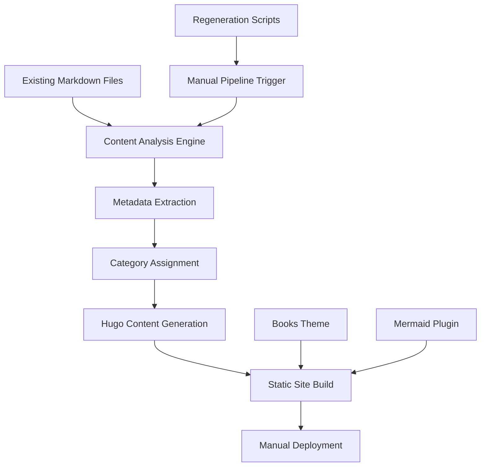

# Design Document: Hugo Documentation Site

## Executive Summary

This design transforms a collection of technology documentation from file-system organization into a user-friendly Hugo static site. The system analyzes existing markdown documents, extracts metadata, categorizes content, and generates a searchable documentation portal with enhanced navigation features.

**Key Design Decisions:**
- Manual regeneration approach for controlled updates
- Books theme for documentation-focused user experience  
- Content-first navigation over directory structure
- Comprehensive metadata extraction and enhancement
- Mermaid diagram support for technical documentation

## System Overview

The solution uses Hugo with the Books theme to create a documentation site that prioritizes content discovery over file structure. Users can find information through categories, tags, dates, and full-text search rather than navigating directory hierarchies. The system provides manual regeneration scripts to rebuild the site with current documents, allowing for controlled updates and maintenance.

**Primary Goals:**
1. Transform file-based documentation into user-friendly web portal
2. Enable content discovery through multiple navigation methods
3. Preserve original content while adding rich metadata
4. Provide maintainable scripts for site regeneration
5. Support technical diagrams and enhanced formatting

## Architecture

The system follows a manual content transformation pipeline architecture:



### Core Components

**Content Analysis Engine**: Reads all markdown files, extracts titles, analyzes content themes, and generates appropriate summaries and keywords.

**Metadata Enhancement**: Adds front matter to documents including titles, summaries, keywords, categories, and dates while preserving original content.

**Hugo Site Generator**: Transforms enhanced markdown into a static site using the Books theme with customized navigation and taxonomy features.

**Regeneration Scripts**: Manual scripts that rebuild the site with current documents, allowing controlled updates and maintenance.

## Components and Interfaces

### Content Processor

**Input**: Raw markdown files from the repository
**Output**: Enhanced markdown files with complete front matter
**Responsibilities**:
- Extract document titles from content
- Generate 2-3 sentence summaries
- Create relevant keyword tags
- Assign documents to categories
- Preserve original markdown content

### Category Engine

**Input**: Document content and metadata
**Output**: Category assignments and navigation structure
**Responsibilities**:
- Analyze content to determine 4-5 main categories
- Assign each document to exactly one primary category
- Generate category-based navigation hierarchy
- Create collapsible navigation sections

### Hugo Configuration Manager

**Input**: Enhanced content and site requirements
**Output**: Complete Hugo site configuration
**Responsibilities**:
- Configure Books theme for documentation use
- Set up taxonomy for tags and categories
- Enable Mermaid diagram rendering
- Configure table of contents generation
- Set up search functionality

### Site Regeneration Scripts

**Input**: Manual execution trigger
**Output**: Updated Hugo site ready for deployment
**Responsibilities**:
- Execute complete content processing pipeline
- Generate Hugo site with current documents
- Provide Hugo live preview server for testing (`hugo server`)
- Prepare site for manual deployment
- Provide clear feedback on processing results

### Documentation Generator

**Input**: Project structure and script functionality
**Output**: Quick reference documentation
**Responsibilities**:
- Generate concise project overview
- Document script execution procedures
- Provide command examples and usage patterns
- Create maintainer-focused reference guide

## Data Models

### Document Metadata

```yaml
title: string          # Extracted from document content
summary: string        # 2-3 sentence description
keywords: string[]     # Array of relevant tags
category: string       # Primary category assignment
date: datetime         # Document creation/modification date
weight: number         # Navigation ordering
draft: boolean         # Publication status
```

### Category Structure

```yaml
name: string           # Category display name
description: string    # Category description
weight: number         # Display order
icon: string          # Optional category icon
documents: Document[] # Documents in this category
```

### Site Configuration

```yaml
baseURL: string        # GitHub Pages URL
title: string         # Site title
theme: "books"        # Hugo theme
params:
  navigation:
    collapsible: true
  search:
    enabled: true
  mermaid:
    enabled: true
  tableOfContents:
    enabled: true
    position: "right"
```

## Correctness Properties

*A property is a characteristic or behavior that should hold true across all valid executions of a system-essentially, a formal statement about what the system should do. Properties serve as the bridge between human-readable specifications and machine-verifiable correctness guarantees.*

### Property Reflection

After reviewing the prework analysis, I identified several areas where properties can be consolidated:

- Properties 1.2, 1.3, 1.4, and 2.4 all relate to proper display of document titles and summaries - these can be combined into comprehensive display properties
- Properties 2.2 and 2.3 both test metadata processing - these can be combined into a single metadata completeness property
- Properties 3.2 and 3.4 both test file organization rules - these can be combined into a file structure property

### Navigation and User Experience Properties

**Property 1: Navigation Structure Completeness**
*For any* generated Hugo site, the navigation should contain 4-5 main categories with collapsible sections, where each section displays document titles (not filenames) extracted from front matter
**Validates: Requirements 1.1, 1.2**

**Property 2: Document List Display Consistency**
*For any* document list view (category, tag filter, search results), each document entry should display both the extracted title and the generated summary from front matter
**Validates: Requirements 1.3, 1.4**

**Property 3: Sorting Functionality Completeness**
*For any* document collection, the system should provide functional sort options (date, category, alphabetical) that correctly reorder documents according to the selected criteria
**Validates: Requirements 1.5**

**Property 4: Table of Contents Generation**
*For any* document with headers, the rendered page should include a right-side table of contents that accurately reflects the document's header hierarchy
**Validates: Requirements 2.1**

**Property 5: Title Usage Consistency**
*For any* document reference throughout the site, the system should use extracted document titles from front matter instead of filenames
**Validates: Requirements 2.2**

### Content Processing Properties

**Property 6: Metadata Processing Completeness**
*For any* processed document, the front matter should contain a 2-3 sentence summary, relevant keywords array, extracted title, and category assignment
**Validates: Requirements 3.1, 3.2**

**Property 7: Content Preservation**
*For any* original markdown document, the processed version should preserve the exact original content while adding only front matter metadata
**Validates: Requirements 3.3**

**Property 8: Category Assignment Consistency**
*For any* processed document, it should be assigned to exactly one of the 4-5 main categories based on content analysis
**Validates: Requirements 3.4**

**Property 9: Mermaid Rendering**
*For any* document containing Mermaid code blocks, the rendered HTML should convert those blocks into interactive SVG diagrams rather than plain text
**Validates: Requirements 2.3**

### System Management Properties

**Property 10: File Organization Compliance**
*For any* generated Hugo files, all site-related files should be stored under the `/site` directory and avoid dot-prefixed names except for standard files like .gitignore
**Validates: Requirements 4.2, 4.3**

**Property 11: Script Execution Completeness**
*For any* execution of the regeneration scripts, the system should successfully process all current documents and generate a complete Hugo site ready for deployment
**Validates: Requirements 4.1**

**Property 12: Documentation Completeness**
*For any* generated project documentation, it should include historical prompt, agent guidelines, and quick reference with sufficient detail for project continuation
**Validates: Requirements 5.1, 5.2, 5.3, 6.1, 6.2, 6.3**

## Error Handling

### Content Processing Errors

**Missing Titles**: If a document lacks a clear title, extract from the first header or use filename as fallback
**Summary Generation Failures**: Provide default summary indicating content type if automatic generation fails
**Category Assignment Failures**: Assign to "Miscellaneous" category if automatic categorization fails
**Invalid Markdown**: Log errors but continue processing other documents

### Build Process Errors

**Hugo Build Failures**: Validate all markdown and configuration before building
**Theme Compatibility Issues**: Test theme integration during setup
**Mermaid Rendering Errors**: Gracefully degrade to code blocks if diagram rendering fails
**Deployment Failures**: Retry deployment with exponential backoff

### Runtime Errors

**Missing Assets**: Provide fallback content for missing images or resources
**Search Index Corruption**: Rebuild search index automatically
**Navigation Errors**: Ensure navigation remains functional even with malformed content

## Testing Strategy

### Unit Testing Approach

Unit tests will focus on individual components and specific functionality:

**Content Analysis Tests**:
- Title extraction from various markdown formats
- Summary generation for different content types
- Keyword extraction accuracy
- Category assignment logic

**Hugo Configuration Tests**:
- Theme integration correctness
- Navigation structure generation
- Taxonomy configuration
- Mermaid plugin integration

**File Processing Tests**:
- Front matter injection without content modification
- File organization compliance
- Path handling and directory structure

### Property-Based Testing Approach

Property-based tests will verify universal behaviors across all valid inputs using **fast-check** (JavaScript/TypeScript property testing library). Each property-based test will run a minimum of 100 iterations to ensure comprehensive coverage.

**Property Test Implementation Requirements**:
- Each correctness property must be implemented by a single property-based test
- Tests must be tagged with comments referencing the design document property
- Tag format: `**Feature: hugo-docs-site, Property {number}: {property_text}**`
- Generate diverse test inputs including edge cases (empty documents, special characters, various markdown structures)

**Test Data Generation**:
- Random markdown documents with varying structures
- Different header hierarchies and content lengths
- Various combinations of front matter and content
- Edge cases like empty files, malformed markdown, special characters

**Property Validation**:
- Navigation structure contains required elements
- Document metadata completeness across all processed files
- Content preservation verification through comparison
- File organization compliance checking
- Mermaid rendering verification

### Integration Testing

**Hugo Live Preview Testing**:
- Use `hugo server` for real-time testing during development
- Validate navigation structure and functionality in live preview
- Test Mermaid diagram rendering in browser
- Verify search functionality and taxonomy filtering
- Check responsive design across different screen sizes

**End-to-End Pipeline Tests**:
- Complete content processing pipeline
- Hugo site generation and build
- Manual script execution workflow
- Site deployment readiness verification

**Cross-Browser Compatibility**:
- Navigation functionality across browsers
- Mermaid diagram rendering consistency
- Search functionality performance
- Mobile responsiveness validation

### Performance Testing

**Build Performance**:
- Site generation time with large document collections
- Memory usage during content processing
- Script execution time and resource usage

**Runtime Performance**:
- Page load times
- Search response times
- Navigation responsiveness