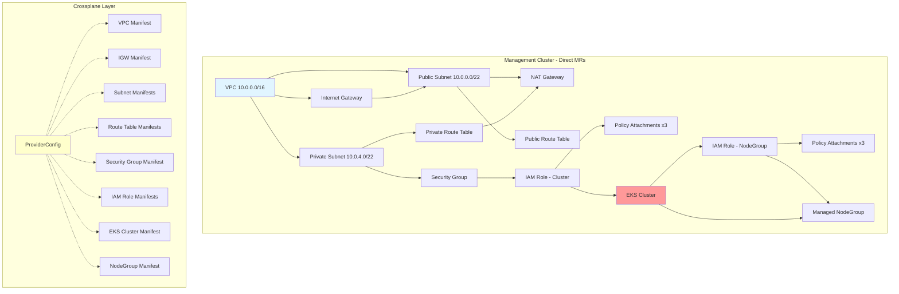
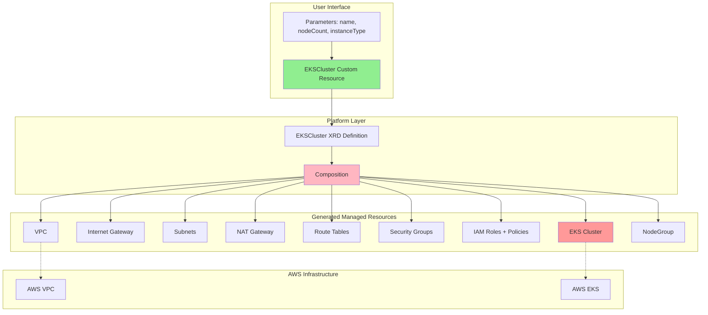
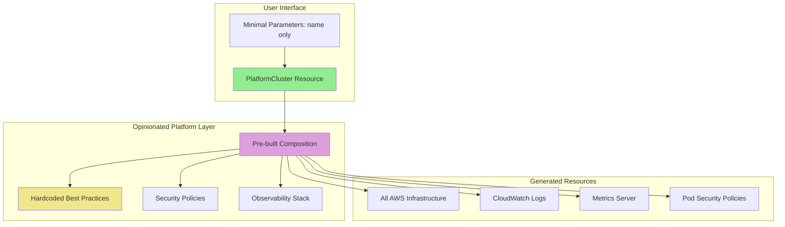
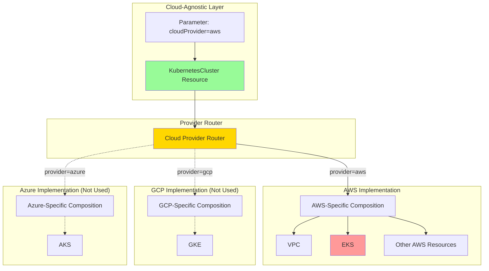
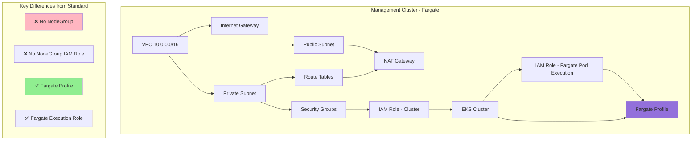
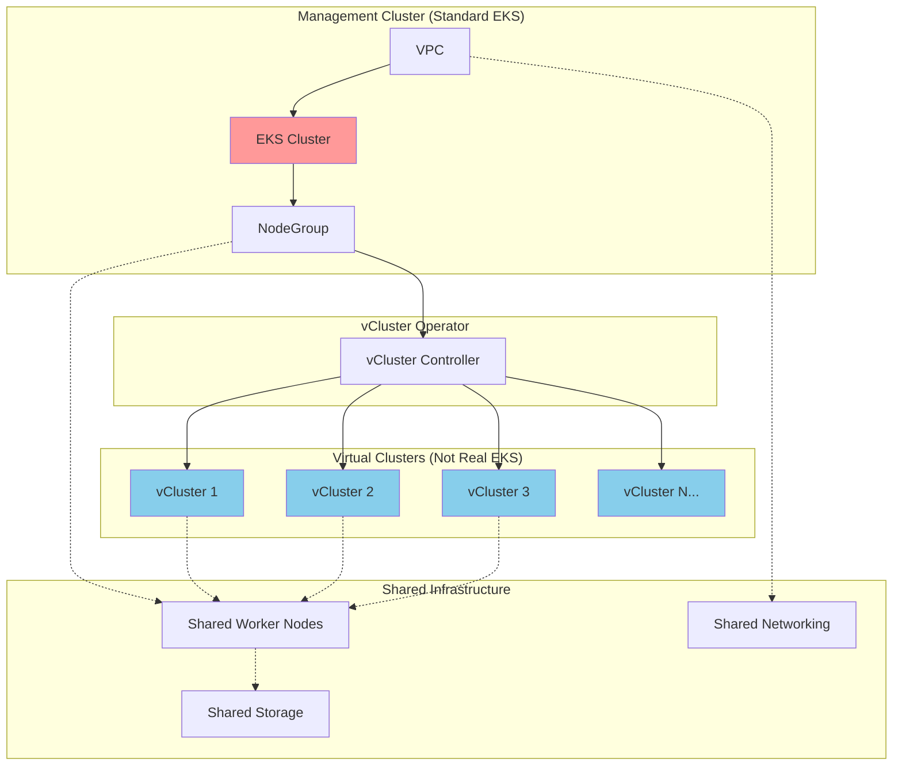
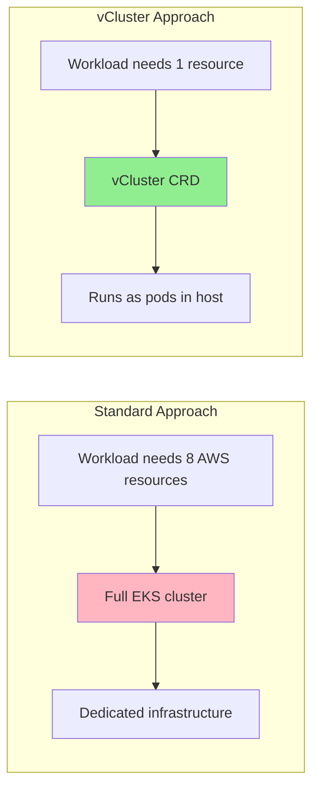
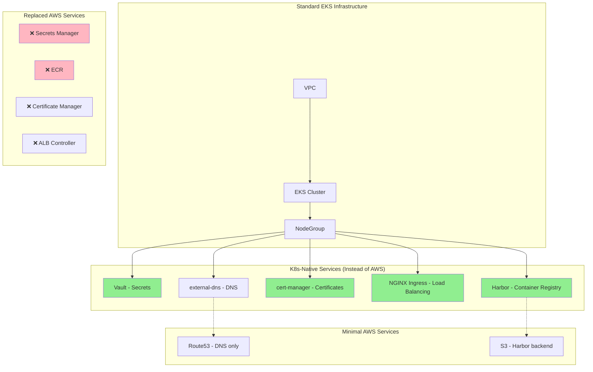
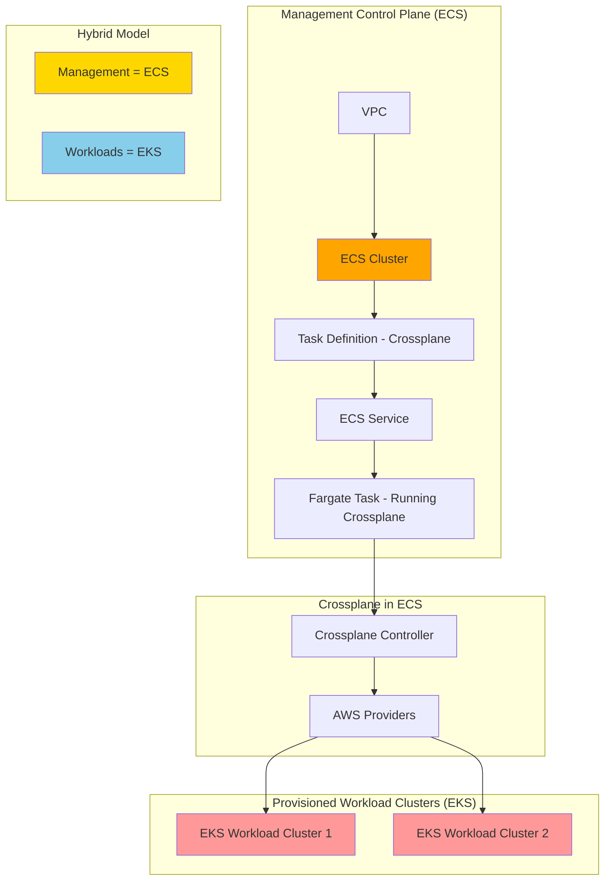

# Stage 2: Architecture Design

## Reference Network Architecture

### Management Cluster VPC Layout

**VPC CIDR:** `10.0.0.0/16` (65,536 IPs)

**Subnet Allocation:**
- **Public Subnet:** `10.0.0.0/22` (1,024 IPs) - Internet Gateway, NAT Gateway
- **Management Cluster Private Subnet:** `10.0.4.0/22` (1,024 IPs) - EKS control plane, worker nodes
- **Workload Cluster 1 Private Subnet:** `10.0.8.0/22` (1,024 IPs)
- **Workload Cluster 2 Private Subnet:** `10.0.12.0/22` (1,024 IPs)
- **Workload Cluster N...** continues in /22 blocks

**Key Components:**
- Single Internet Gateway for public subnet
- Single NAT Gateway in public subnet (for private subnet internet access)
- Route tables: public (IGW route), private (NAT route)
- Single AZ deployment (us-east-1a as default)

**Template Parameters:**
- `vpc_cidr` (default: 10.0.0.0/16)
- `cluster_name` (for resource naming)
- `aws_region` (default: us-east-1)
- `availability_zone` (default: us-east-1a)
- `node_instance_type` (default: t3.medium)
- `node_count` (default: 2)

---

## Management Cluster Resource Stack

### Infrastructure Resources (All Approaches Need These)

1. **VPC** - Virtual network
2. **Internet Gateway** - Public internet access
3. **Public Subnet** - /22 for NAT and public resources
4. **Private Subnet** - /22 for management cluster
5. **NAT Gateway** - Private subnet internet egress
6. **Route Tables** (2) - Public and private routing
7. **Route Table Associations** - Link subnets to route tables
8. **Security Group** - EKS cluster communication
9. **IAM Role (Cluster)** - EKS control plane permissions
10. **IAM Role (NodeGroup)** - Worker node permissions
11. **IAM Role Policy Attachments** - Required AWS managed policies
12. **EKS Cluster** - Kubernetes control plane
13. **EKS NodeGroup** - Managed worker nodes

### Crossplane-Specific Resources

14. **ProviderConfig** - AWS credentials configuration
15. **Namespace** - Organization (e.g., `crossplane-system`, `platform`)

**Total Base Resources:** ~15 distinct AWS resources

---

## Workload Cluster Template Structure

Each workload cluster follows a similar pattern but in its own /22 subnet:

**Required Template Parameters:**
- `workload_cluster_name` - Unique cluster identifier
- `workload_subnet_cidr` - The /22 block to use (e.g., 10.0.8.0/22)
- `node_instance_type` - Instance type (default: t3.medium)
- `node_count` - Number of nodes (default: 2)

**Resources Per Workload Cluster:**
1. Private Subnet (in management VPC)
2. Route Table Association (to existing private route table)
3. Security Group
4. IAM Role (Cluster)
5. IAM Role (NodeGroup)
6. IAM Role Policy Attachments
7. EKS Cluster
8. EKS NodeGroup

**Total Per Workload:** ~8 resources (reuses VPC, IGW, NAT from management)

---

## Approach-Specific Architectural Differences

**Direct MRs:**
- All 15 resources defined as individual manifests
- Manual dependency management via resource references
- Explicit configuration of every property

**XRDs:**
- Single `EKSCluster` custom resource
- Composition maps to underlying 15 resources
- Parameters expose only: cluster name, node count, instance type

**Opinionated:**
- Pre-built composition with hardcoded best practices
- Minimal parameters (often just cluster name)
- May include additional resources (monitoring, logging)

**Multi-Cloud:**
- Cloud-agnostic `KubernetesCluster` resource
- AWS-specific composition underneath
- Same interface could work with GCP/Azure compositions

**Fargate:**
- Replaces NodeGroup resources with Fargate Profile
- Removes IAM NodeGroup role
- Adds Fargate Pod Execution Role

**vCluster:**
- Management cluster is standard EKS
- Workload "clusters" become vCluster CRDs, not EKS clusters
- Dramatically simplified workload template (no VPC/IAM resources)

**K8s-Native:**
- Standard EKS infrastructure
- Adds: Harbor deployment, Vault deployment, cert-manager, NGINX Ingress controller
- Removes dependencies on ECR, Secrets Manager, ACM, ALB

**ECS Control Plane:**
- ECS Cluster instead of EKS for management plane
- ECS Task Definition for Crossplane controller
- ECS Service to run Crossplane
- Still provisions EKS for workload clusters

---

## Resource Dependency Diagrams

### Approach 1: Direct Managed Resources

**Key Characteristics:**
- 15+ individual manifest files
- Each manifest represents one AWS resource
- Dependencies managed through resource references (e.g., `subnetIdRef`)
- Complete visibility into every resource property

---

### Approach 2: Composite Resources (XRDs)

**Key Characteristics:**
- Single custom resource exposes simplified API
- Composition template generates all 15 resources
- Platform team owns the Composition
- Users only see abstracted interface

---

### Approach 3a: Opinionated Platform

**Key Characteristics:**
- Minimal user input required
- Opinionated defaults baked in
- Additional resources beyond basic infrastructure
- Limited flexibility, maximum convenience

---

### Approach 3b: Multi-Cloud Abstraction

**Key Characteristics:**
- Cloud-agnostic API definition
- Multiple provider-specific implementations
- Same interface across clouds
- Lowest common denominator constraints

---

### Approach 3c: Fargate-First Architecture

**Key Characteristics:**
- No EC2 node management
- Fargate Profile replaces NodeGroup
- Different IAM role (Pod Execution vs Node)
- Serverless compute model

---

### Approach 3d: vCluster-Based Multi-Tenancy

**Key Characteristics:**
- One real EKS cluster (management)
- Multiple virtual clusters running as pods
- Workload "clusters" are not separate EKS clusters
- Massive cost savings, shared infrastructure

**Workload Cluster Comparison:**

---

### Approach 3e: Kubernetes-Native Tooling

**Key Characteristics:**
- Standard EKS infrastructure
- Cloud-agnostic tooling for services
- Additional operational complexity
- Higher resource requirements
- Better cloud portability

---

### Approach 3f: ECS Control Plane Alternative

**Key Characteristics:**
- Management plane on ECS (not Kubernetes)
- Crossplane runs as ECS task
- Provisions standard EKS workload clusters
- Unusual architecture, limited community patterns

---

## Diagram Comparison Summary

**Complexity Gradient:**
- **Simplest Structure:** vCluster (fewest resources per workload)
- **Most Transparent:** Direct MRs (every resource visible)
- **Most Abstracted:** Opinionated (user sees almost nothing)
- **Most Hybrid:** ECS Control Plane (mixing orchestrators)

**Resource Count Comparison:**

| Approach | Mgmt Cluster Resources | Per Workload Resources |
|----------|------------------------|------------------------|
| Direct MRs | 15 individual MRs | 8 MRs |
| XRDs | 1 XR + 1 Composition | 1 XR |
| Opinionated | 1 XR | 1 XR |
| Multi-Cloud | 1 Generic XR | 1 Generic XR |
| Fargate | 14 MRs (no NodeGroup) | 7 MRs |
| vCluster | 15 MRs + vCluster Op | 1 vCluster CRD |
| K8s-Native | 15 MRs + 5 apps | 8 MRs |
| ECS Control | ECS Task + resources | 8 EKS MRs |

---

## Stage 2 Complete

This architecture design provides the foundation for understanding how each approach structures and organizes resources. The diagrams illustrate the fundamental differences in complexity, abstraction levels, and architectural patterns across all approaches.
