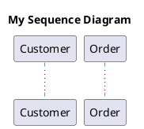

# Cross-Diagram Domain Model Reuse in PlantUML

## Overview

This document demonstrates how to reuse your centralized domain model across multiple UML diagram types in PlantUML.

## What We've Created

### 1. **Central Domain Model**
- **Location**: `model/all-classes.iuml` and `model/all-relationships.iuml`
- **Contains**: 7 domain classes (Customer, Order, OrderItem, Product, Inventory, Payment, Shipment)
- **Purpose**: Single source of truth for all domain objects

### 2. **Class Diagrams** (4 different views)
- `views/customer-management.puml` - Customer and Order
- `views/order-fulfillment.puml` - Order, Payment, and Shipment
- `views/inventory-management.puml` - OrderItem, Product, and Inventory
- `views/complete-system.puml` - All classes and relationships

### 3. **Sequence Diagram**
- `sequences/place-order-sequence.puml`
- Shows the flow of placing an order
- References domain objects: Customer, Order, OrderItem, Product, Inventory
- Demonstrates method calls from the class model

### 4. **Deployment Diagram**
- `deployment/system-deployment.puml`
- Shows physical deployment architecture
- Notes which domain objects are managed by which services
- Maps domain model to infrastructure

### 5. **State Diagram**
- `states/order-state.puml`
- Shows state transitions for the Order class
- References methods from Customer, Order, Payment, Inventory, Shipment classes
- Demonstrates lifecycle of a domain object

### 6. **Component Diagram**
- `components/system-components.puml`
- Shows logical components of the system
- Documents which components manage which domain classes
- Links architecture to domain model

## How Model Reuse Works

### Approach 1: Direct Reference (Documentation)
The simplest approach is to reference your domain model in comments:



**Pros:**
- Simple and clear
- Works with all diagram types
- No technical limitations

**Cons:**
- Doesn't enforce consistency
- Manual synchronization required

### Approach 2: Shared Procedures (Advanced)
Use PlantUML procedures to extract reusable information:

```plantuml
' In model/domain-model-unified.iuml
!function $order_methods()
!return "addItem(), calculateTotal(), submit()"
!endfunction

' In your sequence diagram
!include ../model/domain-model-unified.iuml
' Now you can reference $order_methods() programmatically
```

**Pros:**
- Enforces consistency
- Single source of truth for method names
- Can be used programmatically

**Cons:**
- More complex setup
- Requires PlantUML preprocessing knowledge

### Approach 3: Hybrid Documentation
Maintain a "model catalog" that documents your domain:

**model/README.md**:
```markdown
# Domain Model Catalog

## Classes
- **Customer**: manages user accounts
- **Order**: represents a purchase
- **OrderItem**: line item in an order
- **Product**: item available for purchase
- **Inventory**: stock management
- **Payment**: payment processing
- **Shipment**: delivery tracking

## Key Methods
- Customer.placeOrder() -> Order
- Order.addItem(OrderItem) -> void
- Order.calculateTotal() -> double
- Inventory.checkAvailability() -> boolean
- Payment.process() -> boolean
```

Then reference this in all diagram types.

## Best Practices for Cross-Diagram Consistency

### 1. **Naming Conventions**
Use consistent names across all diagram types:
- Class names: PascalCase (e.g., `Customer`, `OrderItem`)
- Methods: camelCase (e.g., `placeOrder()`, `calculateTotal()`)
- Participants in sequences: Match class names

### 2. **Documentation Standards**
Add notes in each diagram explaining the domain model connection:

```plantuml
note right of [Order Service]
  Manages:
  - Customer
  - Order
  - OrderItem
end note
```

### 3. **File Organization**
```
project/
├── model/
│   ├── all-classes.iuml           # Central class definitions
│   ├── all-relationships.iuml     # Central relationships
│   └── domain-model-unified.iuml  # Procedures for reuse
├── views/                         # Class diagram views
├── sequences/                     # Sequence diagrams
├── deployment/                    # Deployment diagrams
├── states/                        # State diagrams
├── components/                    # Component diagrams
└── README.md                      # Model catalog
```

### 4. **Traceability**
In each non-class diagram, explicitly document which domain classes are involved:

```plantuml
' Domain objects involved: Customer, Order, Payment
' Related class diagram: views/customer-management.puml
```

## Example: End-to-End Model Usage

### Step 1: Define Domain Model
`model/all-classes.iuml` - Define Customer and Order classes

### Step 2: Create Class View
`views/customer-management.puml` - Show Customer → Order relationship

### Step 3: Create Sequence Diagram
`sequences/place-order-sequence.puml` - Show Customer.placeOrder() calling Order methods

### Step 4: Create State Diagram
`states/order-state.puml` - Show Order lifecycle with state transitions

### Step 5: Create Deployment Diagram
`deployment/system-deployment.puml` - Show which service hosts Customer and Order logic

### Step 6: Create Component Diagram
`components/system-components.puml` - Show CustomerManagement component managing Customer class

All six diagrams reference the same Customer and Order domain objects, maintaining consistency!

## Benefits of This Approach

✅ **Single Source of Truth** - Domain model defined once in `model/`
✅ **Consistency** - Same names and concepts across all diagram types
✅ **Traceability** - Easy to see which diagrams involve which classes
✅ **Maintainability** - Change a class name once, update all diagrams
✅ **Documentation** - Each diagram type shows different perspective
✅ **Completeness** - Combined, diagrams give full system picture

## Limitations to Be Aware Of

⚠️ **PlantUML doesn't validate cross-references** - If you rename Order to PurchaseOrder in the class model, sequence diagrams won't automatically update

⚠️ **No automatic synchronization** - Method signatures can drift between class and sequence diagrams

⚠️ **Manual consistency required** - You must actively maintain alignment

## Solutions to Limitations

### Solution 1: Code Generation
Generate PlantUML from actual source code:
- Class diagrams from Java/C#/Python classes
- Sequence diagrams from execution traces
- This ensures diagrams match implementation

### Solution 2: Review Process
- When updating domain model, grep for class names across all diagram types
- Use version control to track changes
- Review diagrams when classes change

### Solution 3: Documentation Links
Add explicit links between diagrams:

```plantuml
note
  See class diagram: [[../views/customer-management.puml]]
  Implementation: [[../../src/Customer.java]]
end note
```

## Summary

**Yes, you can reuse your domain model across all PlantUML diagram types!**

The key is:
1. **Define your model once** in a central location
2. **Reference it consistently** in all diagram types
3. **Document the connections** between diagrams
4. **Maintain alignment** through process and tooling

This gives you a comprehensive, multi-view documentation system where:
- **Class diagrams** show structure
- **Sequence diagrams** show behavior
- **State diagrams** show lifecycle
- **Component diagrams** show architecture
- **Deployment diagrams** show infrastructure

All referencing the same underlying domain model!
