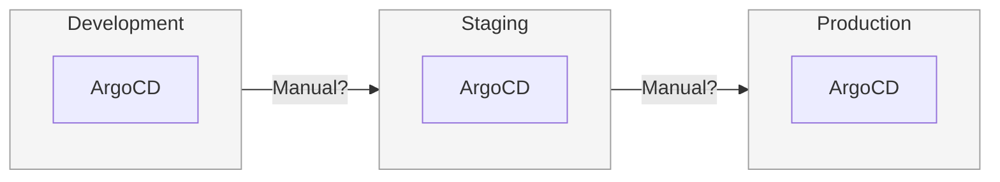
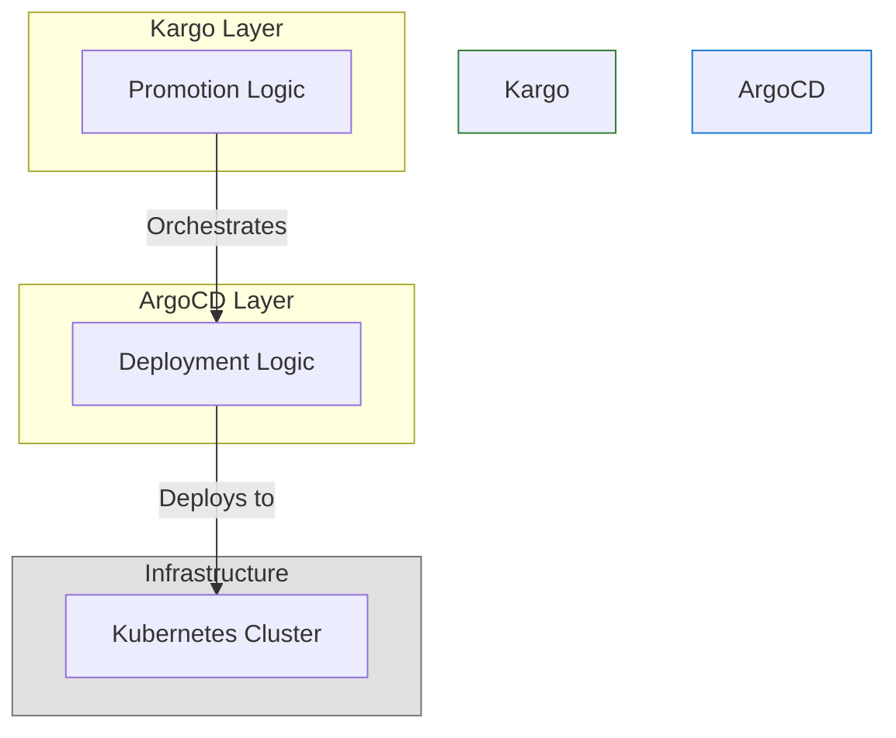
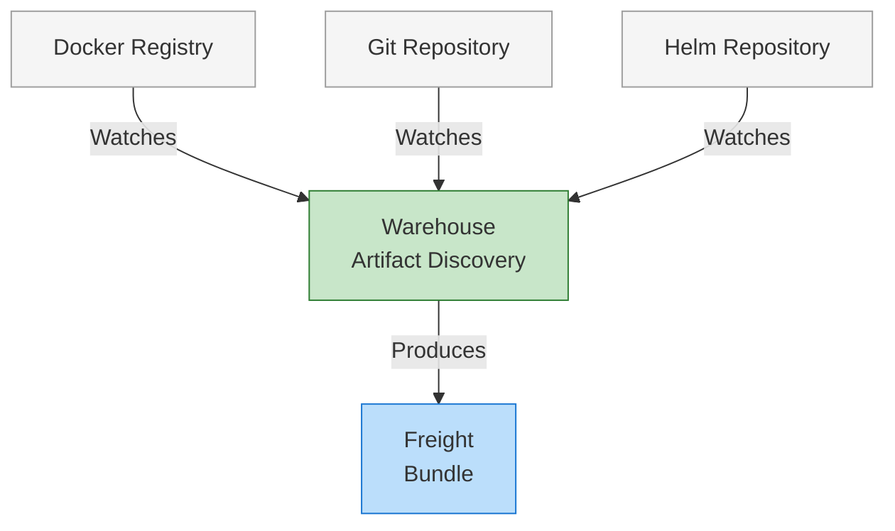
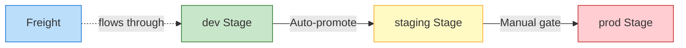
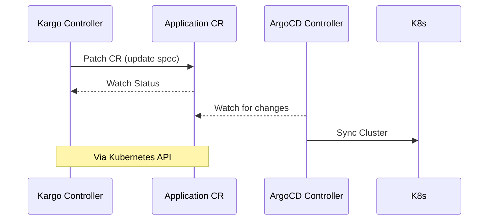
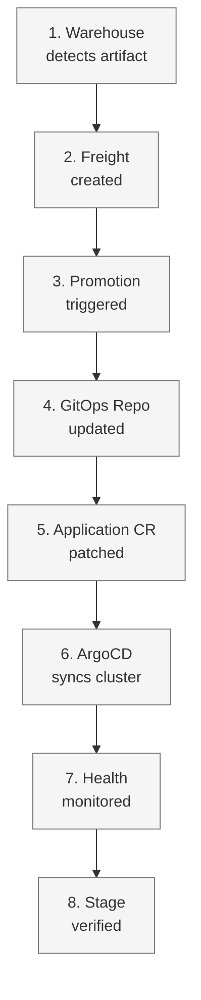
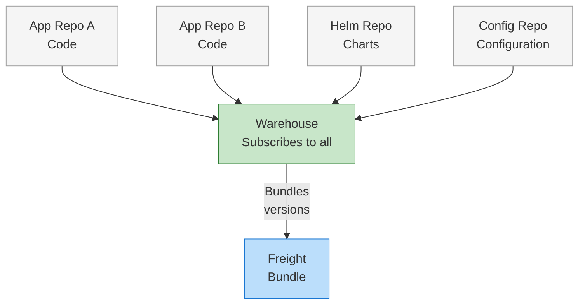
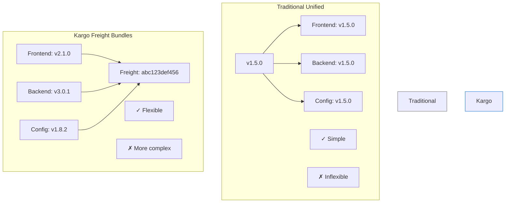

# Kargo: GitOps Promotion for ArgoCD

**Solving the Multi-Environment Deployment Gap**

---

# What ArgoCD Doesn't Do

ArgoCD excels at continuous deployment - syncing Git state to Kubernetes clusters. However, there's a critical gap:

- ArgoCD syncs Git to Kubernetes
- Missing: Promotion workflow orchestration
- No dev → staging → prod concept
- No artifact version coordination
- Manual or scripted promotions required



**The Problem:** Teams use manual processes, custom scripts, or CI/CD orchestration to promote between environments. This gap is precisely what Kargo addresses.

---

# Kargo: Promotion Orchestration Layer

Kargo and ArgoCD are complementary tools that work together:

- ArgoCD: Deployment engine (how)
- Kargo: Promotion orchestrator (what, when)
- Declarative promotion workflows
- Multi-stage artifact coordination
- Built by Argo creators



**Key Insight:** Both tools remain independent and can function separately. Integration is Kubernetes-native through Custom Resources, not API calls.

---

# Warehouses: Artifact Discovery

Warehouses are the entry point of the Kargo workflow - the artifact discovery mechanism.

- Monitor repositories for new artifacts
- Images, Git commits, Helm charts
- Apply version constraints (semver)
- Automatic discovery with webhooks
- Produce Freight when versions found



**How it Works:** Pull-based monitoring rather than push-based triggers (GitOps principle). Can subscribe to multiple repository types simultaneously. Warehouses don't deploy - they discover and package into Freight.

---

# Freight: Immutable Artifact Bundles

Critical concept: Freight is **NOT** unified versioning across all components.

- Bundle of specific artifact versions
- NOT a single version number
- Contains: digests, SHAs, chart versions
- Immutable and cryptographically identified
- Promoted as atomic unit

```mermaid
graph TB
    subgraph "Freight Bundle: abc123def456 (brave-eagle)"
        F1[frontend:v2.1.0<br/>@sha256:abc...]
        F2[backend:v3.0.1<br/>@sha256:def...]
        F3[chart: myapp:v0.5.2]
    end
    
    style F1 fill:#ffecb3,stroke:#ffa000
    style F2 fill:#c5e1a5,stroke:#689f38
    style F3 fill:#b39ddb,stroke:#673ab7
```

**Example YAML:**
```yaml
# Freight bundle structure
apiVersion: kargo.akuity.io/v1alpha1
kind: Freight
metadata:
  name: abc123def456  # SHA-1 hash
  alias: brave-eagle  # Human-friendly
artifacts:
  images:
    - repoURL: myregistry.io/frontend
      tag: v2.1.0
      digest: sha256:abc...
    - repoURL: myregistry.io/backend
      tag: v3.0.1
      digest: sha256:def...
  charts:
    - name: myapp
      version: v0.5.2
```

**Key Point:** Each artifact maintains its own version, bundled together as a tested combination. Immutability ensures reproducibility - Freight never changes after creation.

---

# Stages: Promotion Targets

Stages are promotion targets, though they typically map to environments.

- Represent promotion targets (typically environments)
- Define Freight acceptance rules
- Specify promotion mechanisms
- Track health and verification
- Chain together to form pipelines



**Configuration:** Each Stage defines which Freight it accepts and how promotion executes. Promotion mechanisms are fully declarative via Kubernetes resources. Auto-promotion for lower environments, manual gates for production is the typical pattern.

---

# Kubernetes-Native Integration

Key architectural decision: Kubernetes-native integration, not REST API calls.

- Kargo patches Application Custom Resources
- No REST API calls
- Authorization via annotations
- Status monitoring via K8s watch
- Declarative, not imperative



**Example Authorization:**
```yaml
# ArgoCD Application annotation
apiVersion: argoproj.io/v1alpha1
kind: Application
metadata:
  annotations:
    kargo.akuity.io/authorized-stage: "myproject:production"
```

**Design Benefits:** Decoupled design with no tight coupling between systems. RBAC-based security model using standard Kubernetes mechanisms. ArgoCD sees standard CR modifications and doesn't need Kargo awareness.

---

# End-to-End Promotion Flow

Complete picture of one promotion cycle from start to verification.

1. Warehouse detects new artifact
2. Freight created (immutable bundle)
3. Promotion triggered (auto/manual)
4. GitOps repo updated
5. Application CR patched
6. ArgoCD syncs cluster
7. Health monitored
8. Stage verified for next promotion



**Workflow Characteristics:** State-driven workflow, not event-driven - continuous reconciliation. Each step is declarative via Kubernetes resources. Failure at any step halts progression - safe by default. Entire workflow visible through kubectl and Kargo UI.

---

# Coordinating Multiple Artifact Sources

Modern reality: polyrepo architectures are common.

- Challenge: Code, charts, config separate
- Single Warehouse subscribes to all
- Freight bundles specific version each
- Promoted together as unit
- Prevents version mismatches



**Solution:** Application code, infrastructure code, configuration often live in separate repositories. Kargo's solution: Warehouse subscribes to multiple repositories simultaneously and Freight bundles one specific version from each. This is an alternative to unified versioning - independent artifact versions with coordinated promotion.

---

# Preventing Incompatible Combinations

Real-world problem: timing issues can create incompatible Freight.

- Problem: Race conditions create bad Freight
- Solution 1: Creation criteria (expressions)
- Solution 2: Manual assembly
- Solution 3: Multiple Warehouses
- Solution 4: Gatekeeper Stage

**Example Expression-Based Criteria:**
```yaml
# Warehouse with Freight creation criteria
apiVersion: kargo.akuity.io/v1alpha1
kind: Warehouse
spec:
  freightCreationPolicy: Automatic
  freightCreationCriteria:
    expression: |
      imageFrom('frontend').Tag == imageFrom('backend').Tag
```

**The Problem:** Frontend v2.0 discovered before backend v2.0 is ready, creates incompatible bundle.

**Solutions:**
- **Solution 1 (most powerful):** Expression-based creation criteria
- **Solution 2:** Manual Freight assembly for complex compatibility rules
- **Solution 3:** Separate Warehouses for fast-moving vs slow-moving artifacts
- **Solution 4:** Gatekeeper Stage filters bad combinations before important environments

Choose strategy based on coordination requirements and team workflow.

---

# Working with Freight

Freight immutability is a feature, not a limitation - it ensures reproducibility.

- Freight is immutable (by design)
- Cannot merge Freight after creation
- Manual assembly: Select compatible versions
- Freight cloning: Template for hotfixes
- Multiple Warehouses: Parallel pipelines

**Strategies:**

| Strategy | Use Case | Flexibility |
|----------|----------|-------------|
| Manual Assembly | Complex compatibility | High |
| Freight Cloning | Hotfixes | Medium |
| Multiple Warehouses | Different cadences | High |

**Design Context:** Cannot merge existing Freight - would break audit trail and create untested combinations. Manual assembly: Warehouse discovers multiple versions, user selects compatible set. Freight cloning use case: Production hotfix - clone prod Freight, replace one buggy component.

---

# Visibility Beyond Kargo

Enterprise requirement: tracking releases beyond the Kargo system.

- Kargo tracks internally (Freight, commits)
- External needs: tags, manifests, dashboards
- Promotion steps can create tags
- Release manifest files for automation
- Hybrid approach recommended

```mermaid
graph LR
    subgraph Internal Kargo
        I1[Freight resources]
        I2[Git commits]
        I3[Promotion history]
        I4[Health status]
    end
    
    subgraph External Git/Tools
        E1[Git tags]
        E2[Release manifests]
        E3[Dashboards]
        E4[CMDB integration]
    end
    
    Internal Kargo <-->|Promotion<br/>creates both| External Git/Tools
    
    style Internal Kargo fill:#e3f2fd,stroke:#1976d2
    style External Git/Tools fill:#f5f5f5,stroke:#757575
```

**Approach:** Kargo provides excellent internal tracking via Freight and Git commits. External visibility needs: Git tags for humans, manifests for automation. The promotion process can create both simultaneously. Hybrid approach: rich internal tracking plus external accessibility.

---

# Architectural Trade-offs

Both architectural approaches have merit - not one-size-fits-all.

- Traditional: Single version across artifacts
- Kargo: Independent versions, bundled promotion
- Unified: Simple, inflexible
- Freight: Flexible, more complex
- Both valid; context matters



**Unified Versioning:** Single version tag across all components (v1.5.0 everywhere). Simple to communicate, easy mental model. But: tight coupling, requires rebuilding everything for any change.

**Freight Approach:** Each artifact maintains independent version. Flexible, handles independent lifecycles, selective promotion. But: more complex, requires coordination mechanism.

**Migration Path:** Hybrid approaches possible - unified major versions, independent minor/patch. Migration path exists from unified to Freight-based promotion.

---

# Ensuring Safe Promotions

Stage health encompasses more than just Application health.

- Stage health ≠ Application health
- Multiple health indicators aggregate
- Argo Rollouts integration
- Custom verification jobs
- Progressive promotion gates

**Health Checks Aggregate:**
- ✓ Application sync status
- ✓ Application health status
- ✓ Verification results
- ✓ Custom checks
- → Stage health decision

**Integration:** Works with Argo Rollouts for progressive delivery patterns. Custom verification via Kubernetes Jobs or external systems. Verification gates prevent premature promotion to next Stage. Failed verification stops progression - safe by default.

---

# Deployment Patterns with Kargo

Not one-size-fits-all - pattern selection based on requirements.

- Common: Image + config together
- Grouped: Multiple images as unit
- Independent: Different cadences
- Gatekeeper: Filter bad combinations
- Choose based on coupling

**Pattern Overview:**

```
[Common Case]          [Grouped Services]
Single Warehouse       Multiple images
     ↓                      ↓
  Combined              Promoted
   Freight              together

[Independent]          [Gatekeeper]
Multiple               Initial filter
Warehouses             stage first
```

**Pattern Selection:**
- **Common case:** Single Warehouse for tightly coupled components (image + config)
- **Grouped services:** Microservices with interdependencies promoted together
- **Independent pipelines:** Different promotion cadences for different artifact types
- **Gatekeeper pattern:** Initial Stage filters invalid combinations before important environments

Selection criteria: Component coupling, change frequency, risk tolerance. Most teams start with common pattern, evolve to more complex as needs arise.

---

# GitOps Repository Structure

GitOps repository structure affects the promotion workflow.

- Stage-specific branches (recommended)
- Single branch with paths (alternative)
- Format: stage/dev, stage/staging, stage/prod
- Not Git Flow—independent storage
- Use path filters to prevent loops

**Stage-Specific Branches:**
```
main (source)
├── stage/dev (rendered)
├── stage/staging (rendered)
└── stage/prod (rendered)
```

**Single Branch Alternative:**
```
main
├── builds/dev/
├── builds/staging/
└── builds/prod/
```

**Recommended Approach:** Stage-specific branches for rendered manifests. Clear separation of environment states with independent histories. Easy rollback per environment - checkout previous commit on branch. These are NOT merge-based Git Flow branches - they're independent storage for rendered state.

**Path Filter Requirement:** Prevent Warehouse from triggering on its own promotion outputs. Feedback loop prevention is critical for stability.

---

# Production Recommendations

Production-tested recommendations from real deployments.

- Separate source from GitOps repos
- Use Freight creation criteria
- Auto-promote lower environments
- Manual gates for production
- Implement verification at each stage

**Checklist:**
- ✓ Repository structure: Source ≠ GitOps
- ✓ Freight creation: Use criteria expressions
- ✓ Promotion policy: Auto dev, manual prod
- ✓ Verification: Define for each stage
- ✓ Access control: RBAC for approvals

**Details:**
- **Repository separation:** Source code repos separate from GitOps manifest repos. Prevents conflicts, enables different access controls.
- **Freight creation criteria:** Prevent incompatible combinations proactively
- **Automation strategy:** Auto-promote dev/test, manual approval for production
- **Verification:** At each Stage before allowing next promotion
- **Security:** RBAC-based access control for production promotion approvals. Least privilege via Kubernetes RBAC.

---

# Issues and Quick Fixes

Common issues encountered in real deployments with quick fixes.

- Incompatible Freight → Creation criteria
- Feedback loops → Path filters
- Slow discovery → Webhooks
- App not syncing → Check annotation
- Lost context → External tracking

**Troubleshooting Guide:**

| Issue | Symptom | Solution |
|-------|---------|----------|
| Bad combos | Version mismatch | Use criteria |
| Loops | Infinite triggers | Path filters |
| Slow | Delayed discovery | Add webhooks |
| No sync | CR not updating | Check annotation |
| No visibility | Can't track externally | Git tags |

**Diagnostic Approach:**
- Incompatible Freight: Use creation criteria expressions to prevent
- Feedback loops: Warehouse triggering on own promotion output - use path filters
- Slow artifact discovery: Add webhooks for immediate notification
- Application not syncing: Verify authorization annotation present and correct
- Lost context externally: Implement Git tagging in promotion process

Most issues are configuration, not bugs. Check Warehouse status, Promotion logs, Application events.

---

# Integrating Kargo into Existing Setup

Low-risk adoption strategy for existing ArgoCD environments.

- Prerequisites: K8s, ArgoCD, GitOps repo
- Start small: Single app, dev→staging
- Expand gradually: Add stages, apps
- No disruption to existing ArgoCD
- Incremental adoption possible

**Adoption Phases:**
```
Phase 1: Install + Single App
  ↓
Phase 2: Add Stages
  ↓
Phase 3: Multiple Apps
  ↓
Phase 4: Advanced Patterns
```

**Strategy Details:**
- Prerequisites already in place for most teams: Kubernetes cluster, ArgoCD, GitOps repositories
- Start with single non-critical application, two stages (dev, staging)
- ArgoCD continues working as-is - no disruption to existing deployments
- Learn Kargo patterns and concepts with low stakes
- Expand gradually: Add production stage, additional applications
- Advanced patterns come later: Multiple Warehouses, verification, complex criteria
- Team can learn incrementally without big-bang migration
- Parallel operation: Some apps via Kargo, others traditional while transitioning

---

# Key Takeaways

Recap core concepts: Kargo addresses the promotion gap in ArgoCD.

- Kargo solves ArgoCD promotion gap
- Declarative, Kubernetes-native
- Freight bundles coordinate artifacts
- Progressive, verifiable promotions
- Resources: docs.kargo.io

**Key Points:**
1. ArgoCD deploys, Kargo promotes
2. Freight = immutable artifact bundles
3. Stages = promotion targets
4. Kubernetes-native integration
5. Production-ready from Argo team

**Resources:**
- Documentation: docs.kargo.io
- GitHub: github.com/akuity/kargo
- Community: Discord, CNCF Slack

**Summary:** Complementary relationship - deployment engine plus promotion orchestration. Freight concept critical: bundled artifacts, not unified versioning. Declarative workflows via Kubernetes resources - GitOps principles maintained.

---

# Appendix A1: Multi-Repository Warehouse Example

Complete Warehouse YAML with subscriptions to image, Git, and Helm repositories.

```yaml
apiVersion: kargo.akuity.io/v1alpha1
kind: Warehouse
metadata:
  name: my-warehouse
  namespace: my-project
spec:
  # Automatic Freight creation with criteria
  freightCreationPolicy: Automatic
  freightCreationCriteria:
    expression: |
      imageFrom('myapp/frontend').Tag == imageFrom('myapp/backend').Tag
  
  subscriptions:
    # Container image subscription
    - image:
        repoURL: myregistry.io/myapp/frontend
        semverConstraint: ^2.0.0
        discoveryLimit: 10
        
    - image:
        repoURL: myregistry.io/myapp/backend
        semverConstraint: ^2.0.0
        discoveryLimit: 10
    
    # Git repository subscription
    - git:
        repoURL: https://github.com/myorg/config.git
        commitSelectionStrategy: NewestFromBranch
        branch: main
        includePaths:
          - config/
        excludePaths:
          - config/README.md
    
    # Helm chart subscription
    - chart:
        repoURL: https://charts.example.com
        name: myapp
        semverConstraint: ^1.0.0
```

**Explanation:** This Warehouse subscribes to multiple artifact types. Freight creation criteria ensures frontend and backend versions match before creating Freight. Discovery limits prevent excessive version tracking.

---

# Appendix A2: Production Stage Example

Complete Stage YAML with promotion template and manual approval.

```yaml
apiVersion: kargo.akuity.io/v1alpha1
kind: Stage
metadata:
  name: production
  namespace: my-project
spec:
  # Request Freight from upstream staging Stage
  requestedFreight:
    - origin:
        kind: Warehouse
        name: my-warehouse
      sources:
        stages:
          - staging
  
  # Promotion template (manual trigger only)
  promotionTemplate:
    spec:
      vars:
        - name: gitopsRepo
          value: https://github.com/myorg/gitops.git
      
      steps:
        - uses: git-clone
          config:
            repoURL: ${{ vars.gitopsRepo }}
            checkout:
              - branch: stage/production
                create: true
                path: ./out
        
        - uses: kustomize-set-image
          config:
            path: ./out
            images:
              - image: myapp/frontend
                tag: ${{ imageFrom('myapp/frontend').Tag }}
        
        - uses: git-commit
          as: commit
          config:
            path: ./out
            message: "Production release"
        
        - uses: git-push
          config:
            path: ./out
        
        - uses: argocd-update
          config:
            apps:
              - name: myapp-production
                namespace: argocd
```

**Explanation:** Production Stage accepts Freight verified in staging. Manual promotion required (no auto-promotion). Promotion template updates GitOps repo and triggers ArgoCD sync.

---

# Appendix A3: ArgoCD Application Authorization Example

Complete ArgoCD Application with Kargo authorization annotation.

```yaml
apiVersion: argoproj.io/v1alpha1
kind: Application
metadata:
  name: myapp-production
  namespace: argocd
  annotations:
    # Authorize Kargo Stage to manage this Application
    kargo.akuity.io/authorized-stage: "my-project:production"
spec:
  project: default
  
  source:
    repoURL: https://github.com/myorg/gitops.git
    targetRevision: stage/production
    path: .
  
  destination:
    server: https://kubernetes.default.svc
    namespace: myapp-production
  
  syncPolicy:
    automated:
      prune: true
      selfHeal: true
    syncOptions:
      - CreateNamespace=true
  
  # Optional: ignore differences
  ignoreDifferences:
    - group: apps
      kind: Deployment
      jsonPointers:
        - /spec/replicas
```

**Explanation:** Authorization annotation grants production Stage permission to patch this Application. Auto-sync ensures ArgoCD deploys changes immediately. targetRevision points to stage-specific branch updated by Kargo.

---

# Appendix A4: Freight Creation Criteria Examples

Expression-based criteria to prevent incompatible combinations.

```yaml
# Tag matching - ensure versions match
freightCreationCriteria:
  expression: |
    imageFrom('frontend').Tag == imageFrom('backend').Tag

# Version constraints - only create for stable releases
freightCreationCriteria:
  expression: |
    !(imageFrom('myapp').Tag contains 'alpha') &&
    !(imageFrom('myapp').Tag contains 'beta')

# Date-based filtering - only recent commits
freightCreationCriteria:
  expression: |
    commitFrom('github.com/myorg/repo').CommitterDate
      .After(date('2025-01-01'))

# Combined criteria - versions match AND stable
freightCreationCriteria:
  expression: |
    imageFrom('frontend').Tag == imageFrom('backend').Tag &&
    imageFrom('backend').Tag == chartFrom('myapp').Version &&
    !(imageFrom('frontend').Tag contains 'rc')

# Specific version pattern - only patch updates
freightCreationCriteria:
  expression: |
    imageFrom('myapp').Tag matches '^v2\\.1\\.\\d+$'
```

**Explanation:** Criteria prevent Warehouse from creating Freight with incompatible artifact versions. Use expressions for tag matching, version filtering, date constraints, or complex combinations.

---

# Appendix A5: Complete Promotion Workflow

Full promotion template with all common steps.

```yaml
promotionTemplate:
  spec:
    vars:
      - name: gitopsRepo
        value: https://github.com/myorg/gitops.git
    
    steps:
      # Clone source and output branches
      - uses: git-clone
        config:
          repoURL: ${{ vars.gitopsRepo }}
          checkout:
            - branch: main
              path: ./src
            - branch: stage/dev
              create: true
              path: ./out
      
      # Clear output directory
      - uses: git-clear
        config:
          path: ./out
      
      # Update image tags
      - uses: kustomize-set-image
        as: update-image
        config:
          path: ./src/overlays/dev
          images:
            - image: myapp/frontend
              tag: ${{ imageFrom('myapp/frontend').Tag }}
            - image: myapp/backend
              tag: ${{ imageFrom('myapp/backend').Tag }}
      
      # Build manifests
      - uses: kustomize-build
        config:
          path: ./src/overlays/dev
          outPath: ./out
      
      # Commit changes
      - uses: git-commit
        as: commit
        config:
          path: ./out
          messageFromSteps:
            - update-image
      
      # Push to remote
      - uses: git-push
        config:
          path: ./out
      
      # Update ArgoCD Application
      - uses: argocd-update
        config:
          apps:
            - name: myapp-dev
              namespace: argocd
              sources:
                - repoURL: ${{ vars.gitopsRepo }}
                  desiredRevision: ${{ outputs.commit.commit }}
```

**Explanation:** Complete promotion workflow: clone repos, update images, build manifests, commit, push, and trigger ArgoCD. Uses step outputs (commit SHA) to update Application targetRevision.

---

# Appendix A6: Git Tag Creation for Releases

Bash step for creating annotated tags and release manifests.

```bash
# Git tag creation step in promotion template
steps:
  # ... standard promotion steps ...
  
  # Create annotated Git tag
  - uses: bash
    config:
      script: |
        #!/bin/bash
        cd ./out
        
        # Generate release version
        RELEASE_TAG="release-$(date +%Y.%m.%d-%H%M%S)"
        
        # Create annotated tag with component manifest
        git tag -a "$RELEASE_TAG" -m "Production Release
        
        Kargo Freight: ${{ ctx.freight.name }}
        Freight Alias: ${{ ctx.freight.alias }}
        
        Components:
        - Frontend: ${{ imageFrom('myapp/frontend').Tag }}
        - Backend: ${{ imageFrom('myapp/backend').Tag }}
        - Chart: ${{ chartFrom('myapp').Version }}
        
        Promoted: $(date -u +%Y-%m-%dT%H:%M:%SZ)
        Promoted By: ${{ ctx.promotion.createdBy }}"
        
        # Push tag
        git push origin "$RELEASE_TAG"
        
        # Optional: Create release manifest
        cat > release-manifest.json <<EOF
        {
          "version": "$RELEASE_TAG",
          "freight": "${{ ctx.freight.name }}",
          "components": {
            "frontend": "${{ imageFrom('myapp/frontend').Tag }}",
            "backend": "${{ imageFrom('myapp/backend').Tag }}"
          }
        }
        EOF
```

**Explanation:** Create Git tags during production promotions for external tracking. Tags include complete component manifest, Freight reference, and timestamp. Release manifest enables programmatic access.

---

# Appendix A7: Multiple Warehouses Pattern

Independent pipelines for different artifact cadences.

```yaml
# Warehouse 1: Application images (fast-moving)
apiVersion: kargo.akuity.io/v1alpha1
kind: Warehouse
metadata:
  name: app-images
  namespace: my-project
spec:
  subscriptions:
    - image:
        repoURL: myregistry.io/myapp/frontend
    - image:
        repoURL: myregistry.io/myapp/backend

---
# Warehouse 2: Infrastructure config (slow-moving)
apiVersion: kargo.akuity.io/v1alpha1
kind: Warehouse
metadata:
  name: infra-config
  namespace: my-project
spec:
  subscriptions:
    - git:
        repoURL: https://github.com/myorg/infra-config.git
        branch: main

---
# Stage accepts Freight from BOTH Warehouses
apiVersion: kargo.akuity.io/v1alpha1
kind: Stage
metadata:
  name: staging
  namespace: my-project
spec:
  requestedFreight:
    - origin:
        kind: Warehouse
        name: app-images
      sources:
        direct: true
    - origin:
        kind: Warehouse
        name: infra-config
      sources:
        direct: true
```

**Explanation:** Use multiple Warehouses when artifacts have different change frequencies. Stage requests Freight from both Warehouses. Enables promoting images daily while config changes weekly.

---

# Appendix A8: Freight Cloning for Hotfixes

Using Freight cloning to create emergency hotfix releases.

**Scenario:** Critical bug in production backend

**Production Freight contains:**
- frontend:v2.0.0
- backend:v2.0.0 (buggy)
- config:v1.5.0

**Step 1: Build and push hotfix**
```bash
docker build -t myregistry.io/myapp/backend:v2.0.1 .
docker push myregistry.io/myapp/backend:v2.0.1
```

**Step 2: Clone production Freight via Kargo UI/CLI**
1. Navigate to production Stage
2. Select current Freight
3. Click "Clone Freight"
4. Select backend artifact
5. Change version to v2.0.1
6. Click "Create Freight"

**Result: New Freight with hotfix**
- frontend:v2.0.0 (unchanged)
- backend:v2.0.1 (hotfix)
- config:v1.5.0 (unchanged)

**Step 3: Promote hotfix Freight to production**
- Can bypass lower environments for emergency
- Or test in dev/staging first if time permits

**Key Benefits:** Freight cloning preserves all other artifacts. Only replaces the component needing hotfix. Maintains reproducibility and audit trail.

---

# Appendix A9: Verification with Argo Rollouts

Stage verification using AnalysisTemplate.

```yaml
# Stage with verification via AnalysisTemplate
apiVersion: kargo.akuity.io/v1alpha1
kind: Stage
metadata:
  name: staging
  namespace: my-project
spec:
  requestedFreight:
    - origin:
        kind: Warehouse
        name: my-warehouse
      sources:
        direct: true
  
  # Verification configuration
  verification:
    analysisTemplates:
      - name: smoke-tests
    
    # Run analysis after promotion
    analysisRunMetadata:
      labels:
        stage: staging
  
  promotionTemplate:
    # ... promotion steps ...

---
# AnalysisTemplate for verification
apiVersion: argoproj.io/v1alpha1
kind: AnalysisTemplate
metadata:
  name: smoke-tests
  namespace: my-project
spec:
  metrics:
    - name: http-check
      interval: 30s
      count: 5
      successCondition: result == '200'
      provider:
        web:
          url: https://myapp-staging.example.com/health
          jsonPath: "{$.status}"
    
    - name: error-rate
      interval: 1m
      count: 3
      successCondition: result < 0.05
      provider:
        prometheus:
          address: http://prometheus:9090
          query: |
            sum(rate(http_requests_total{status=~"5.."}[5m])) / 
            sum(rate(http_requests_total[5m]))
```

**Explanation:** Verification ensures Freight is healthy before marking as verified for next Stage. AnalysisTemplate defines health checks: HTTP endpoints, Prometheus metrics, custom tests. Failed verification prevents promotion.

---

# Appendix A10: Troubleshooting Common Issues

Diagnostic steps and solutions for frequent problems.

**Issue 1: Freight not being created**

Check Warehouse status:
```bash
kubectl get warehouse -n my-project my-warehouse -o yaml
# Look for errors in status.conditions
```

Solution: Add credentials for private registries:
```yaml
apiVersion: v1
kind: Secret
metadata:
  name: registry-creds
  namespace: my-project
  labels:
    kargo.akuity.io/cred-type: image
stringData:
  repoURL: ghcr.io
  username: myuser
  password: ghp_xxxxxxxxxxxxx
```

**Issue 2: Promotion failing - git push errors**

Check for Git credentials:
```yaml
apiVersion: v1
kind: Secret
metadata:
  name: git-creds
  namespace: my-project
  labels:
    kargo.akuity.io/cred-type: git
stringData:
  repoURL: https://github.com/myorg/gitops.git
  username: myuser
  password: ghp_xxxxxxxxxxxxx
```

**Issue 3: Application not syncing after promotion**

Verify authorization annotation:
```bash
kubectl get application -n argocd myapp-dev -o yaml
# Should have: kargo.akuity.io/authorized-stage: "project:stage"
```

**Issue 4: Check Promotion logs for detailed errors**
```bash
kubectl get promotion -n my-project <promotion-name> -o yaml
# Review status.stepResults for failures
```

---

# Appendix A11: Expression Language Reference

Complete guide to Kargo expression syntax.

**Context Variables:**
```
${{ ctx.stage }}                    # Current Stage name
${{ ctx.freight.name }}             # Freight SHA identifier
${{ ctx.freight.alias }}            # Human-friendly alias
${{ ctx.promotion.createdBy }}      # Who triggered promotion
```

**Artifact Functions:**
```
${{ imageFrom('myapp/frontend').Tag }}        # Image tag
${{ imageFrom('myapp/frontend').Digest }}     # Image digest
${{ commitFrom('github.com/org/repo').ID }}   # Git commit SHA
${{ commitFrom('github.com/org/repo').Message }}  # Commit message
${{ chartFrom('my-chart').Version }}          # Helm chart version
```

**Artifact Functions with Warehouse Filter:**
```
${{ imageFrom('myapp', warehouse('my-warehouse')).Tag }}
```

**Variable References:**
```
${{ vars.gitopsRepo }}              # Global variable
${{ outputs.commit.commit }}        # Step output (by alias)
${{ outputs['step-name'].value }}   # Square bracket notation
${{ task.outputs['step'].value }}   # Task output
```

**Utility Functions:**
```
${{ timestamp() }}                           # Unix timestamp
${{ timestamp("2006.01.02") }}              # Formatted date
${{ timestamp("2006-01-02T15:04:05") }}     # ISO format
${{ quote(imageFrom('app').Tag) }}          # YAML-safe quoting
```

**Freight Creation Criteria Examples:**
```
imageFrom('frontend').Tag == imageFrom('backend').Tag
imageFrom('app').Tag > '2.0.0'
!(imageFrom('app').Tag contains 'alpha')
commitFrom('repo').CommitterDate.After(date('2025-01-01'))
```

---

# Appendix A12: Complete End-to-End Example

Full Kargo setup for e-commerce microservices application.

```yaml
# Complete Kargo Setup for E-Commerce Application

# 1. Warehouse for microservices
apiVersion: kargo.akuity.io/v1alpha1
kind: Warehouse
metadata:
  name: ecommerce-warehouse
  namespace: ecommerce
spec:
  subscriptions:
    - image:
        repoURL: myregistry.io/ecommerce/frontend
    - image:
        repoURL: myregistry.io/ecommerce/api
    - image:
        repoURL: myregistry.io/ecommerce/worker
    - chart:
        repoURL: https://charts.example.com
        name: ecommerce

---
# 2. Dev Stage (auto-promote)
apiVersion: kargo.akuity.io/v1alpha1
kind: Stage
metadata:
  name: dev
  namespace: ecommerce
spec:
  requestedFreight:
    - origin:
        kind: Warehouse
        name: ecommerce-warehouse
      sources:
        direct: true
  promotionTemplate:
    spec:
      steps:
        - uses: git-clone
          config:
            repoURL: https://github.com/myorg/ecommerce-gitops.git
            checkout:
              - branch: stage/dev
                create: true
                path: ./out
        - uses: helm-update-image
          config:
            path: ./out/values.yaml
            images:
              - image: ecommerce/frontend
                key: frontend.image.tag
              - image: ecommerce/api
                key: api.image.tag
        - uses: git-commit
          config:
            path: ./out
        - uses: git-push
          config:
            path: ./out
        - uses: argocd-update
          config:
            apps:
              - name: ecommerce-dev
```

**Explanation:** Complete example showing Warehouse tracking 3 microservices + Helm chart, dev Stage with auto-promotion. Production would add verification and manual approval. Demonstrates real-world multi-service setup.

---

**End of Document**
