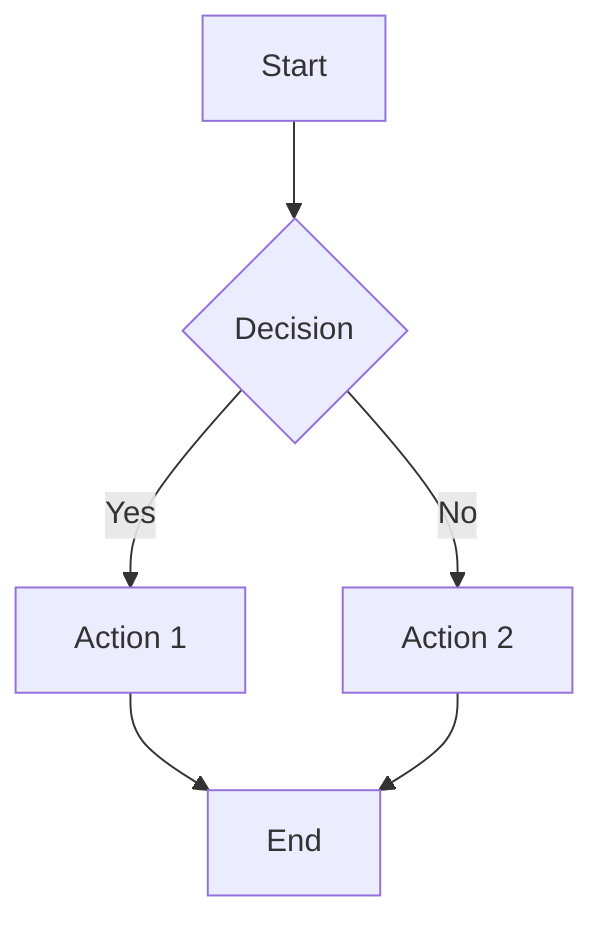
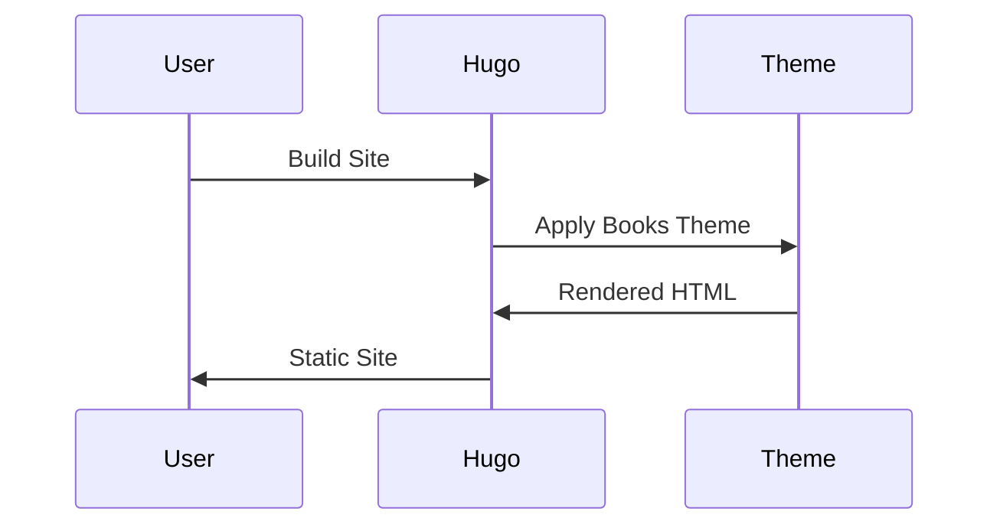
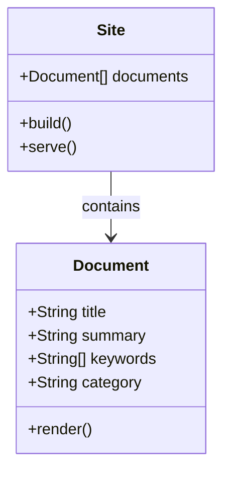

# Mermaid Diagram Test

This document tests various Mermaid diagram types to ensure they render correctly.

## Flowchart

## Sequence Diagram

## Class Diagram

If all three diagrams above render as interactive SVG graphics instead of code blocks, then Mermaid is working correctly!