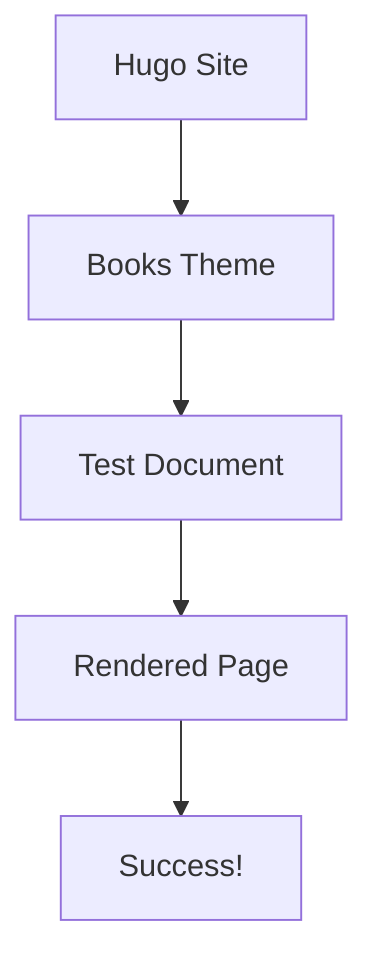

# Test Document

This is a test document to verify that Hugo and the Books theme are working correctly.

## Features to Test

### Table of Contents

This document should show a table of contents on the right side with the following sections:

- Features to Test
- Table of Contents  
- Mermaid Diagrams
- Code Blocks
- Lists and Formatting

### Mermaid Diagrams

Here's a test Mermaid diagram:



### Code Blocks

Here's a code block to test syntax highlighting:

```javascript
function testHugo() {
    console.log("Hugo and Books theme are working!");
    return true;
}
```

### Lists and Formatting

**Bold text** and *italic text* should render correctly.

1. Numbered list item 1
2. Numbered list item 2
3. Numbered list item 3

- Bullet point 1
- Bullet point 2
- Bullet point 3

> This is a blockquote to test formatting.

If you can see this document rendered properly with:
- Table of contents on the right
- Proper navigation in the sidebar
- Formatted text and code blocks
- The Mermaid diagram (if configured)

Then Hugo and the Books theme are working correctly!