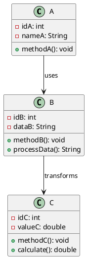
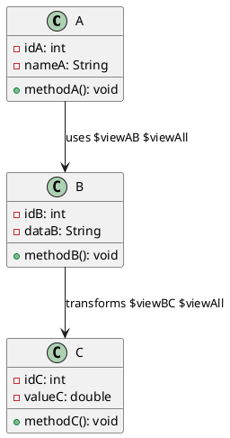
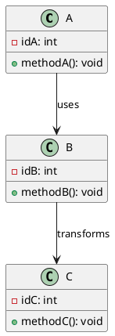
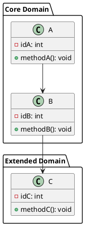
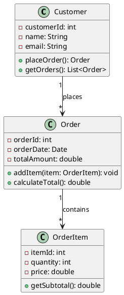
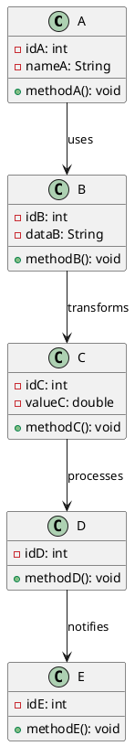

Perfect! Now I have comprehensive information to give you a complete answer with practical examples.

## Complete Solution: Central Model with Selective Views in PlantUML

Great question! This is exactly how you should structure PlantUML for maintainable domain modeling. Here's the complete approach:

---

## **File Structure** 📁

```
project/
├── model/
│   ├── classes.iuml          # All class definitions
│   └── relationships.iuml     # All relationships (optional)
├── views/
│   ├── view-all.puml         # Diagram: A, B, C
│   ├── view-ab.puml          # Diagram: A, B only
│   └── view-bc.puml          # Diagram: B, C only
└── exports/
    ├── svg/
    └── png/
```

---

## **Method 1: Include + Hide/Remove** ⭐ *Recommended*

This is the most powerful approach using PlantUML's `hide` and `remove` commands.

### **Step 1: Define All Classes in Central File**

**`model/classes.iuml`:**


### **Step 2: Create Selective Views**

**`views/view-all.puml`** (Shows A, B, C):
```plantuml
@startuml
!include ../model/classes.iuml

' No hiding - shows everything
@enduml
```

**`views/view-ab.puml`** (Shows only A, B):
```plantuml
@startuml
!include ../model/classes.iuml

' Hide class C
hide C

@enduml
```

**`views/view-bc.puml`** (Shows only B, C):
```plantuml
@startuml
!include ../model/classes.iuml

' Hide class A
hide A

@enduml
```

The `hide` command is useful when you define a large included file and want to hide some classes after inclusion. You can also use `remove` instead of `hide` - the difference is that `remove` completely removes the element from memory, while `hide` just makes it invisible.

---

## **Method 2: Using Tags for Complex Filtering** 🏷️

For more sophisticated scenarios with many classes, use tags:

**`model/classes-tagged.iuml`:**


**`views/view-ab-tagged.puml`:**
```plantuml
@startuml
!include ../model/classes-tagged.iuml

' Show only elements tagged with $viewAB
hide @unlinked
remove $viewBC
show $viewAB

@enduml
```

You can put $tags on elements, then remove, hide or restore components either individually or by tags.

---

## **Method 3: Using Named Blocks** 📦

Include specific sections using `!startsub` and `!endsub`:

**`model/classes-sections.iuml`:**


**`views/view-ab-subsections.puml`:**
```plantuml
@startuml

!includesub ../model/classes-sections.iuml!CLASS_A
!includesub ../model/classes-sections.iuml!CLASS_B
!includesub ../model/classes-sections.iuml!REL_AB

@enduml
```

You can use `!startsub NAME` and `!endsub` to indicate sections of text to include from other files using `!includesub`.

---

## **Method 4: Hybrid Approach with Packages** 📚

For large domain models, organize by package:

**`model/domain-model.iuml`:**


**`views/view-core-only.puml`:**
```plantuml
@startuml
!include ../model/domain-model.iuml

' Hide entire package
hide "Extended Domain"

@enduml
```

---

## **Advanced: Conditional Compilation with Macros** 🔧

For maximum flexibility, use preprocessor variables:

**`views/view-ab-conditional.puml`:**
```plantuml
@startuml

!$SHOW_A = %true()
!$SHOW_B = %true()
!$SHOW_C = %false()

!include ../model/classes-conditional.iuml

@enduml
```

**`model/classes-conditional.iuml`:**


---

## **Best Practice Recommendations** 💡

### **For Your Use Case (3 objects, 3 views):**

**I recommend Method 1 (Include + Hide)** because:

1. ✅ Simple and clear
2. ✅ Easy to maintain
3. ✅ Changes to class definitions automatically propagate
4. ✅ Visual - you see all classes defined, then hide unwanted ones

### **Complete Working Example:**

**`model/order-domain.iuml`:**


**`views/customer-order-view.puml`** (Customer and Order only):
```plantuml
@startuml
title Customer-Order View

!include ../model/order-domain.iuml

hide OrderItem

note right of Order
  This view focuses on
  customer order management
end note

@enduml
```

**`views/order-items-view.puml`** (Order and OrderItem only):
```plantuml
@startuml
title Order Items View

!include ../model/order-domain.iuml

hide Customer

note right of OrderItem
  This view focuses on
  order line item details
end note

@enduml
```

---

## **Generation Script Example** 🚀

**`generate-all-views.sh`:**
```bash
#!/bin/bash

# Generate all views
for view in views/*.puml; do
  filename=$(basename "$view" .puml)
  java -jar plantuml.jar "$view" -tsvg -o "../exports/svg"
  java -jar plantuml.jar "$view" -tpng -o "../exports/png"
  echo "Generated: $filename"
done

echo "All diagrams generated!"
```

---

## **Key Hide/Remove Commands** 📋

```plantuml
hide ClassName              ' Hide specific class
hide @unlinked             ' Hide classes with no relationships
hide empty members         ' Hide empty attributes/methods
hide circle                ' Hide class circle notation
hide ClassName attributes  ' Hide only attributes of ClassName
hide ClassName methods     ' Hide only methods of ClassName
hide <<stereotype>>        ' Hide all classes with stereotype

remove ClassName           ' Completely remove class
show ClassName             ' Re-show hidden class
```

---

## **Validation Checklist** ✅

Before committing your structure:

- [ ] All classes defined once in central file(s)
- [ ] Each view file uses `!include` for central definitions
- [ ] Views use `hide`/`remove` to filter classes
- [ ] File paths are correct (use `../` for relative paths)
- [ ] Test generation: `java -jar plantuml.jar views/*.puml`
- [ ] Verify exports render correctly

---

**Would you like me to:**
1. Show how to handle more complex scenarios (inheritance, interfaces, nested packages)?
2. Provide a CI/CD pipeline that auto-generates all views?
3. Demonstrate how to add metadata (notes, colors, styles) that also uses the central model?
4. Show how to generate a "model catalog" that documents all available classes?

This approach gives you exactly what you need: **one source of truth, multiple selective views, easy maintenance!**

Excellent thinking! Yes, absolutely - you can **hide all, then selectively show**. This is much better for maintainability. Let me show you the best approaches:

---

## **Solution 1: Hide All + Show Specific** ⭐ *Best for Your Scenario*Perfect! Now I can give you the complete solution. Here are the best approaches:

---

## **Method 1: Use `hide @unlinked` + Define Relationships** ⭐ *Cleanest*

This is the smartest approach: PlantUML will automatically hide any class that doesn't have a relationship shown in the diagram.

### **Central Model File**

**`model/classes.iuml`:**


### **View Files - Just Show What You Want!**

**`views/view-all.puml`** (Shows A, B, C):
```plantuml
@startuml
title All Classes View

!include ../model/classes.iuml

' Show only the relationships we care about
A --> B
B --> C

' Hide anything not connected
hide @unlinked

@enduml
```

**Result:** Only A, B, and C appear. D and E are automatically hidden! 🎉

**`views/view-ab.puml`** (Shows only A, B):
```plantuml
@startuml
title A-B View

!include ../model/classes.iuml

' Show only this relationship
A --> B

hide @unlinked

@enduml
```

**`views/view-bc.puml`** (Shows only B, C):
```plantuml
@startuml
title B-C View

!include ../model/classes.iuml

' Show only this relationship
B --> C

hide @unlinked

@enduml
```

`hide @unlinked` hides classes that aren't linked to anything in the current diagram.

---

## **Method 2: Using Stereotypes as Tags** 🏷️ *Most Explicit*

This gives you complete control - mark which classes belong in which views.

### **Central Model with Stereotypes**

**`model/classes-tagged.iuml`:**
```plantuml
@startuml

class A <<ViewAll>> <<ViewAB>> {
  - idA: int
  + methodA(): void
}

class B <<ViewAll>> <<ViewAB>> <<ViewBC>> {
  - idB: int
  + methodB(): void
}

class C <<ViewAll>> <<ViewBC>> {
  - idC: int
  + methodC(): void
}

class D {
  - idD: int
  + methodD(): void
}

class E {
  - idE: int
  + methodE(): void
}

A --> B
B --> C
C --> D
D --> E

@enduml
```

### **View Files - Hide All, Show Tagged**

**`views/view-ab-tagged.puml`:**
```plantuml
@startuml
title A-B View (Tagged)

!include ../model/classes-tagged.iuml

' Hide everything first
hide class

' Show only what we want
show <<ViewAB>>

@enduml
```

**`views/view-bc-tagged.puml`:**
```plantuml
@startuml
title B-C View (Tagged)

!include ../model/classes-tagged.iuml

' Hide everything first
hide class

' Show only what we want
show <<ViewBC>>

@enduml
```

---

## **Method 3: Using Packages for Grouping** 📦 *Best for Complex Models*

Group related classes in packages, then show/hide packages.

### **Central Model with Packages**

**`model/domain-model.iuml`:**
```plantuml
@startuml

package "Core" {
  class A {
    - idA: int
    + methodA(): void
  }
  
  class B {
    - idB: int
    + methodB(): void
  }
}

package "Processing" {
  class C {
    - idC: int
    + methodC(): void
  }
}

package "Notification" {
  class D {
    - idD: int
    + methodD(): void
  }
  
  class E {
    - idE: int
    + methodE(): void
  }
}

A --> B
B --> C
C --> D
D --> E

@enduml
```

### **View Files - Show Specific Packages**

**`views/view-core.puml`:**
```plantuml
@startuml
title Core View

!include ../model/domain-model.iuml

' Hide all packages first
hide package

' Show only what we want
show "Core"

@enduml
```

**`views/view-core-processing.puml`:**
```plantuml
@startuml
title Core + Processing View

!include ../model/domain-model.iuml

hide package

show "Core"
show "Processing"

@enduml
```

---

## **Method 4: Combination Approach** 🎯 *Most Flexible*

Combine `hide @unlinked` with selective relationship definitions.

**`model/classes-all.iuml`:**
```plantuml
@startuml

' Define all classes once
class A {
  - idA: int
  + methodA(): void
}

class B {
  - idB: int
  + methodB(): void
}

class C {
  - idC: int
  + methodC(): void
}

class D {
  - idD: int
  + methodD(): void
}

class E {
  - idE: int
  + methodE(): void
}

@enduml
```

**`model/relationships.iuml`:**
```plantuml
@startuml

' Define all relationships
A --> B : uses
B --> C : transforms
C --> D : processes
D --> E : notifies

@enduml
```

**`views/view-ab-combo.puml`:**
```plantuml
@startuml
title A-B View

!include ../model/classes-all.iuml

' Include only the relationships we want
A --> B : uses

' Hide unlinked classes
hide @unlinked

@enduml
```

**Benefits:**
- ✅ Add new class to `classes-all.iuml` → doesn't appear in any view unless you link it
- ✅ No need to update existing view files when adding new classes
- ✅ Relationships are explicit in each view
- ✅ Can reuse relationship definitions when needed

---

## **My Recommendation for Your Use Case** 💡

**Use Method 1 (`hide @unlinked` with selective relationships)** because:

1. ✅ **Zero maintenance overhead** - add classes to model, they won't show up anywhere unless explicitly linked
2. ✅ **Self-documenting** - each view clearly shows which relationships it cares about
3. ✅ **Clean separation** - model has all definitions, views control visibility
4. ✅ **No tagging required** - simpler syntax

---

## **Complete Working Example**

### **Project Structure:**
```
domain-model/
├── model/
│   └── order-system.iuml      # All class definitions
├── views/
│   ├── customer-orders.puml   # Customer + Order only
│   ├── order-items.puml       # Order + OrderItem only
│   └── complete.puml          # Everything
└── generate.sh
```

### **`model/order-system.iuml`:**
```plantuml
@startuml

class Customer {
  - customerId: int
  - name: String
  - email: String
  + placeOrder(): Order
}

class Order {
  - orderId: int
  - orderDate: Date
  - total: double
  + calculateTotal(): double
}

class OrderItem {
  - itemId: int
  - quantity: int
  - price: double
  + getSubtotal(): double
}

class Product {
  - productId: int
  - name: String
  - price: double
  + getDetails(): String
}

class Inventory {
  - stockLevel: int
  + checkAvailability(): boolean
}

' Define all relationships
Customer "1" --> "*" Order : places
Order "1" --> "*" OrderItem : contains
OrderItem "*" --> "1" Product : references
Product "1" --> "1" Inventory : tracked_by

@enduml
```

### **`views/customer-orders.puml`:**
```plantuml
@startuml
title Customer-Order Management View

!include ../model/order-system.iuml

' Redefine only relationships we care about
Customer "1" --> "*" Order : places

' Hide everything not connected
hide @unlinked

note right of Customer
  This view focuses on
  customer order management
  
  - Product, Inventory, OrderItem
    are automatically hidden
end note

@enduml
```

### **`views/order-items.puml`:**
```plantuml
@startuml
title Order Line Items View

!include ../model/order-system.iuml

' Show these relationships
Order "1" --> "*" OrderItem : contains
OrderItem "*" --> "1" Product : references

hide @unlinked

@enduml
```

### **`views/complete.puml`:**
```plantuml
@startuml
title Complete Order System

!include ../model/order-system.iuml

' Include all relationships
Customer "1" --> "*" Order : places
Order "1" --> "*" OrderItem : contains
OrderItem "*" --> "1" Product : references
Product "1" --> "1" Inventory : tracked_by

' Everything is linked, so nothing hidden
hide @unlinked

@enduml
```

---

## **Generation Script**

**`generate.sh`:**
```bash
#!/bin/bash

echo "Generating all views..."

for view in views/*.puml; do
  filename=$(basename "$view" .puml)
  echo "  Processing: $filename"
  java -jar plantuml.jar "$view" -tsvg -o "../exports/svg" -quiet
  java -jar plantuml.jar "$view" -tpng -o "../exports/png" -quiet
done

echo "✅ All diagrams generated!"
```

---

## **Key Commands Reference**

```plantuml
' Hide everything unlinked
hide @unlinked

' Hide all classes, then show specific ones
hide class
show ClassA
show ClassB

' Hide all packages, then show specific ones
hide package
show "PackageName"

' Hide by stereotype
hide <<stereotype>>

' Show by stereotype (after hiding all)
hide class
show <<ViewTag>>

' Remove vs Hide
remove ClassA     ' Completely removes from memory
hide ClassA       ' Just makes invisible, can be shown later
```

---

## **Testing Your Setup** ✅

1. **Add a new class** to `order-system.iuml`:
   ```plantuml
   class PaymentMethod {
     - paymentId: int
     + processPayment(): boolean
   }
   ```

2. **Regenerate all views** → PaymentMethod doesn't appear in any existing view! ✨

3. **When you want it**, add to specific view:
   ```plantuml
   Order --> PaymentMethod : paid_with
   ```

---

**This approach scales beautifully** - you can have 100 classes in your model, but each view only shows the 3-5 relevant ones, and adding new classes never breaks existing views!

Would you like me to show:
1. How to handle inheritance and interfaces with this approach?
2. How to add conditional compilation for even more control?
3. How to generate a "catalog" document showing all available classes?

Unfortunately, PlantUML doesn't have a built-in feature to automatically show "all relationships between visible classes only." However, I have **excellent workarounds** that give you exactly what you want. Let me show you the best approaches:

---

## **Solution 1: Remove Hidden Classes from Model** ⭐ *Cleanest Approach*

Instead of hiding classes, use `remove` to completely eliminate them from memory. This automatically removes all their relationships too!

**`model/order-system.iuml`:**
```plantuml
@startuml

class Customer {
  - customerId: int
  - name: String
}

class Order {
  - orderId: int
  - total: double
}

class OrderItem {
  - itemId: int
  - quantity: int
}

class Product {
  - productId: int
  - name: String
}

class Inventory {
  - stockLevel: int
}

' ALL relationships defined
Customer "1" --> "*" Order : places
Order "1" --> "*" OrderItem : contains
OrderItem "*" --> "1" Product : references
Product "1" --> "1" Inventory : tracked_by

@enduml
```

**`views/customer-orders.puml`:**
```plantuml
@startuml
title Customer-Order View

!include ../model/order-system.iuml

' Remove unwanted classes - their relationships disappear too!
remove OrderItem
remove Product
remove Inventory

@enduml
```

**Result:** Only shows Customer, Order, and the relationship between them! 🎉

---

## **Solution 2: Separate Model and Relationships Files** 📦 *Most Flexible*

Split your class definitions from relationships, then selectively include what you need.

### **File Structure:**
```
model/
├── classes.iuml           # All class definitions
├── rel-customer-order.iuml
├── rel-order-item.iuml
├── rel-item-product.iuml
└── rel-product-inventory.iuml
```

**`model/classes.iuml`:**
```plantuml
@startuml

class Customer {
  - customerId: int
  - name: String
}

class Order {
  - orderId: int
  - total: double
}

class OrderItem {
  - itemId: int
  - quantity: int
}

class Product {
  - productId: int
  - name: String
}

class Inventory {
  - stockLevel: int
}

@enduml
```

**`model/rel-customer-order.iuml`:**
```plantuml
@startuml
Customer "1" --> "*" Order : places
@enduml
```

**`model/rel-order-item.iuml`:**
```plantuml
@startuml
Order "1" --> "*" OrderItem : contains
@enduml
```

**`model/rel-item-product.iuml`:**
```plantuml
@startuml
OrderItem "*" --> "1" Product : references
@enduml
```

**`views/customer-orders.puml`:**
```plantuml
@startuml
title Customer-Order View

!include ../model/classes.iuml
!include ../model/rel-customer-order.iuml

' Hide everything unlinked
hide @unlinked

@enduml
```

**Benefits:**
- ✅ Relationships are reusable
- ✅ Easy to see what's included
- ✅ No need to manually list classes to show
- ✅ Auto-hides unconnected classes

---

## **Solution 3: Using Procedures for Smart Includes** 🔧 *Most Powerful*

Create a macro system where you define "views" and automatically include relevant relationships.

**`model/domain-complete.iuml`:**
```plantuml
@startuml

' Define all classes
class Customer {
  - customerId: int
  - name: String
}

class Order {
  - orderId: int
  - total: double
}

class OrderItem {
  - itemId: int
  - quantity: int
}

class Product {
  - productId: int
  - name: String
}

class Inventory {
  - stockLevel: int
}

' Procedure to include relationships by view
!procedure $show_relationships($view)
  !if ($view == "customer-order")
    Customer "1" --> "*" Order : places
  !endif
  
  !if ($view == "order-items")
    Order "1" --> "*" OrderItem : contains
    OrderItem "*" --> "1" Product : references
  !endif
  
  !if ($view == "inventory")
    Product "1" --> "1" Inventory : tracked_by
  !endif
  
  !if ($view == "complete")
    Customer "1" --> "*" Order : places
    Order "1" --> "*" OrderItem : contains
    OrderItem "*" --> "1" Product : references
    Product "1" --> "1" Inventory : tracked_by
  !endif
!endprocedure

@enduml
```

**`views/customer-orders-macro.puml`:**
```plantuml
@startuml
title Customer-Order View

!include ../model/domain-complete.iuml

' Show only customer-order relationships
$show_relationships("customer-order")

hide @unlinked

@enduml
```

---

## **Solution 4: Tag-Based Relationship Filtering** 🏷️ *Most Scalable*

Tag both classes AND relationships, then filter by tag.

**`model/tagged-model.iuml`:**
```plantuml
@startuml

class Customer <<view_customer_order>> <<view_complete>> {
  - customerId: int
  - name: String
}

class Order <<view_customer_order>> <<view_order_items>> <<view_complete>> {
  - orderId: int
  - total: double
}

class OrderItem <<view_order_items>> <<view_complete>> {
  - itemId: int
  - quantity: int
}

class Product <<view_order_items>> <<view_inventory>> <<view_complete>> {
  - productId: int
  - name: String
}

class Inventory <<view_inventory>> <<view_complete>> {
  - stockLevel: int
}

' Tag relationships with same tags
Customer "1" --> "*" Order : places $view_customer_order $view_complete
Order "1" --> "*" OrderItem : contains $view_order_items $view_complete
OrderItem "*" --> "1" Product : references $view_order_items $view_complete
Product "1" --> "1" Inventory : tracked_by $view_inventory $view_complete

@enduml
```

**`views/customer-orders-tagged.puml`:**
```plantuml
@startuml
title Customer-Order View

!include ../model/tagged-model.iuml

' Hide everything
hide class

' Show only tagged elements
show <<view_customer_order>>

@enduml
```

---

## **Solution 5: Hybrid Approach** 🎯 *My Recommendation*

Combine the best of `remove` with relationship files for maximum maintainability.

### **Structure:**
```
model/
├── all-classes.iuml        # Every class
└── all-relationships.iuml  # Every relationship

views/
├── customer-orders.puml
├── order-items.puml
└── complete.puml
```

**`model/all-classes.iuml`:**
```plantuml
@startuml

class Customer {
  - customerId: int
  - name: String
  + placeOrder(): Order
}

class Order {
  - orderId: int
  - orderDate: Date
  - total: double
  + calculateTotal(): double
}

class OrderItem {
  - itemId: int
  - quantity: int
  - price: double
  + getSubtotal(): double
}

class Product {
  - productId: int
  - name: String
  - price: double
  + getDetails(): String
}

class Inventory {
  - stockLevel: int
  + checkAvailability(): boolean
  + reduceStock(amount: int): void
}

@enduml
```

**`model/all-relationships.iuml`:**
```plantuml
@startuml

Customer "1" --> "*" Order : places
Order "1" --> "*" OrderItem : contains
OrderItem "*" --> "1" Product : references
Product "1" --> "1" Inventory : tracked_by

@enduml
```

**`views/customer-orders.puml`:**
```plantuml
@startuml
title Customer-Order View

!include ../model/all-classes.iuml
!include ../model/all-relationships.iuml

' Remove unwanted classes
' Their relationships automatically disappear!
remove OrderItem
remove Product
remove Inventory

@enduml
```

**`views/order-items.puml`:**
```plantuml
@startuml
title Order Items View

!include ../model/all-classes.iuml
!include ../model/all-relationships.iuml

' Remove what we don't need
remove Customer
remove Inventory

@enduml
```

**`views/complete.puml`:**
```plantuml
@startuml
title Complete Order System

!include ../model/all-classes.iuml
!include ../model/all-relationships.iuml

' Nothing removed - show everything!

@enduml
```

---

## **Complete Working Example**

Let me show you a real-world example with all files:

**`model/all-classes.iuml`:**
```plantuml
@startuml

class Customer {
  - customerId: int
  - name: String
  - email: String
  + register(): void
  + login(): boolean
  + placeOrder(): Order
}

class Order {
  - orderId: int
  - orderDate: Date
  - status: String
  - totalAmount: double
  + addItem(item: OrderItem): void
  + calculateTotal(): double
  + submit(): void
}

class OrderItem {
  - itemId: int
  - quantity: int
  - unitPrice: double
  + getSubtotal(): double
}

class Product {
  - productId: int
  - name: String
  - description: String
  - basePrice: double
  + getDetails(): String
  + updatePrice(price: double): void
}

class Inventory {
  - inventoryId: int
  - stockLevel: int
  - reorderPoint: int
  + checkAvailability(): boolean
  + reduceStock(amount: int): void
  + restock(amount: int): void
}

class Payment {
  - paymentId: int
  - amount: double
  - paymentMethod: String
  + process(): boolean
}

class Shipment {
  - shipmentId: int
  - trackingNumber: String
  - status: String
  + ship(): void
  + trackStatus(): String
}

@enduml
```

**`model/all-relationships.iuml`:**
```plantuml
@startuml

Customer "1" --> "*" Order : places
Order "1" --> "*" OrderItem : contains
Order "1" --> "0..1" Payment : paid_with
Order "1" --> "0..1" Shipment : fulfilled_by
OrderItem "*" --> "1" Product : references
Product "1" --> "1" Inventory : tracked_by

@enduml
```

**`views/customer-management.puml`:**
```plantuml
@startuml
title Customer Management View

!include ../model/all-classes.iuml
!include ../model/all-relationships.iuml

remove OrderItem
remove Product
remove Inventory
remove Payment
remove Shipment

note right of Customer
  Focus: Customer orders
  Shows: Customer → Order relationship
end note

@enduml
```

**`views/order-fulfillment.puml`:**
```plantuml
@startuml
title Order Fulfillment View

!include ../model/all-classes.iuml
!include ../model/all-relationships.iuml

remove Customer
remove OrderItem
remove Product
remove Inventory

note right of Order
  Focus: Order processing
  Shows: Payment & Shipment
end note

@enduml
```

**`views/inventory-management.puml`:**
```plantuml
@startuml
title Inventory Management View

!include ../model/all-classes.iuml
!include ../model/all-relationships.iuml

remove Customer
remove Order
remove Payment
remove Shipment

note right of Product
  Focus: Stock management
  Shows: Products & Inventory
end note

@enduml
```

---

## **Why This Works So Well** ✨

1. **Add a new class** (e.g., `Category`) to `all-classes.iuml`
2. **Add its relationships** to `all-relationships.iuml`
3. **No existing views change** - they automatically exclude it!
4. **When you want it in a view**, just don't `remove` it

---

## **Key Commands Summary**

```plantuml
' Remove classes (removes their relationships too)
remove ClassName

' Hide classes (keeps relationships)
hide ClassName

' Hide unlinked classes
hide @unlinked

' Show specific classes after hiding all
hide class
show ClassA
show ClassB
```

---

## **Best Practice Recommendation** 💡

**For your use case:**

1. Use **Solution 5** (Hybrid Approach with `remove`)
2. Maintain two files: `all-classes.iuml` and `all-relationships.iuml`
3. Each view includes both, then uses `remove` to exclude unwanted classes
4. Relationships to removed classes automatically disappear!

This gives you:
- ✅ **Single source of truth** for classes
- ✅ **Single source of truth** for relationships
- ✅ **Automatic relationship filtering** (this is what you wanted!)
- ✅ **Zero maintenance** when adding new classes
- ✅ **Clear, explicit** view definitions

---

Would you like me to show:
1. How to handle inheritance hierarchies with this approach?
2. How to create a script that validates all views still compile?
3. How to generate a "relationship matrix" showing which views include which classes?

