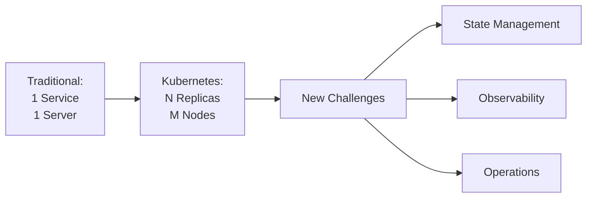
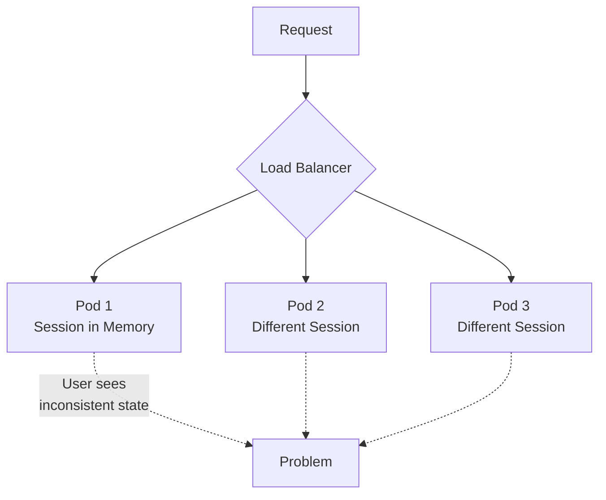
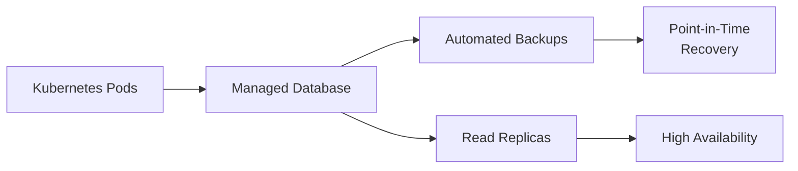
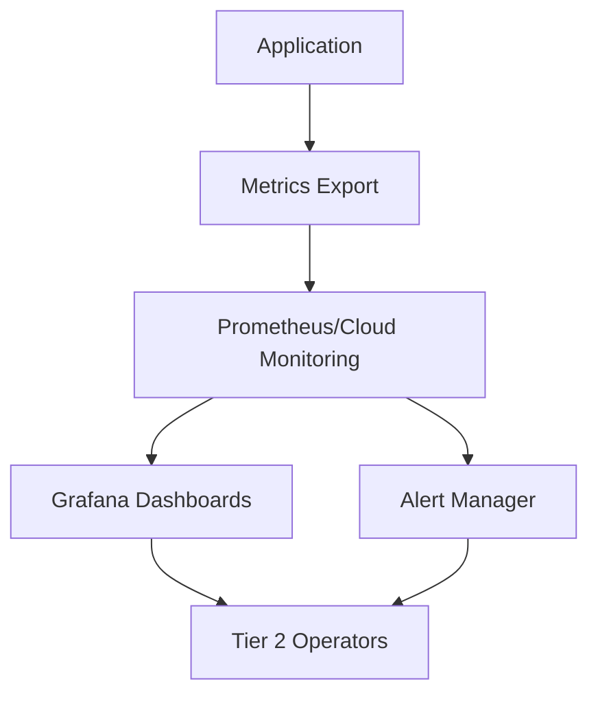
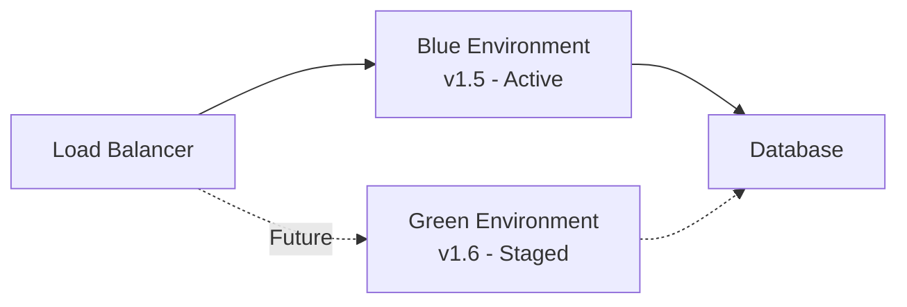
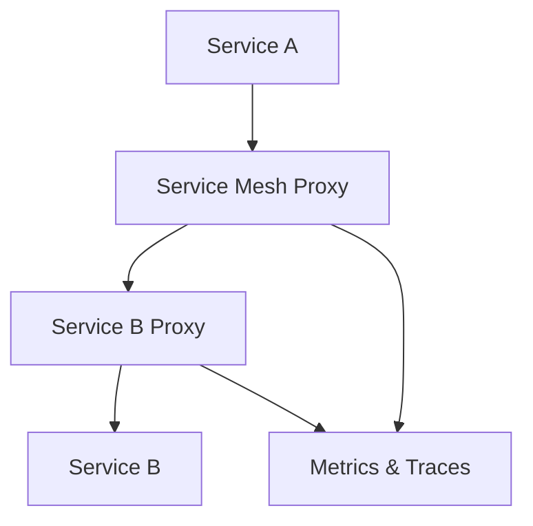
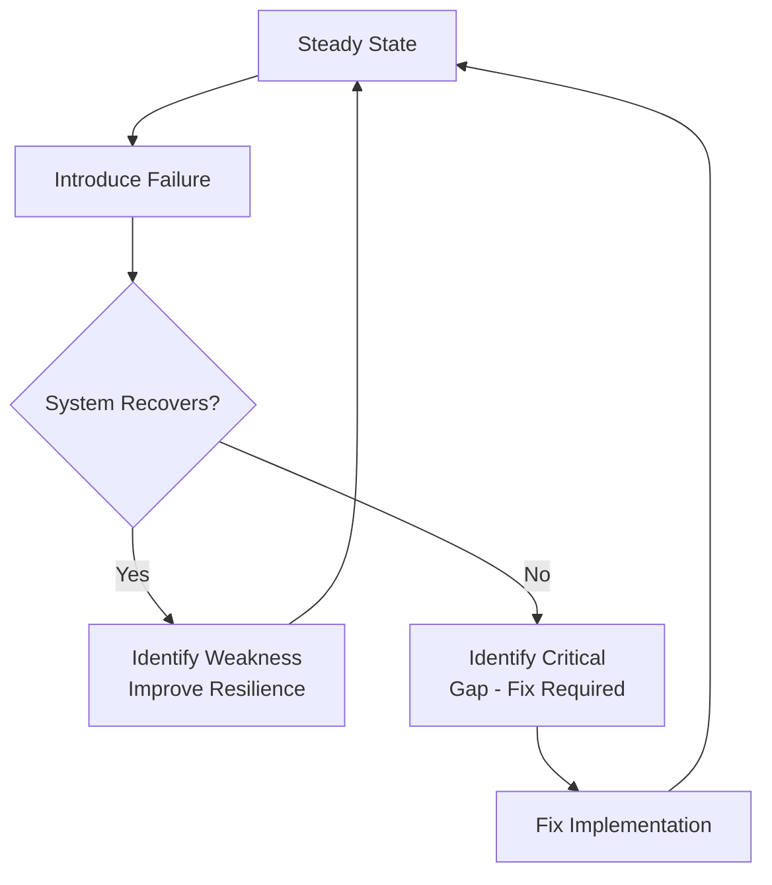

# Production Readiness Guide: From Docker Compose to Kubernetes

## Introduction

This guide bridges the gap between traditional single-server deployments and cloud-native Kubernetes environments. If you've spent years deploying applications on Unix servers or PC hardware, where each service runs as a single process on a known machine, the shift to distributed systems represents both an operational paradigm change and an architectural evolution.

The fundamental difference is deceptively simple: instead of one copy of your service running on one machine, you now have N copies running across M nodes, managed by an orchestrator you don't directly control. This change ripples through every aspect of operations—from how you think about state and storage, to how you diagnose failures, to what your operators need to know to keep systems running.

This guide focuses on the operational and architectural considerations that matter when your application must scale, survive failures, and be supported by operations personnel who may not be developers. We'll explore what changes when you move from docker-compose with single replicas to Kubernetes with multiple replicas, and what you need to build to ensure your Tier 2 operations team can handle issues without constantly escalating to your development team.



## 1. Understanding the Replica Reality: Is Your Application Really Stateless?

When you've only ever run one copy of each service, you've never truly tested whether your application can handle multiple concurrent replicas. Hidden assumptions about uniqueness, file system access, and in-memory state can surface immediately when you scale to multiple pods.

### The Single-Replica Trap

Applications developed and tested with single replicas often contain patterns that break under distribution:

**In-memory caching** that assumes all requests hit the same process. User sessions stored in application memory work fine with one replica but fail randomly when load-balanced across multiple pods.

**File system operations** that treat local disk as shared storage. If one replica writes files that another expects to read, you'll encounter intermittent failures based on which pod handles which request.

**Sequential processing assumptions** where developers expect operations to complete in order because there's only one processor. With multiple replicas, race conditions emerge.

**Singleton patterns and global state** that work perfectly when there's truly only one instance, but create conflicts when replicated.

### Discovery Through Testing

Before you go to production, you must validate true statelessness:

- **Run multiple replicas in staging** - Deploy at least 3 replicas of each service and run your test suite. Many race conditions only appear with 3+ replicas.

- **Session affinity testing** - Disable sticky sessions and verify users can complete transactions even when each request hits a different replica.

- **File system audit** - Identify every filesystem write. Ask: does this need to be persistent? Shared? Should it use object storage instead?

- **Load testing with replica variation** - Test with 2 replicas, then 5, then 10. Watch for errors that correlate with replica count changes.

- **Chaos testing** - Kill random pods during load tests. Does the application recover gracefully?

### Common Patterns That Need Attention



**Sessions**: Move to distributed session stores (Redis, managed cache services) or use stateless JWT tokens.

**Uploads and generated files**: Use object storage (S3, GCS, Azure Blob) instead of local filesystem. Every replica must access the same storage.

**Background jobs**: Ensure job queues prevent duplicate processing. Multiple replicas shouldn't pick up the same work item.

**Database connections**: Connection pools per replica can overwhelm databases. Use connection pooling proxies or managed database connection management.

**Caching**: Implement distributed caching or accept cache inconsistency. Document which caches are per-pod vs. shared.

### Testing Strategy

Create a test plan specifically for multi-replica behavior:

1. **Smoke tests with replica scaling** - Deploy, scale to N replicas, run tests, scale to N+5, run tests again
2. **Concurrent user simulation** - Load testing tools that hit different replicas per request
3. **Data consistency validation** - Verify that operations produce identical results regardless of which replica processes them
4. **Failure injection** - Kill pods, restart pods, network partition pods during active transactions

The goal is to discover state-related issues before production deployment, not during a critical outage.

## 2. Data Durability: Protecting What Matters

In distributed systems, durability requires conscious architecture. The ephemeral nature of containers means nothing stored in a pod's filesystem survives that pod's termination. Understanding what needs to persist, where it lives, and how it's protected becomes critical.

### The Persistence Hierarchy

Not all data is equal. Categorize your data by criticality:

**Mission-critical data** that must survive any failure: user transactions, financial records, compliance data. This belongs in managed databases with automated backups, point-in-time recovery, and high availability configurations.

**Important application state** that's expensive to regenerate: cached computations, processed datasets, user uploads. Store in persistent volumes with backup strategies or object storage with versioning.

**Temporary working data** that can be safely lost: in-progress calculations, request logs not yet shipped to log aggregation. Ephemeral storage is fine.

**Derived data** that can be rebuilt: materialized views, aggregated reports, search indexes. Consider whether the rebuild cost justifies backup complexity.

### Database Strategy for Kubernetes

Since you're using cloud-managed databases external to Kubernetes, your durability strategy simplifies significantly:

**Leverage managed services**: Use RDS, Cloud SQL, Azure Database services. These provide automated backups, replication, and point-in-time recovery without you building the infrastructure.

**Define RPO and RTO**: Recovery Point Objective (how much data can you afford to lose?) and Recovery Time Objective (how quickly must you recover?) drive your backup frequency and testing requirements.

**Test restores regularly**: Backups you've never restored are just hope, not disaster recovery. Schedule quarterly restore drills to non-production environments.

**Monitor backup completion**: Treat backup failures as critical alerts. A month of failed backups means you're no longer protected.



### Persistent Volumes for Application Data

When applications need persistent storage beyond databases:

**StatefulSets vs. Deployments** - Use StatefulSets when pods need stable, persistent storage. Each pod gets its own persistent volume that follows it through restarts.

**Storage classes and performance** - Understand the performance characteristics of your cloud provider's storage options. Not all persistent volumes are equally fast.

**Backup strategies for volumes** - Cloud providers offer volume snapshots. Implement scheduled snapshots for important application volumes, but recognize these are point-in-time and may not capture in-flight transactions.

**Volume expansion planning** - Start with adequate space and monitor usage. Some storage classes support online expansion; others require downtime.

### Object Storage for Unstructured Data

User uploads, generated reports, and files belong in object storage, not in pods or persistent volumes:

**Versioning and lifecycle policies** - Enable versioning to protect against accidental deletion. Implement lifecycle rules to archive or delete old versions.

**Cross-region replication** - For disaster recovery, replicate critical buckets to another region.

**Access patterns and costs** - Frequent access vs. archive storage have different performance and cost profiles. Design accordingly.

### Disaster Recovery Planning

Beyond backups, you need tested procedures:

**Document recovery procedures** - Step-by-step instructions for restoring from backup to a functioning system. Include database restores, volume restores, and configuration restoration.

**Practice disaster scenarios** - At least annually, perform a full disaster recovery test. Can you rebuild the entire system from backups in a reasonable timeframe?

**Communication plans** - Who needs to know about data loss incidents? What's the escalation path? Document this before you need it.

## 3. Observability: Enabling Tier 2 Operations

Your operations team needs to diagnose and resolve issues without understanding your codebase. This requires thoughtfully designed observability—metrics, logs, and dashboards that surface problems and their probable causes.

### The Three Pillars for Operations

**Metrics** answer "what is happening?" - Request rates, error rates, resource utilization, queue depths. These should be aggregated across all replicas.

**Logs** answer "why did this happen?" - Structured logs with correlation IDs that let operators trace a request across multiple services and replicas.

**Traces** answer "where is the bottleneck?" - Distributed tracing shows request flow through your microservices, highlighting slow or failing components.

For Tier 2 operations, metrics and logs are most immediately actionable. Traces are powerful for Tier 3 deep dives.

### Designing Metrics That Matter

Avoid metric sprawl. Focus on metrics that indicate health and enable diagnosis:

**Golden signals** for each service:
- Request rate (requests per second)
- Error rate (percentage of requests failing)
- Latency (response time distribution)
- Saturation (resource utilization - CPU, memory, connections)

**Infrastructure metrics**:
- Pod restart counts (indicates crashes)
- Node resource pressure (CPU, memory, disk)
- Persistent volume usage
- Network errors and retransmissions

**Application-specific metrics**:
- Business transaction rates (orders processed, reports generated)
- Queue depths and processing lag
- External dependency health (database, third-party APIs)
- Cache hit rates



### Structured Logging Strategy

Logs are only useful if operators can find relevant information quickly:

**Log levels with purpose**:
- ERROR: Something failed that requires attention
- WARN: Something unexpected but handled
- INFO: Normal business operations (transactions, state changes)
- DEBUG: Detailed information for troubleshooting (disabled in production by default)

**Structured format**: Use JSON logging with consistent fields:
- Timestamp with timezone
- Service name and version
- Pod/replica identifier
- Correlation ID (traces request across services)
- User/session identifier (when applicable)
- Message and context data

**Correlation is critical**: When a request flows through Service A → Service B → Service C, the correlation ID should flow through all three. This lets operators grep logs across services to understand a single transaction's path.

**Avoid log noise**: Don't log every request at INFO level in high-traffic services. Log errors, significant state changes, and business events. Trace-level detail should require explicit enablement.

### Grafana Dashboards for Operators

Design dashboards that answer common questions without requiring code knowledge:

**Service Health Dashboard** (one per service):
- Request rate over time
- Error rate and error types
- Response time percentiles (p50, p95, p99)
- Active replica count
- Pod restart frequency
- Recent error log samples

**Infrastructure Health Dashboard**:
- Node CPU and memory utilization
- Pod resource requests vs. limits vs. actual usage
- Persistent volume capacity and usage
- Network throughput and error rates

**Business Metrics Dashboard**:
- Transaction volumes by type
- Processing queue depths
- SLA compliance (if applicable)
- External dependency status

**Alert Status Dashboard**:
- Currently firing alerts
- Alert history and trends
- Alert fatigue metrics (alerts that fire but are ignored)

Each dashboard should have annotations explaining what metrics mean and what values suggest problems. For example: "Error rate above 1% indicates service degradation—check error logs."

### Alert Design Philosophy

Alerts should be actionable. If an alert fires but operators can't do anything about it, it's noise:

**Alert on symptoms, not causes**: Alert when users are impacted (high error rate), not on low-level metrics unless they reliably predict impact.

**Provide context**: Alert messages should include:
- What is wrong (service X error rate is 5%)
- Why it matters (users cannot complete transactions)
- Initial investigation steps (check pod logs for errors, verify database connectivity)
- Runbook link

**Avoid alert fatigue**: Too many alerts train operators to ignore them. Set thresholds carefully. Use warning vs. critical severity appropriately.

**Alert on trends**: Don't just alert when disk is 95% full—alert when disk usage is growing at a rate that will fill it within 24 hours. This provides time to act before crisis.

## 4. Runbooks: Empowering Non-Developer Operations

Runbooks transform tribal knowledge into executable procedures. Well-written runbooks let Tier 2 operators resolve issues independently, reserving Tier 3 escalation for truly novel problems.

### Anatomy of an Effective Runbook

A good runbook has consistent structure:

**Title and summary**: What problem does this address? Brief symptom description.

**Symptoms and detection**: How do operators know this is happening? What alerts fire? What do dashboards show?

**Impact assessment**: Is this affecting users? Partially or completely? Which features are degraded?

**Diagnosis steps**: How to confirm the root cause. Include commands to run, logs to check, metrics to examine.

**Resolution steps**: Numbered, sequential actions to resolve the issue. Each step should be precise enough for someone unfamiliar with the system.

**Escalation criteria**: When should this be escalated to Tier 3? What information should be collected before escalating?

**Prevention**: How can this be prevented in the future? Is this a symptom of needed architectural changes?

### Runbook Example 1: Pod Memory Thrashing

**Problem**: Pods repeatedly killed for OOM (Out Of Memory) and immediately rescheduled, creating a restart loop that degrades service.

**Symptoms**:
- High pod restart count for specific service (visible in Kubernetes dashboard)
- Alert: "ServiceX pod restart rate exceeds threshold"
- Grafana shows intermittent service availability
- Pod events show "OOMKilled" status

**Impact**: Service degraded or unavailable. Requests may timeout or return errors. Users experience intermittent failures.

**Diagnosis**:
1. Check pod restart count:
   ```
   kubectl get pods -n production | grep service-name
   ```
   Look for high RESTARTS count.

2. Examine pod events:
   ```
   kubectl describe pod <pod-name> -n production
   ```
   Look for "OOMKilled" in events section.

3. Check memory usage vs. limits:
   ```
   kubectl top pod <pod-name> -n production
   ```
   Compare memory usage against configured limits (visible in pod spec).

4. Review memory trends in Grafana: Navigate to Service Health dashboard, examine memory usage over past hour. Is memory climbing steadily or spiking?

**Root Cause Determination**:
- If memory usage approaches limit before killing: Memory limit too low for workload
- If memory climbs continuously until kill: Potential memory leak
- If memory spikes suddenly: Workload burst (e.g., large report generation)

**Resolution**:

For memory limit too low (most common):
1. Check current memory request and limit:
   ```
   kubectl get deployment <service-name> -n production -o yaml | grep -A 5 resources
   ```

2. Increase memory limit (requires deployment update—Tier 3 action):
   - Document current memory request/limit values
   - Document observed memory usage pattern
   - Escalate to Tier 3 with this data

3. Temporary mitigation: If service is completely down, reduce replica count to zero, then scale back to 1:
   ```
   kubectl scale deployment <service-name> -n production --replicas=0
   kubectl scale deployment <service-name> -n production --replicas=1
   ```
   This stops the restart loop temporarily. Alert Tier 3 immediately.

For suspected memory leak:
1. Collect heap dump (if application supports it) - Tier 3 action
2. Document memory growth rate
3. Escalate to Tier 3 with timeline and metrics

For workload burst:
1. Verify if spike correlates with known activity (report generation schedule, batch job)
2. If predictable, note timing for capacity planning discussion with Tier 3
3. If unpredictable, escalate for investigation

**Escalation Criteria**:
- Unable to determine root cause within 15 minutes
- Resolution requires deployment configuration changes
- Suspected application code issue (memory leak)
- Problem persists after temporary mitigation

**Prevention**: Regular capacity review. Memory limits should be set with 30% headroom above normal peak usage.

### Runbook Example 2: Financial Reporting Service Timeout

**Problem**: Financial report generation requests timeout after 60 seconds, preventing users from accessing monthly reports.

**Symptoms**:
- Alert: "ReportService response time p99 exceeds 60s"
- User reports: "I can't download this month's financial report"
- Grafana ReportService dashboard shows high latency for report generation endpoint
- Error logs show "Request timeout after 60000ms"

**Impact**: Users cannot generate or download financial reports. Critical for month-end closing processes.

**Diagnosis**:
1. Verify the specific report type failing:
   - Check error logs for report parameters:
     ```
     kubectl logs -n production deployment/report-service --tail=100 | grep "timeout"
     ```
   - Note report period, account range, or other parameters in timeout messages

2. Check database performance:
   - Navigate to Database Health dashboard in Grafana
   - Look for slow query alerts or high connection counts
   - Check if database CPU/memory is saturated

3. Examine report service resource usage:
   - Check Report Service dashboard for CPU/memory saturation
   - Compare current resource usage to baseline

4. Review recent changes:
   - Check deployment history: Has report service been updated recently?
   - Check data volume: Is this month's data significantly larger than previous months?
   - Check concurrent report requests: Are many users requesting reports simultaneously?

**Root Cause Determination**:
- Database slow query: Database dashboard shows high query time, low throughput
- Insufficient compute resources: Report service CPU at 100%
- Data volume spike: This month's transaction volume 5x normal
- Concurrent load: 20+ simultaneous report requests (normal is <5)

**Resolution**:

For database slow query:
1. Identify slow queries in database logs (if accessible)
2. Check for missing indexes or lock contention
3. Escalate to Tier 3 if query optimization needed
4. Temporary: Ask users to stagger report generation rather than requesting all at once

For insufficient compute resources:
1. Scale report service replicas to increase capacity:
   ```
   kubectl scale deployment report-service -n production --replicas=5
   ```
   (Current replica count is typically 2; scaling to 5 provides additional capacity)

2. Monitor for 5 minutes: Check if report completion rate improves

3. If improved, maintain higher replica count and notify Tier 3 for permanent capacity adjustment

4. If not improved, scale back and escalate

For data volume spike:
1. Verify transaction count for current period is anomalous
2. Confirm with business stakeholders if data volume is expected (e.g., acquisition, new customer onboarding)
3. Escalate to Tier 3 for query optimization and capacity planning
4. Temporary: Offer users ability to generate reports for sub-ranges (weekly instead of monthly) if report service supports it

For concurrent load:
1. Check if report requests correlate with month-end schedule
2. Implement request queuing if supported (check service documentation)
3. Communicate with users about staggering requests
4. Escalate to Tier 3 for capacity planning if this is a recurring monthly pattern

**Escalation Criteria**:
- Root cause unclear after 20 minutes of investigation
- Database performance issues persist
- Scaling replicas doesn't improve performance
- Problem occurs outside month-end period (suggests underlying issue)
- Users report critical business impact (month-end closing deadline)

**Prevention**: 
- Capacity testing before month-end with expected data volumes
- Query performance monitoring and optimization
- Implement report request queuing to smooth load
- Consider pre-generating common reports asynchronously

---

### Runbook Maintenance

Runbooks are living documents:

**Update after each incident**: If operators discover new diagnostic steps or resolution approaches, incorporate them immediately.

**Validate quarterly**: Test runbooks against non-production environments. Can a junior operator follow them successfully?

**Track escalation patterns**: If a runbook consistently leads to Tier 3 escalation, either the runbook is incomplete or the issue requires architectural changes.

**Link to monitoring**: Every runbook should be linked from relevant alerts and dashboard annotations.

## 5. Deployment Patterns: Blue/Green for Zero Downtime

Traditional deployments often involve downtime windows: stop the service, deploy new code, start the service. In a mission-critical environment supporting many downstream systems, downtime is not acceptable. Blue/green deployment provides a path to zero-downtime releases.

### What is Blue/Green Deployment?

Blue/green maintains two complete production environments: blue (current production) and green (new version). At any time, one environment is live and serving traffic. The other is idle or staging the next release.



**Deployment process**:
1. Blue is serving production traffic at v1.5
2. Deploy v1.6 to green environment
3. Test green environment thoroughly (smoke tests, health checks)
4. Switch traffic from blue to green
5. Monitor green for issues
6. If successful, blue becomes the standby environment for next release
7. If problems, switch traffic back to blue (instant rollback)

### Why Blue/Green for Your Context?

**Mission-critical dependency**: Downstream systems rely on your service. Any downtime cascades to those systems.

**Instant rollback**: If the new version has issues, reverting is a traffic switch, not a redeployment. Rollback takes seconds, not minutes.

**Pre-production validation**: The green environment is running the real production configuration. You can validate thoroughly before traffic hits it.

**Confidence in releases**: Operators know that any release can be undone instantly, reducing anxiety around deployments.

### Implementation in Kubernetes

Kubernetes supports blue/green through Services and label selectors:

**Label environments**: Pods are labeled with version (e.g., `version: blue` or `version: green`)

**Service selector**: The Kubernetes Service that fronts your application selects which version receives traffic:
```yaml
selector:
  app: financial-service
  version: blue
```

**Switching traffic**: Update the Service selector to point to green:
```yaml
selector:
  app: financial-service
  version: green
```

**Tools and automation**: Your CI/CD platform likely provides blue/green capabilities. Work with platform team to understand the mechanism.

### Considerations and Challenges

**Database migrations**: Both blue and green connect to the same database. Database schema changes must be backward-compatible with the previous version. Deploy schema changes separately, before application code changes.

**Stateful services**: Blue/green works best for stateless services. If services maintain state, switching traffic can be complex. This is another reason to validate true statelessness.

**Resource cost**: You're running two full environments. In cloud Kubernetes, this means paying for double the resources during deployment. Accepting this cost is part of achieving zero downtime.

**Health check design**: Green must pass comprehensive health checks before traffic switches. Design health endpoints that verify all dependencies.

### Rollback Decision Criteria

Define clear criteria for when to rollback:

**Automated rollback triggers**:
- Error rate exceeds threshold (e.g., 5% of requests failing)
- Response time degradation (e.g., p95 latency doubles)
- Health check failures

**Manual rollback criteria**:
- Customer reports of data inconsistency
- Critical functionality not working (even if error rate looks normal)
- Unexpected behavior in downstream systems

**Rollback window**: Define how long you monitor before declaring success. Typical: 30-60 minutes of green running with production traffic before decommissioning blue.

### Communication and Coordination

Blue/green requires coordination:

**Pre-deployment**: Notify operations team of deployment window. Ensure monitoring is active and operators are available.

**During deployment**: Real-time monitoring of metrics and logs as traffic switches to green.

**Post-deployment**: Clear "all clear" or "rollback initiated" communication.

**Runbook for rollback**: Operators should have a runbook for executing rollback, including who has authority to make the call.

## 6. Service Mesh: Traffic Management and Observability

A service mesh is infrastructure layer that handles service-to-service communication, providing features like traffic routing, load balancing, retries, circuit breaking, and observability without requiring changes to application code. For a distributed microservices architecture, service mesh addresses cross-cutting concerns that would otherwise need to be implemented in every service.

### What Problem Does Service Mesh Solve?

In a microservices architecture, services communicate frequently. Without a service mesh, each service must implement:

**Retry logic**: When Service A calls Service B and gets a transient failure, should it retry? How many times? With what backoff?

**Circuit breaking**: If Service B is consistently failing, Service A should stop calling it temporarily to avoid cascading failures.

**Load balancing**: When Service A calls Service B, which of the 5 replicas of Service B should receive the request?

**Observability**: How do you track request flow from Service A → Service B → Service C? How do you measure latency at each hop?

**Security**: How do you ensure traffic between services is encrypted? How do you verify service identity?

Implementing these in application code is repetitive, error-prone, and creates coupling. Service mesh moves these concerns to infrastructure.



### Core Service Mesh Capabilities

**Traffic management**: Fine-grained control over routing. Send 95% of traffic to stable version, 5% to new version (canary). Route requests from specific users to a test version. Implement timeouts and retries consistently.

**Resilience patterns**: Circuit breakers prevent cascading failures. Retries handle transient errors. Timeouts prevent resource exhaustion from slow services.

**Observability**: Automatic distributed tracing. Service-to-service latency metrics. Request success and failure rates between services. All without instrumentation code.

**Security**: Mutual TLS between services. Service identity and authorization. Traffic encryption without application code changes.

### When You Need Service Mesh

Service mesh adds complexity—containers, configuration, learning curve. Consider service mesh when:

**You have many microservices** (more than 5-10). The communication complexity justifies the infrastructure complexity.

**Inter-service communication is complex**: Services call each other frequently. Failure in one service impacts many others.

**Observability is difficult**: You struggle to understand request flow or identify bottlenecks across services.

**You need traffic control**: Canary deployments, A/B testing, or gradual rollouts are business requirements.

**Security requirements are stringent**: Mutual TLS and service identity verification are mandatory.

For simpler architectures (2-3 services with straightforward communication), service mesh may be overkill. Evaluate against your complexity and requirements.

### Integration Considerations

Introducing service mesh requires application awareness:

**Health checks**: Services must expose health endpoints. The mesh uses these to determine if a service replica is healthy.

**Graceful shutdown**: When a pod terminates, it should finish in-flight requests before exiting. The mesh uses this to drain traffic during rollouts.

**Connection handling**: Services should handle connection resets gracefully. The mesh may close connections as part of traffic management.

**Configuration**: While the mesh handles traffic routing, someone must configure the policies—timeout values, retry counts, circuit breaker thresholds.

### Service Mesh and Your Operations Team

Service mesh provides powerful observability tools for Tier 2:

**Service topology visualization**: Graphical view of which services call which others, with latency and error rates on each connection.

**Request tracing**: Click on a slow request and see its entire path through the system, with timing at each service.

**Traffic shifting**: During incidents, redirect traffic away from problematic service replicas without redeploying.

However, service mesh also requires new knowledge:

**New debugging surface**: When issues arise, is it application code, service mesh configuration, or mesh infrastructure? Operators need training to distinguish.

**Configuration complexity**: Misconfigured service mesh policies can cause outages. Change management for mesh configuration is critical.

**Runbooks updated**: Troubleshooting steps must account for the mesh. "Check service logs" becomes "Check service logs and mesh proxy logs."

## 7. Secrets and Configuration Management

Applications need configuration (database URLs, feature flags) and secrets (database passwords, API keys). In traditional deployments, these lived in config files on known servers. In Kubernetes, where pods are ephemeral and scheduled unpredictably, configuration must be externalized and secrets must be protected.

### Configuration vs. Secrets

**Configuration**: Non-sensitive data that varies between environments (dev/staging/production). Examples: service URLs, timeout values, feature flags, replica counts.

**Secrets**: Sensitive data that must be protected. Examples: database passwords, API keys, TLS certificates, encryption keys.

Separate these conceptually and technically. Configuration can be visible; secrets must be encrypted and access-controlled.

### Kubernetes ConfigMaps for Configuration

ConfigMaps store configuration data as key-value pairs or files, accessible to pods:

**Environment variables**: Inject configuration as environment variables into containers.

**Volume mounts**: Mount configuration files into containers at specific paths.

**Updates**: Changing a ConfigMap doesn't automatically restart pods. Decide if configuration changes require redeployment or if applications watch for changes.

**Per-environment**: Maintain separate ConfigMaps for dev, staging, production. Your CI/CD pipeline should deploy the correct ConfigMap for each environment.

### Kubernetes Secrets for Sensitive Data

Kubernetes Secrets store sensitive data, with some additional protections:

**Base64 encoding**: Secrets are base64-encoded (not encrypted by default). This prevents casual viewing but is not security.

**Encryption at rest**: Configure Kubernetes to encrypt Secrets at rest in etcd. Work with your platform team to verify this is enabled.

**Access control**: Use RBAC to limit which services can read which Secrets. Not every service needs access to every secret.

**Rotation**: Secrets should be rotated periodically (database passwords, API keys). Plan for how applications will pick up new secrets—typically requires pod restart.

### External Secrets Management

Many organizations use external secret management systems (HashiCorp Vault, AWS Secrets Manager, Azure Key Vault, Google Secret Manager) integrated with Kubernetes:

**Benefits**:
- Centralized secret management across multiple clusters
- Audit logging of secret access
- Automated rotation
- Fine-grained access policies

**Integration**: External secret operators sync secrets from external systems into Kubernetes Secrets, keeping applications unchanged while improving secret security.

If your platform team provides external secrets integration, use it. If not, Kubernetes Secrets are acceptable with proper encryption and access control.

### Configuration Management Strategy

**Immutable configuration**: Treat configuration as immutable within an environment. Don't change configuration in running production—deploy a new version with updated configuration. This ensures configuration changes are tracked and reproducible.

**Version control**: All ConfigMaps and Secret definitions (values redacted) should be in version control alongside application code. This provides history and rollback capability.

**Validation**: Validate configuration before deployment. Missing or malformed configuration should cause deployment failure in staging, not production.

**Documentation**: Document what each configuration value means and acceptable ranges. Operators may need to adjust values during incidents (e.g., increase timeouts during slow database performance).

### Secrets in Operations Runbooks

Runbooks should never include secrets. Instead:

**Reference secret locations**: "Database password is in Secret `db-credentials` key `password`"

**Describe retrieval process**: "To view current database connection string: `kubectl get secret db-credentials -n production -o yaml | grep connection-string`"

**Escalation for secret access**: If Tier 2 operators need to view secrets during troubleshooting, document the approval and audit process.

## 8. Pre-Production Validation and Testing

Before a distributed system goes to production, validation must go beyond "the tests pass." You must validate behavior under failure, load, and chaos—conditions that don't occur in development.

### Testing Pyramid for Distributed Systems

**Unit tests**: Verify individual component behavior. These remain important but don't validate distributed behavior.

**Integration tests**: Verify service-to-service communication. Test that Service A correctly calls Service B with expected contracts.

**End-to-end tests**: Verify complete user workflows across all services. Critical for catching cross-service issues.

**Load tests**: Verify performance and stability under expected and peak load. Identify bottlenecks and resource exhaustion.

**Chaos tests**: Verify resilience under failure conditions. Kill pods, introduce network latency, fill disks—does the system recover?

### Load Testing Strategy

Load testing answers: "Can this system handle production traffic?"

**Realistic traffic patterns**: Don't just hammer one endpoint. Simulate actual user behavior—browsing, transactions, reports—in realistic proportions.

**Baseline performance**: Establish performance baseline in staging with low load. Then increase load to identify degradation points.

**Sustained load**: Run at expected production load for hours, not minutes. Memory leaks and resource exhaustion take time to manifest.

**Peak load**: Test at 2x-3x expected peak traffic. This provides margin for unexpected traffic spikes and validates auto-scaling.

**Breaking point**: Continue increasing load until the system fails. Understanding failure modes is valuable—does it degrade gracefully or crash catastrophically?

**Metrics under load**:
- Response time percentiles (p50, p95, p99)
- Error rates
- Resource utilization (CPU, memory, network, disk)
- Database query performance
- Queue depths if using asynchronous processing

### Chaos Engineering

Chaos testing validates that your system handles failures gracefully:

**Pod failures**: Kill random pods during traffic. Does the system continue serving requests? Do other replicas take over?

**Node failures**: Drain or terminate entire nodes. Does Kubernetes reschedule pods? Does traffic route around failed nodes?

**Network issues**: Introduce latency between services. Introduce packet loss. Does the system timeout gracefully? Do retries work?

**Resource exhaustion**: Limit CPU or memory for specific services. Does the system degrade gracefully or cascade fail?

**Dependency failures**: Make external dependencies (database, third-party APIs) slow or unavailable. Does the circuit breaker trigger? Are errors handled?



**Start small**: Don't run chaos tests in production initially. Validate resilience in staging first. Once confident, consider controlled production chaos testing.

**Tools**: Chaos Mesh, Litmus, or cloud provider chaos tools. Your platform team may have preferred tools.

### Validation Checklist Before Production

Before declaring production-ready:

- All services pass health checks under load
- Multi-replica testing completed (3+ replicas of each service)
- Load testing at 2x expected peak traffic completed successfully
- Chaos testing identifies no critical failures
- Database connection pooling validated (no connection exhaustion)
- Monitoring and alerting tested (trigger test alerts, verify delivery)
- Runbooks tested by operations team on staging environment
- Backup and restore tested successfully
- Blue/green deployment tested and rolled back successfully
- Log aggregation verified (can find logs for specific requests)
- All Tier 2 training completed

## 9. Additional Considerations

### Capacity Planning and Auto-Scaling

Kubernetes can automatically scale replicas based on metrics, but this requires planning:

**Horizontal Pod Autoscaler (HPA)**: Scales replicas based on CPU, memory, or custom metrics. Configure target utilization (e.g., "scale up when average CPU exceeds 70%").

**Vertical Pod Autoscaler (VPA)**: Adjusts CPU and memory requests/limits. Useful for right-sizing resources.

**Testing auto-scaling**: Validate that scaling triggers at expected thresholds. Verify that new replicas become healthy before receiving traffic. Test scale-down to ensure it doesn't disrupt active requests.

**Limits on scaling**: Set minimum and maximum replica counts. Unlimited scaling can exhaust cluster resources or cause cost surprises.

### Multi-Environment Strategy

Your platform provides dev/staging/production environments:

**Environment parity**: Keep environments as similar as possible. Differences create bugs that only appear in production.

**Data in staging**: Use realistic data volumes in staging. Small datasets don't reveal performance issues.

**Promotion process**: Code and containers promoted through environments, not rebuilt. A container tested in staging is the same container deployed to production.

**Configuration separation**: Only configuration differs between environments. Use separate ConfigMaps and Secrets per environment.

### Documentation for Sustainability

Beyond runbooks, maintain:

**Architecture documentation**: Service dependencies, data flow, external integrations. Updated as architecture evolves.

**Operations handbook**: Overview of the system for new operators. How to navigate dashboards, where to find logs, who to escalate to.

**Change log**: Document all production changes—deployments, configuration updates, infrastructure changes. Invaluable during incident investigation.

**Incident post-mortems**: After incidents, document what happened, root cause, and prevention steps. Share learnings across teams.

### Continuous Improvement

Production operations is iterative:

**Monitor escalation patterns**: If Tier 2 consistently escalates specific issues, improve runbooks or add automation.

**Reduce toil**: Repetitive manual tasks are candidates for automation. Scripted remediation reduces time to recovery.

**Review and update**: Quarterly review of runbooks, dashboards, and alerts. Remove obsolete items, add new patterns.

**Training and knowledge sharing**: Regular training sessions for operators. Shadowing during incidents builds expertise.

---

## Production Readiness Checklist

Use this checklist to evaluate your readiness for production deployment. Each item represents a category of concern. If you answer "no" or "unsure" to any item, investigate further using the relevant section of this guide.

### Application Architecture and Testing

- [ ] Services have been tested running with 3+ replicas simultaneously
- [ ] Session management does not rely on in-memory storage in individual pods
- [ ] File uploads and generated files use object storage, not local filesystem
- [ ] Load testing completed at 2x expected peak traffic for sustained period (4+ hours)
- [ ] Chaos testing performed (pod kills, network latency, resource constraints)
- [ ] No singleton patterns or global state that assume single instance
- [ ] Database connection pooling validated—no connection exhaustion under load
- [ ] Race conditions and concurrency issues investigated and resolved
- [ ] End-to-end tests pass consistently with multiple replicas

### Data Durability and Backup

- [ ] All critical data stored in managed databases with automated backups enabled
- [ ] Recovery Point Objective (RPO) and Recovery Time Objective (RTO) defined
- [ ] Database restore procedure documented and tested within last 3 months
- [ ] Backup monitoring and alerting configured (alerts on backup failure)
- [ ] Persistent volumes identified and backup strategy defined
- [ ] Object storage configured with versioning for critical data
- [ ] Disaster recovery plan documented with step-by-step procedures
- [ ] Cross-region replication enabled for critical data (if required by RPO/RTO)

### Observability and Monitoring

- [ ] Metrics exported for all services (request rate, error rate, latency, saturation)
- [ ] Structured logging implemented with correlation IDs across services
- [ ] Log aggregation configured—can search logs across all pods and services
- [ ] Grafana dashboards created for service health, infrastructure health, and business metrics
- [ ] Dashboard annotations explain metrics and alert thresholds
- [ ] Alerts configured for critical symptoms (error rate, latency, resource exhaustion)
- [ ] Alert messages include context and link to relevant runbooks
- [ ] Distributed tracing available (if using service mesh or APM tooling)
- [ ] All metrics and logs retained for at least 30 days for investigation

### Operations and Runbooks

- [ ] Runbooks created for common failure scenarios (pod OOM, service timeouts, database connectivity)
- [ ] Runbooks tested by operations team in staging environment
- [ ] Each runbook includes symptoms, diagnosis steps, resolution steps, and escalation criteria
- [ ] Runbooks linked from relevant alerts and dashboard annotations
- [ ] Operations team trained on runbook usage and troubleshooting procedures
- [ ] Escalation path documented (Tier 1 → Tier 2 → Tier 3)
- [ ] Communication plan for incidents defined (who to notify, how to escalate)
- [ ] Operations handbook created with system overview and navigation guide

### Deployment and Release

- [ ] Blue/green deployment strategy implemented and tested
- [ ] Rollback procedure documented and tested successfully
- [ ] Health check endpoints defined and validated for all services
- [ ] Database migrations are backward-compatible with previous application version
- [ ] Deployment automation includes pre-deployment validation checks
- [ ] Post-deployment monitoring period defined (typically 30-60 minutes)
- [ ] Rollback decision criteria clearly defined (error rate thresholds, etc.)
- [ ] Deployment communication process established (notify operations before deployment)

### Service Mesh (if applicable)

- [ ] Service mesh deployed and configured across all services
- [ ] Traffic management policies defined (timeouts, retries, circuit breakers)
- [ ] Service-to-service communication encrypted (mutual TLS)
- [ ] Operations team trained on service mesh observability tools
- [ ] Runbooks updated to include service mesh proxy logs in troubleshooting
- [ ] Service mesh configuration change management process defined

### Secrets and Configuration

- [ ] Secrets stored in Kubernetes Secrets or external secrets manager (not in code)
- [ ] Kubernetes Secrets encrypted at rest (verify with platform team)
- [ ] RBAC configured to limit secret access to required services only
- [ ] ConfigMaps defined for each environment (dev/staging/production)
- [ ] Configuration validated before deployment (prevents malformed config in production)
- [ ] All configuration and secret definitions (values redacted) in version control
- [ ] Secret rotation process defined and tested
- [ ] Runbooks reference secret locations, never include actual secrets

### Pre-Production Validation

- [ ] Multi-replica testing completed in staging (3+ replicas per service)
- [ ] Load testing at peak traffic completed successfully
- [ ] Sustained load testing (4+ hours) shows no memory leaks or resource exhaustion
- [ ] Chaos testing identifies no critical failures
- [ ] Auto-scaling tested and validated (if configured)
- [ ] All monitoring and alerting tested—can trigger and receive test alerts
- [ ] Backup and restore tested successfully in non-production environment
- [ ] Blue/green deployment and rollback tested end-to-end
- [ ] Security scanning completed (container vulnerabilities, dependency audits)

### Capacity and Resource Planning

- [ ] CPU and memory requests/limits defined for all services based on load testing
- [ ] Persistent volume sizes defined with growth projections
- [ ] Horizontal Pod Autoscaler configured with tested thresholds (if using auto-scaling)
- [ ] Minimum and maximum replica counts defined
- [ ] Node capacity sufficient for expected replica counts with headroom
- [ ] Database capacity sufficient for expected data growth over 6-12 months

### Documentation and Knowledge Transfer

- [ ] Architecture documentation current and accessible
- [ ] Service dependencies mapped and documented
- [ ] Operations handbook created with system overview
- [ ] All runbooks accessible to operations team (wiki, documentation portal)
- [ ] Training completed for Tier 2 operations team
- [ ] Incident response process documented
- [ ] Post-incident review process defined
- [ ] Contact information for escalations documented and current

### Compliance and Security (coordinate with platform teams)

- [ ] Network policies reviewed and approved by platform security team
- [ ] RBAC permissions reviewed and approved
- [ ] Container security scanning completed
- [ ] Secrets access audited and minimized to required services
- [ ] Compliance requirements reviewed (data residency, retention, etc.)
- [ ] Vulnerability remediation process defined

---

## Conclusion

Moving from traditional single-server deployments to distributed Kubernetes environments requires rethinking assumptions about state, persistence, observability, and operations. The shift from one replica to N replicas across M nodes is not just a scaling change—it's an architectural and operational transformation.

This guide has covered the critical areas you must address to deploy a production-ready distributed system: validating true statelessness, protecting data durability, enabling operational observability, empowering Tier 2 with effective runbooks, implementing zero-downtime deployments, understanding service mesh value, managing secrets properly, and validating thoroughly before production.

Use the checklist as your roadmap. Each unchecked item represents risk. Some risks are acceptable in early production; others are not. Prioritize based on your mission-critical requirements and user impact.

Remember that production operations is iterative. You will discover gaps, refine runbooks, adjust alerts, and improve observability based on real-world experience. Build feedback loops—from incidents to post-mortems to improvements—and your operational maturity will grow continuously.

The detailed prompts in the companion guide provide deep-dive resources for each topic. Use them to expand your knowledge in specific areas as you progress through your production readiness journey.
