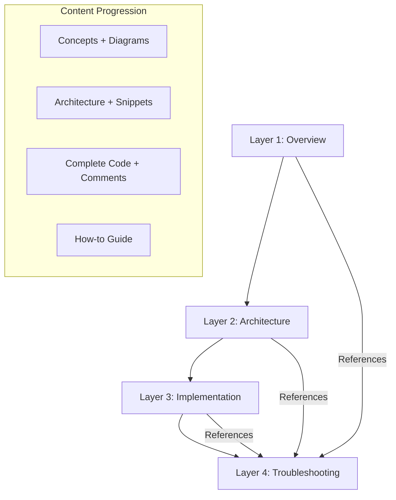
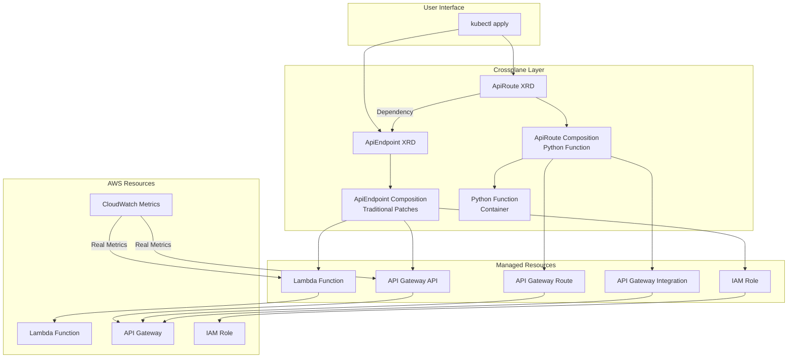
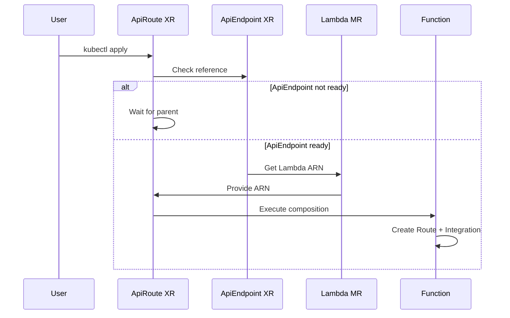
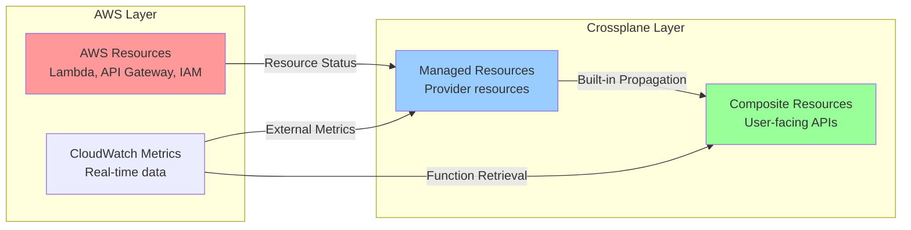

# Design Document

## Overview

This design document outlines the architecture and implementation approach for a comprehensive 4-layer Crossplane v2.1 tutorial system. The tutorial teaches Composite Resources through a practical ApiEndpoint and ApiRoute example, demonstrating both traditional patches and Python Composition Functions while integrating real CloudWatch metrics for status fields.

The system is designed as a learning tool for Kubernetes/AWS/Terraform experts who want to understand Crossplane's architectural patterns. The tutorial uses a toy API system that is complete enough to demonstrate real concepts but simple enough to focus on Crossplane structure rather than production complexity.

## Architecture

**Executive Summary:** This section outlines the tutorial's 4-layer progressive disclosure structure and the example system architecture that demonstrates Crossplane concepts. The tutorial uses a two-tier API system (ApiEndpoint + ApiRoute) to showcase both traditional patches and Python Composition Functions, with real CloudWatch metrics integration for comprehensive learning.

### 4-Layer Tutorial Structure

The tutorial follows a progressive disclosure pattern with four distinct layers:



**Layer 1 (Overview)**: Provides conceptual understanding through diagrams and narrative. No code is presented, focusing entirely on the big picture and workflow understanding.

**Layer 2 (Architecture)**: Deep-dives into architectural patterns with minimal code snippets (5-15 lines maximum). Explains how components interact and why design decisions were made.

**Layer 3 (Implementation)**: Complete, executable code with extensive inline comments serving as teaching narrative. All YAML manifests, Python functions, and deployment scripts are provided.

**Layer 4 (Troubleshooting)**: How-to guide format for resolving common issues. Cross-referenced from other layers where problems might occur.

### Example System Architecture

The tutorial demonstrates Crossplane concepts through a two-tier API system:



## System Components

**Executive Summary:** This section details the technical implementation of the tutorial system, organized into three key areas: XRD specifications (ApiEndpoint and ApiRoute schemas), composition strategies (traditional patches vs Python functions), and integration patterns (AWS providers, CloudWatch metrics, container registry, and educational methodologies). Each component demonstrates specific Crossplane concepts while maintaining educational focus.

This section describes the technical components that comprise the tutorial system, organized into XRD specifications, composition strategies, and integration patterns.

### XRD Specifications

#### ApiEndpoint XRD (Traditional Patch Approach)

The ApiEndpoint XRD demonstrates Crossplane's traditional patch-and-transform composition pattern. It encapsulates the creation of a complete API endpoint including Lambda function, API Gateway, and IAM role.

**Spec Interface:**
- `apiName`: String identifier for the API resources
- `description`: Human-readable description
- `lambdaRuntime`: Python runtime version (default: python3.11)

**Status Interface:**
- `endpointUrl`: Live API Gateway endpoint URL
- `deploymentTime`: Resource creation timestamp
- `lambdaArn`: Lambda function ARN
- `invocationCount`: Real CloudWatch metric showing Lambda invocations
- `lastInvoked`: Real CloudWatch timestamp of last invocation

*For detailed status field patterns and propagation mechanisms, see the Status Field Patterns section.*

**XRD Schema Definition:**
```yaml
spec:
  type: object
  properties:
    apiName:
      type: string
      description: "Name of the API Gateway API"
    description:
      type: string
      description: "Description of the API"
    lambdaRuntime:
      type: string
      description: "Lambda runtime version"
      default: "python3.11"
  required:
  - apiName

status:
  type: object
  properties:
    endpointUrl:
      type: string
      description: "Live API Gateway endpoint URL"
    deploymentTime:
      type: string
      description: "Deployment timestamp"
    lambdaArn:
      type: string
      description: "ARN of the Lambda function"
    invocationCount:
      type: integer
      description: "CloudWatch invocation count"
    lastInvoked:
      type: string
      description: "CloudWatch last invocation timestamp"
```

#### ApiRoute XRD (Python Function Approach)

The ApiRoute XRD demonstrates custom composition logic through a Python Composition Function. It creates API Gateway routes that connect to parent ApiEndpoint Lambda functions.

**Spec Interface:**
- `routePath`: HTTP path pattern (e.g., "/hello")
- `httpMethod`: HTTP method (GET, POST, PUT, DELETE, PATCH)
- `responseText`: Custom response text for the route
- `apiEndpointRef`: Composite resource reference to parent ApiEndpoint

**Status Interface:**
- `routeStatus`: Computed health status (Ready, PartiallyReady, Pending)
- `createdAt`: Route creation timestamp
- `integrationId`: API Gateway Integration ID for debugging
- `requestCount`: Real CloudWatch metric showing route requests
- `avgResponseTime`: Real CloudWatch metric showing average response time

*For detailed status field patterns and computation mechanisms, see the Status Field Patterns section.*

**XRD Schema Definition:**
```yaml
spec:
  type: object
  properties:
    routePath:
      type: string
      description: "HTTP path for the route"
      pattern: '^/.*'
    httpMethod:
      type: string
      description: "HTTP method for the route"
      enum: [GET, POST, PUT, DELETE, PATCH]
    responseText:
      type: string
      description: "Text response for this route"
    apiEndpointRef:
      type: object
      description: "Reference to the parent ApiEndpoint"
      properties:
        name:
          type: string
          description: "Name of the ApiEndpoint XR"
      required:
      - name
  required:
  - routePath
  - httpMethod
  - responseText
  - apiEndpointRef

status:
  type: object
  properties:
    routeStatus:
      type: string
      description: "Route health status"
    createdAt:
      type: string
      description: "Route creation timestamp"
    integrationId:
      type: string
      description: "API Gateway Integration ID"
    requestCount:
      type: integer
      description: "CloudWatch request count"
    avgResponseTime:
      type: number
      description: "CloudWatch average response time"
```

### Composition Strategies

#### Traditional Patch-and-Transform (ApiEndpoint)

**Composition Strategy:**
Uses traditional patch-and-transform with `ToCompositeFieldPath` patches to propagate status from Managed Resources to the Composite Resource. No custom functions are involved, demonstrating the declarative approach.

**AWS Provider Resource Requirements:**
- `lambda.aws.upbound.io/v1beta1/Function` - Lambda function with inline code
- `lambda.aws.upbound.io/v1beta1/Permission` - API Gateway invoke permissions
- `apigatewayv2.aws.upbound.io/v1beta1/API` - HTTP API Gateway
- `iam.aws.upbound.io/v1beta1/Role` - Lambda execution role

#### Python Composition Function (ApiRoute)

**Composition Strategy:**
Uses Python Composition Function deployed as a container to implement custom logic including dependency resolution, status aggregation, and real CloudWatch metrics retrieval.

**Function Data Flow:**

**Input (RunFunctionRequest):**
- `observed.composite`: Current ApiRoute XR state
- `observed.resources`: Current Managed Resource states
- `desired.composite`: Desired XR state from previous pipeline steps
- `desired.resources`: Desired MR states from previous pipeline steps

**Output (RunFunctionResponse):**
- `desired.resources`: Updated MR specifications (Route + Integration)
- `desired.composite.status`: Computed status fields including real metrics

**AWS Provider Resource Requirements:**
- `apigatewayv2.aws.upbound.io/v1beta1/Route` - API Gateway routes
- `apigatewayv2.aws.upbound.io/v1beta1/Integration` - Lambda integrations

#### Dependency Resolution Pattern

The ApiRoute → ApiEndpoint dependency demonstrates Crossplane v2's composite resource reference pattern:



This pattern is fundamental to Crossplane and demonstrates how child resources automatically wait for parent resources to reach Ready status before proceeding with their own resource creation.

### Integration Patterns

#### AWS Provider Integration

**Provider Family Configuration:**
- Use `provider-family-aws@v2.3.0` for comprehensive AWS resource management
- Individual providers: `provider-aws-lambda@v2.3.0`, `provider-aws-apigatewayv2@v2.3.0`, `provider-aws-iam@v2.3.0`

#### CloudWatch Integration Strategy

The tutorial integrates real CloudWatch metrics to demonstrate external data source integration in Crossplane status fields. This shows learners how to populate status fields with live AWS metrics rather than static configuration values.

**CloudWatch Integration:**
The function makes minimal CloudWatch API calls to retrieve:
- API Gateway request counts (AWS/ApiGateway Count metric)
- API Gateway response times (AWS/ApiGateway Latency metric)

Error handling ensures that CloudWatch failures don't break the composition process.

*For detailed CloudWatch specifications including namespaces, metrics, dimensions, time ranges, and error handling patterns, see implementation_guidance.md.*

#### Container Registry Strategy

The tutorial uses anonymous container registry (ttl.sh) to eliminate infrastructure setup requirements and focus on Crossplane concepts. This architectural decision allows learners to deploy working Composition Functions without managing container registries.

*For detailed container registry specifications including naming conventions, build commands, and deployment instructions, see implementation_guidance.md.*

#### Terraform Mental Model Integration

When concepts are difficult to explain succinctly, the tutorial provides Terraform context:
- Format: "For instance, when using Terraform you would do similar operations by..."
- Focus: Conceptual descriptions only, no Terraform code examples
- Usage: Supplementary explanation for complex Crossplane concepts
- Examples: XRD ≈ Terraform module interface, Composition ≈ module implementation

#### Status Field Patterns

The tutorial system demonstrates two distinct approaches to status field population in Crossplane, each serving different educational purposes and showcasing different architectural patterns.

##### Status Propagation Flow

Status information flows through Crossplane's architecture in a predictable pattern:



This flow demonstrates how Crossplane bridges the gap between cloud provider resources and user-facing abstractions while maintaining real-time visibility into system state.

##### Built-in Status Propagation (ApiEndpoint Pattern)

The ApiEndpoint XRD demonstrates Crossplane's declarative status propagation using traditional patches:

**Mechanism:**
- Uses `ToCompositeFieldPath` patches in Composition
- Automatically propagates status from Managed Resources to Composite Resource
- No custom code required - purely declarative configuration
- Status updates happen through Crossplane's built-in reconciliation loops

**Status Field Types:**
- **Resource Identifiers** (`endpointUrl`, `lambdaArn`): Direct propagation of AWS resource identifiers
- **Timestamps** (`deploymentTime`): Propagation of resource creation/update times
- **External Metrics** (`invocationCount`, `lastInvoked`): Real CloudWatch metrics retrieved by provider

**Educational Value:**
This pattern teaches learners how Crossplane's declarative approach can handle most status propagation needs without custom code. It demonstrates the power of patch-and-transform compositions and shows how external metrics can be integrated through provider capabilities.

**Example Status Flow:**
```
AWS Lambda Function → Lambda MR status.atProvider.arn → XR status.lambdaArn
AWS API Gateway → API MR status.atProvider.apiEndpoint → XR status.endpointUrl
CloudWatch Metrics → Lambda MR status.atProvider.invocationCount → XR status.invocationCount
```

##### Custom Status Computation (ApiRoute Pattern)

The ApiRoute XRD demonstrates advanced status handling through Python Composition Functions:

**Mechanism:**
- Uses Python Composition Function for custom status logic
- Combines multiple data sources (MR status + CloudWatch APIs)
- Implements computed status fields that don't exist in underlying resources
- Provides custom aggregation and health assessment logic

**Status Field Types:**
- **Computed Health** (`routeStatus`): Aggregated health based on multiple resource states
- **Debugging Information** (`integrationId`): Technical details for troubleshooting
- **Custom Timestamps** (`createdAt`): Function-computed creation times
- **Aggregated Metrics** (`requestCount`, `avgResponseTime`): Real-time CloudWatch data retrieved by function

**Educational Value:**
This pattern teaches learners when and how to implement custom composition logic. It shows how to integrate external APIs (CloudWatch), handle complex status aggregation, and provide enhanced debugging information that goes beyond what individual Managed Resources can provide.

**Example Status Flow:**
```
Function Logic:
1. Check parent ApiEndpoint readiness
2. Retrieve CloudWatch metrics via AWS SDK
3. Aggregate Route + Integration MR status
4. Compute overall health status
5. Update XR status with computed values
```

##### Comparative Educational Benefits

**Built-in Propagation Benefits:**
- Demonstrates Crossplane's declarative power
- Shows how to leverage existing provider capabilities
- Teaches patch-and-transform patterns
- Illustrates zero-code status integration

**Custom Computation Benefits:**
- Shows when custom logic is necessary
- Demonstrates external API integration patterns
- Teaches advanced composition function development
- Illustrates complex status aggregation strategies

**Learning Progression:**
The tutorial uses both patterns to show learners the spectrum of possibilities in Crossplane:
1. Start with declarative approaches (ApiEndpoint) for simplicity
2. Progress to custom functions (ApiRoute) when declarative approaches are insufficient
3. Understand the trade-offs between simplicity and flexibility

This dual approach ensures learners understand both the power of Crossplane's built-in capabilities and the flexibility available when custom logic is required.

**Validates Requirements:** 3.4 (ApiEndpoint status fields), 4.4 (ApiRoute status fields), 6.2 (built-in vs custom status), 6.3 (custom function status computation)

#### Educational Methodology

The tutorial system employs a read-through educational approach based on the Diataxis Framework, which distinguishes between learning-oriented content (tutorials) and problem-solving oriented content (how-to guides).

**Read-Through Tutorial Format:**
The tutorial is designed for passive consumption rather than hands-on exercises. Learners read through the content to understand concepts, with the option to follow along if they choose. This approach allows learners to focus on understanding architectural patterns without being distracted by environment setup or execution details.

**Code-as-Narrative Approach for Layer 3:**
Layer 3 uses extensive inline comments to transform code into teaching narrative. Rather than alternating blocks of explanatory text and code examples, the implementation files contain heavily commented code where the comments explain the WHY and HOW, not just the WHAT. This creates a seamless reading experience where the code itself becomes the primary teaching vehicle.

Example approach:
```yaml
# This XRD defines our ApiEndpoint composite resource.
# We're using the v1 API version because it's the current stable version
# for CompositeResourceDefinitions in Crossplane v2.1
apiVersion: apiextensions.crossplane.io/v1
kind: CompositeResourceDefinition
metadata:
  # The name follows Crossplane's naming convention: <plural>.<group>
  # This creates the API endpoint: apiendpoints.tutorial.crossplane.io
  name: apiendpoints.tutorial.crossplane.io
```

**Learning-Oriented vs Problem-Solving Content:**
Following the Diataxis Framework:
- **Layers 1-3** are learning-oriented tutorials that guide learners through understanding Crossplane concepts in a structured progression
- **Layer 4** is problem-solving oriented, providing direct how-to guidance for resolving specific issues without tutorial narrative

This distinction ensures that learners receive appropriate content for their current need: systematic learning or immediate problem resolution.

**Content Organization Principles:**
- Progressive disclosure: Each layer builds on previous understanding
- Concept-first approach: Explain WHY before showing HOW
- Complete examples: Layer 3 provides fully functional implementations
- Cross-referencing: Layers reference each other appropriately without duplication

**Validates Requirements:** 12.1 (read-through format), 12.2 (code-as-narrative), 12.3 (no alternating text/code blocks)

#### Security Simplification Strategy

The tutorial system deliberately simplifies security concerns to maintain focus on Crossplane architectural concepts rather than production security implementation.

**RBAC and Security Concerns Omission:**
All examples assume administrative privileges and ignore Role-Based Access Control (RBAC) configurations. This educational simplification allows learners to focus on understanding Crossplane's resource composition patterns without being distracted by complex permission models.

**Administrative Privileges Assumption:**
The tutorial assumes learners have cluster-admin privileges and can create any Kubernetes resources. This removes authentication and authorization complexity from the learning path, allowing focus on Crossplane-specific concepts like XRDs, Compositions, and Managed Resources.

**Educational Simplifications with Explicit Notation:**
When simplifications are made for educational purposes, they are explicitly noted in the content. This ensures learners understand what has been simplified and can research production-ready security practices separately.

Example notation approach:
```yaml
# EDUCATIONAL SIMPLIFICATION: In production, you would use
# a dedicated service account with minimal required permissions
# rather than assuming cluster-admin access
apiVersion: v1
kind: ServiceAccount
metadata:
  name: crossplane-tutorial-admin
```

**Simplified Configuration Focus:**
All configurations prioritize legal syntax and functional correctness over production-ready security hardening. This approach ensures examples work reliably in learning environments while maintaining clarity about what constitutes educational versus production approaches.

**Production Security Guidance:**
While security is simplified in examples, the tutorial includes references to Crossplane security documentation for learners who want to understand production security patterns after mastering the core architectural concepts.

**Validates Requirements:** 11.1 (ignore RBAC/security), 11.2 (administrative privileges assumption), 11.4 (explicit educational notation)

### XRD Schema Definitions

**ApiEndpoint XRD Schema:**
```yaml
spec:
  type: object
  properties:
    apiName:
      type: string
      description: "Name of the API Gateway API"
    description:
      type: string
      description: "Description of the API"
    lambdaRuntime:
      type: string
      description: "Lambda runtime version"
      default: "python3.11"
  required:
  - apiName

status:
  type: object
  properties:
    endpointUrl:
      type: string
      description: "Live API Gateway endpoint URL"
    deploymentTime:
      type: string
      description: "Deployment timestamp"
    lambdaArn:
      type: string
      description: "ARN of the Lambda function"
    invocationCount:
      type: integer
      description: "CloudWatch invocation count"
    lastInvoked:
      type: string
      description: "CloudWatch last invocation timestamp"
```

**ApiRoute XRD Schema:**
```yaml
spec:
  type: object
  properties:
    routePath:
      type: string
      description: "HTTP path for the route"
      pattern: '^/.*'
    httpMethod:
      type: string
      description: "HTTP method for the route"
      enum: [GET, POST, PUT, DELETE, PATCH]
    responseText:
      type: string
      description: "Text response for this route"
    apiEndpointRef:
      type: object
      description: "Reference to the parent ApiEndpoint"
      properties:
        name:
          type: string
          description: "Name of the ApiEndpoint XR"
      required:
      - name
  required:
  - routePath
  - httpMethod
  - responseText
  - apiEndpointRef

status:
  type: object
  properties:
    routeStatus:
      type: string
      description: "Route health status"
    createdAt:
      type: string
      description: "Route creation timestamp"
    integrationId:
      type: string
      description: "API Gateway Integration ID"
    requestCount:
      type: integer
      description: "CloudWatch request count"
    avgResponseTime:
      type: number
      description: "CloudWatch average response time"
```

### Composition Function Data Flow

The Python Composition Function processes the following data structures:

**Input (RunFunctionRequest):**
- `observed.composite`: Current ApiRoute XR state
- `observed.resources`: Current Managed Resource states
- `desired.composite`: Desired XR state from previous pipeline steps
- `desired.resources`: Desired MR states from previous pipeline steps

**Output (RunFunctionResponse):**
- `desired.resources`: Updated MR specifications (Route + Integration)
- `desired.composite.status`: Computed status fields including real metrics

**CloudWatch Integration:**
The function makes minimal CloudWatch API calls to retrieve:
- API Gateway request counts (AWS/ApiGateway Count metric)
- API Gateway response times (AWS/ApiGateway Latency metric)

Error handling ensures that CloudWatch failures don't break the composition process.

## Correctness Properties

*A property is a characteristic or behavior that should hold true across all valid executions of a system—essentially, a formal statement about what the system should do. Properties serve as the bridge between human-readable specifications and machine-verifiable correctness guarantees.*

### Converting EARS to Properties

Based on the prework analysis, I'll convert the testable acceptance criteria into universally quantified properties while eliminating redundancy through consolidation.

**Property 1: Tutorial Content Structure Validation**
*For any* tutorial content, it should satisfy all structural requirements: Layer 1 contains diagrams with no code blocks, Layer 2 contains code snippets of 5-15 lines maximum, Layer 3 contains complete implementations with extensive comments, Layer 4 follows how-to guide structure, troubleshooting sections cover all required scenarios (MR stuck in Creating state, function deployment failures, status field not updating, dependency resolution issues), Layer 3 directories contain complete YAML manifests and Python function code with extensive comments, and all layers follow read-through format with Layer 3 using code-as-narrative approach
**Validates: Requirements 1.2, 1.3, 1.4, 1.5, 1.7, 9.1, 9.6, 9.7, 10.1, 10.2, 10.7, 10.8, 12.1, 12.2, 12.3**

**Property 2: Crossplane Technical Compliance**
*For any* YAML manifest or composition in the tutorial, it should use only Crossplane v2.1+ API versions with no v1 patterns (especially Claims), use current upbound AWS provider APIs, include all required spec and status fields (ApiEndpoint with apiName/description/lambdaRuntime spec and endpointUrl/deploymentTime/lambdaArn/invocationCount/lastInvoked status, ApiRoute with routePath/httpMethod/responseText/apiEndpointRef spec and routeStatus/createdAt/integrationId/requestCount/avgResponseTime status), use correct composition approaches (ApiEndpoint with mode Resources and ToCompositeFieldPath patches, ApiRoute with mode Pipeline and Python function references), and create correct AWS resource types (ApiEndpoint creates Lambda/API Gateway/IAM resources, ApiRoute creates Route/Integration resources)
**Validates: Requirements 2.1, 2.2, 2.5, 2.6, 3.1, 3.2, 3.3, 3.4, 3.5, 4.1, 4.2, 4.3, 4.4, 4.5**

**Property 6: Dependency and Error Handling Validation**
*For any* ApiRoute function code, it should check for parent ApiEndpoint resource readiness before proceeding with resource creation and handle dependency timing appropriately
**Validates: Requirements 5.3**

**Property 3: External Integration Validation**
*For any* composition function code or container reference in the tutorial, it should include CloudWatch SDK calls for metric retrieval, handle CloudWatch API failures gracefully without breaking the composition process, and use ttl.sh registry domain for anonymous 24-hour availability
**Validates: Requirements 4.8, 6.1, 6.4**

**Property 4: Content Format and Reference Compliance**
*For any* Terraform reference or performance mention in the tutorial content, it should follow the format "For instance, when using Terraform you would do similar operations by..." with no Terraform code examples, and include brief descriptions with links to external Crossplane documentation while noting function overhead implications in comparison sections
**Validates: Requirements 7.3, 7.4, 8.1, 8.3, 8.4**

**Property 5: Educational Constraint Compliance**
*For any* tutorial content, it should ignore RBAC and security concerns, assume administrative privileges, and explicitly note educational simplifications
**Validates: Requirements 11.1, 11.2, 11.4**

## Error Handling

### Composition Function Error Handling

The Python Composition Function implements graceful error handling for external dependencies:

**CloudWatch API Failures:**
- Wrap CloudWatch calls in try/catch blocks
- Log errors without failing the composition
- Continue with default/empty metric values
- Ensure composition process completes successfully

**Parent Resource Dependencies:**
- Check parent resource readiness before proceeding
- Handle cases where parent resources are not yet available
- Implement proper waiting patterns using Crossplane's reconciliation loops
- Provide clear status messages about dependency states

**Resource Creation Failures:**
- Validate input parameters before resource creation
- Handle AWS API errors gracefully
- Provide meaningful error messages in XR status
- Ensure partial failures don't leave orphaned resources

### Tutorial Content Error Prevention

**YAML Validation:**
- All manifests must pass Kubernetes YAML validation
- Crossplane-specific validation using CRD schemas
- AWS provider resource validation against current API versions

**Code Syntax Validation:**
- Python function code must pass syntax checking
- Docker build validation for container images
- Shell script validation for deployment/cleanup scripts

**Link Validation:**
- External documentation links must be accessible
- Cross-references between tutorial layers must be valid
- Container registry references must use correct ttl.sh format

## Testing Strategy

**Executive Summary:** The tutorial system employs a dual testing approach combining unit tests for specific examples and property-based tests for universal validation. The 6 consolidated properties provide comprehensive coverage of tutorial correctness, from content structure and technical compliance to educational methodology. This approach ensures both concrete correctness and universal properties hold across all content variations.

The tutorial system requires a comprehensive testing approach that validates both the correctness of technical content and the effectiveness of educational structure. Property-based testing is particularly well-suited for a tutorial system because it can verify that educational properties hold across all possible content variations, ensuring consistent learning experiences regardless of how the content evolves.

**Why Property-Based Testing for Tutorial Systems:**

Property-based testing excels at validating tutorial systems because:
- **Universal Coverage**: Ensures educational constraints hold across all content variations, not just specific examples
- **Content Evolution Safety**: Validates that structural requirements remain intact as tutorial content is updated
- **Cross-Layer Consistency**: Verifies that relationships between tutorial layers (references, dependencies, format consistency) remain valid
- **Technical Accuracy**: Ensures all code examples, YAML manifests, and technical specifications remain syntactically correct and semantically consistent
- **Educational Methodology Compliance**: Validates that content follows established educational frameworks (like Diataxis) consistently

The 6 consolidated properties provide comprehensive coverage of tutorial system correctness:
1. **Tutorial Content Structure Validation** - Ensures proper educational progression and completeness
2. **Crossplane Technical Compliance** - Validates technical accuracy and current best practices
3. **External Integration Validation** - Ensures external dependencies work correctly
4. **Content Format and Reference Compliance** - Maintains consistent formatting and valid references
5. **Educational Constraint Compliance** - Enforces educational simplifications consistently
6. **Dependency and Error Handling Validation** - Ensures robust technical implementations

This dual testing approach (unit + property-based) ensures both concrete correctness and universal properties, providing confidence that the tutorial system delivers reliable educational value while maintaining technical accuracy.

### Unit Testing Approach

Unit tests focus on specific examples, edge cases, and integration points:

**Content Validation Tests:**
- Verify specific layer directories contain expected file types
- Test that example YAML manifests parse correctly
- Validate that Python function code compiles without errors
- Check that Mermaid diagrams render properly

**Schema Validation Tests:**
- Test XRD schemas against Kubernetes OpenAPI validation
- Verify composition manifests reference correct resource types
- Validate that function container images build successfully

**Integration Tests:**
- Test cross-references between tutorial layers resolve correctly
- Verify that troubleshooting scenarios are properly linked
- Validate that cleanup scripts reference correct resource names

### Property-Based Testing Configuration

Property-based tests verify universal properties across all tutorial content using a minimum of 100 iterations per test. Each test references its corresponding design document property.

**Property Test 1: Tutorial Content Structure Validation**
- Generate random tutorial content structures
- Verify layer format constraints, troubleshooting completeness, implementation completeness, and educational methodology hold universally
- **Tag: Feature: xrd-tutorial, Property 1: Tutorial Content Structure Validation**

**Property Test 2: Crossplane Technical Compliance**
- Generate variations of YAML manifests and compositions
- Verify Crossplane v2.1 compliance, XRD schema completeness, composition approach validation, and resource creation validation across all variations
- **Tag: Feature: xrd-tutorial, Property 2: Crossplane Technical Compliance**

**Property Test 3: External Integration Validation**
- Generate CloudWatch API failure scenarios and container references
- Verify graceful error handling and ttl.sh registry usage across all scenarios
- **Tag: Feature: xrd-tutorial, Property 3: External Integration Validation**

**Property Test 4: Content Format and Reference Compliance**
- Generate tutorial content with various Terraform references and performance mentions
- Verify format compliance and link requirements across all reference patterns
- **Tag: Feature: xrd-tutorial, Property 4: Content Format and Reference Compliance**

**Property Test 5: Educational Constraint Compliance**
- Generate tutorial content variations
- Verify security simplification compliance across all content
- **Tag: Feature: xrd-tutorial, Property 5: Educational Constraint Compliance**

**Property Test 6: Dependency and Error Handling Validation**
- Generate function code variations with different dependency states
- Verify dependency resolution logic works across all scenarios
- **Tag: Feature: xrd-tutorial, Property 6: Dependency and Error Handling Validation**

**Testing Framework Selection:**
For Python-based validation, use Hypothesis for property-based testing. For YAML/content validation, use custom generators that create valid tutorial content variations while maintaining the universal properties being tested.

**Test Execution Requirements:**
- Minimum 100 iterations per property test due to randomization
- Each property test must reference its design document property
- Both unit and property tests are required for comprehensive coverage
- Unit tests handle concrete examples, property tests verify general correctness