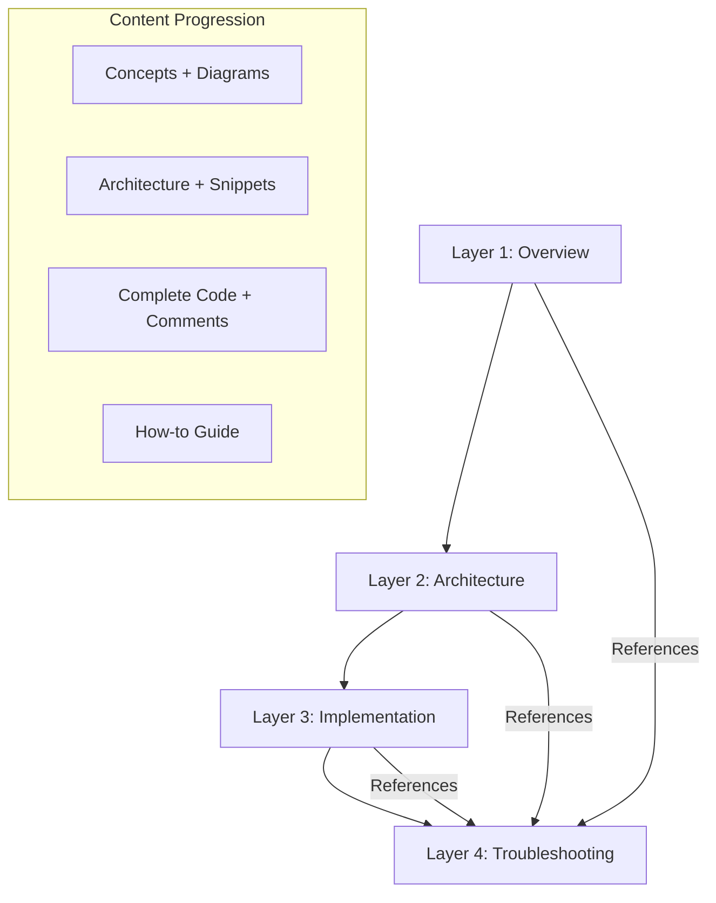
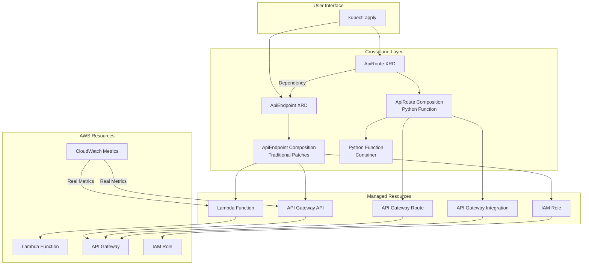
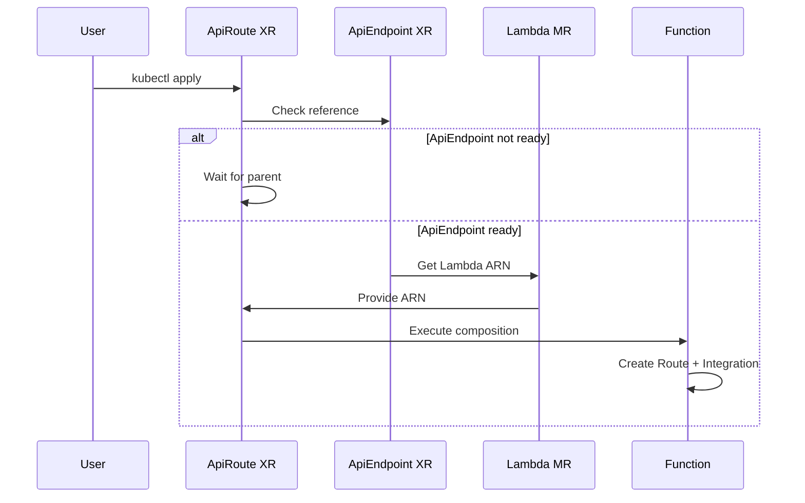

# Design Document

## Overview

This design document outlines the architecture and implementation approach for a comprehensive 4-layer Crossplane v2.1 tutorial system. The tutorial teaches Composite Resources through a practical ApiEndpoint and ApiRoute example, demonstrating both traditional patches and Python Composition Functions while integrating real CloudWatch metrics for status fields.

The system is designed as a learning tool for Kubernetes/AWS/Terraform experts who want to understand Crossplane's architectural patterns. The tutorial uses a toy API system that is complete enough to demonstrate real concepts but simple enough to focus on Crossplane structure rather than production complexity.

## Architecture

### 4-Layer Tutorial Structure

The tutorial follows a progressive disclosure pattern with four distinct layers:



**Layer 1 (Overview)**: Provides conceptual understanding through diagrams and narrative. No code is presented, focusing entirely on the big picture and workflow understanding.

**Layer 2 (Architecture)**: Deep-dives into architectural patterns with minimal code snippets (5-15 lines maximum). Explains how components interact and why design decisions were made.

**Layer 3 (Implementation)**: Complete, executable code with extensive inline comments serving as teaching narrative. All YAML manifests, Python functions, and deployment scripts are provided.

**Layer 4 (Troubleshooting)**: How-to guide format for resolving common issues. Cross-referenced from other layers where problems might occur.

### Example System Architecture

The tutorial demonstrates Crossplane concepts through a two-tier API system:



## Components and Interfaces

### AWS Provider Resource Specifications

The tutorial uses specific upbound AWS provider resources with current API versions as of December 2025:

**Required Managed Resources:**
- `lambda.aws.upbound.io/v1beta1/Function` - Lambda function with inline code
- `lambda.aws.upbound.io/v1beta1/Permission` - API Gateway invoke permissions
- `apigatewayv2.aws.upbound.io/v1beta1/API` - HTTP API Gateway
- `apigatewayv2.aws.upbound.io/v1beta1/Route` - API Gateway routes
- `apigatewayv2.aws.upbound.io/v1beta1/Integration` - Lambda integrations
- `iam.aws.upbound.io/v1beta1/Role` - Lambda execution role

**Provider Family:**
- Use `provider-family-aws@v2.3.0` for comprehensive AWS resource management
- Individual providers: `provider-aws-lambda@v2.3.0`, `provider-aws-apigatewayv2@v2.3.0`, `provider-aws-iam@v2.3.0`

**CloudWatch Integration Specifications:**
- Namespace: `AWS/ApiGateway` for API Gateway metrics
- Namespace: `AWS/Lambda` for Lambda function metrics
- Metrics: `Count` (request count), `Latency` (response time), `Invocations` (Lambda calls)
- Dimensions: `ApiId`, `Route` for API Gateway; `FunctionName` for Lambda
- Time Range: Last 24 hours with 1-hour aggregation periods
- Error Handling: Graceful failure with default values, no composition failure

**Container Registry Strategy:**
The tutorial uses ttl.sh registry for anonymous, temporary container storage:
- Registry: `ttl.sh` domain for all container references
- Availability: 24-hour automatic cleanup
- Authentication: None required (anonymous push/pull)
- Naming: `ttl.sh/crossplane-apiroute-function:24h` format

**Terraform Mental Model Integration:**
When concepts are difficult to explain succinctly, the tutorial provides Terraform context:
- Format: "For instance, when using Terraform you would do similar operations by..."
- Focus: Conceptual descriptions only, no Terraform code examples
- Usage: Supplementary explanation for complex Crossplane concepts
- Examples: XRD ≈ Terraform module interface, Composition ≈ module implementation

The ApiEndpoint XRD demonstrates Crossplane's traditional patch-and-transform composition pattern. It encapsulates the creation of a complete API endpoint including Lambda function, API Gateway, and IAM role.

**Spec Interface:**
- `apiName`: String identifier for the API resources
- `description`: Human-readable description
- `lambdaRuntime`: Python runtime version (default: python3.11)

**Status Interface:**
- `endpointUrl`: Live API Gateway endpoint URL (from API Gateway MR)
- `deploymentTime`: Resource creation timestamp (from API Gateway MR)
- `lambdaArn`: Lambda function ARN (from Lambda MR)
- `invocationCount`: Real CloudWatch metric showing Lambda invocations
- `lastInvoked`: Real CloudWatch timestamp of last invocation

**Composition Strategy:**
Uses traditional patch-and-transform with `ToCompositeFieldPath` patches to propagate status from Managed Resources to the Composite Resource. No custom functions are involved, demonstrating the declarative approach.

### ApiRoute XRD (Python Function Approach)

The ApiRoute XRD demonstrates custom composition logic through a Python Composition Function. It creates API Gateway routes that connect to parent ApiEndpoint Lambda functions.

**Spec Interface:**
- `routePath`: HTTP path pattern (e.g., "/hello")
- `httpMethod`: HTTP method (GET, POST, PUT, DELETE, PATCH)
- `responseText`: Custom response text for the route
- `apiEndpointRef`: Composite resource reference to parent ApiEndpoint

**Status Interface:**
- `routeStatus`: Computed health status (Ready, PartiallyReady, Pending)
- `createdAt`: Route creation timestamp
- `integrationId`: API Gateway Integration ID for debugging
- `requestCount`: Real CloudWatch metric showing route requests
- `avgResponseTime`: Real CloudWatch metric showing average response time

**Composition Strategy:**
Uses Python Composition Function deployed as a container to implement custom logic including dependency resolution, status aggregation, and real CloudWatch metrics retrieval.

### Dependency Resolution Pattern

The ApiRoute → ApiEndpoint dependency demonstrates Crossplane v2's composite resource reference pattern:



This pattern is fundamental to Crossplane and demonstrates how child resources automatically wait for parent resources to reach Ready status before proceeding with their own resource creation.

## Data Models

### XRD Schema Definitions

**ApiEndpoint XRD Schema:**
```yaml
spec:
  type: object
  properties:
    apiName:
      type: string
      description: "Name of the API Gateway API"
    description:
      type: string
      description: "Description of the API"
    lambdaRuntime:
      type: string
      description: "Lambda runtime version"
      default: "python3.11"
  required:
  - apiName

status:
  type: object
  properties:
    endpointUrl:
      type: string
      description: "Live API Gateway endpoint URL"
    deploymentTime:
      type: string
      description: "Deployment timestamp"
    lambdaArn:
      type: string
      description: "ARN of the Lambda function"
    invocationCount:
      type: integer
      description: "CloudWatch invocation count"
    lastInvoked:
      type: string
      description: "CloudWatch last invocation timestamp"
```

**ApiRoute XRD Schema:**
```yaml
spec:
  type: object
  properties:
    routePath:
      type: string
      description: "HTTP path for the route"
      pattern: '^/.*'
    httpMethod:
      type: string
      description: "HTTP method for the route"
      enum: [GET, POST, PUT, DELETE, PATCH]
    responseText:
      type: string
      description: "Text response for this route"
    apiEndpointRef:
      type: object
      description: "Reference to the parent ApiEndpoint"
      properties:
        name:
          type: string
          description: "Name of the ApiEndpoint XR"
      required:
      - name
  required:
  - routePath
  - httpMethod
  - responseText
  - apiEndpointRef

status:
  type: object
  properties:
    routeStatus:
      type: string
      description: "Route health status"
    createdAt:
      type: string
      description: "Route creation timestamp"
    integrationId:
      type: string
      description: "API Gateway Integration ID"
    requestCount:
      type: integer
      description: "CloudWatch request count"
    avgResponseTime:
      type: number
      description: "CloudWatch average response time"
```

### Composition Function Data Flow

The Python Composition Function processes the following data structures:

**Input (RunFunctionRequest):**
- `observed.composite`: Current ApiRoute XR state
- `observed.resources`: Current Managed Resource states
- `desired.composite`: Desired XR state from previous pipeline steps
- `desired.resources`: Desired MR states from previous pipeline steps

**Output (RunFunctionResponse):**
- `desired.resources`: Updated MR specifications (Route + Integration)
- `desired.composite.status`: Computed status fields including real metrics

**CloudWatch Integration:**
The function makes minimal CloudWatch API calls to retrieve:
- API Gateway request counts (AWS/ApiGateway Count metric)
- API Gateway response times (AWS/ApiGateway Latency metric)

Error handling ensures that CloudWatch failures don't break the composition process.

## Correctness Properties

*A property is a characteristic or behavior that should hold true across all valid executions of a system—essentially, a formal statement about what the system should do. Properties serve as the bridge between human-readable specifications and machine-verifiable correctness guarantees.*

### Converting EARS to Properties

Based on the prework analysis, I'll convert the testable acceptance criteria into universally quantified properties while eliminating redundancy through consolidation.

**Property 1: Tutorial Layer Content Validation**
*For any* tutorial layer directory, the content should match the expected format constraints: Layer 1 contains diagrams with no code blocks, Layer 2 contains code snippets of 5-15 lines maximum, Layer 3 contains complete implementations with extensive comments, and Layer 4 follows how-to guide structure
**Validates: Requirements 1.2, 1.3, 1.4, 1.5, 1.7**

**Property 2: Crossplane v2.1 Compliance**
*For any* YAML manifest in the tutorial, it should use only Crossplane v2.1+ API versions, contain no v1 patterns (especially Claims), and use current upbound AWS provider APIs
**Validates: Requirements 2.1, 2.2, 2.5, 2.6**

**Property 3: XRD Schema Completeness**
*For any* XRD definition, it should include all required spec and status fields as specified: ApiEndpoint with apiName/description/lambdaRuntime spec and endpointUrl/deploymentTime/lambdaArn/invocationCount/lastInvoked status, ApiRoute with routePath/httpMethod/responseText/apiEndpointRef spec and routeStatus/createdAt/integrationId/requestCount/avgResponseTime status
**Validates: Requirements 3.3, 3.4, 4.3, 4.4**

**Property 4: Composition Approach Validation**
*For any* composition resource, it should use the correct approach: ApiEndpoint compositions use mode Resources with ToCompositeFieldPath patches, ApiRoute compositions use mode Pipeline with Python function references
**Validates: Requirements 3.2, 3.5, 4.2, 4.5**

**Property 5: Dependency Resolution Implementation**
*For any* ApiRoute function code, it should check for parent ApiEndpoint resource readiness before proceeding with resource creation and handle dependency timing appropriately
**Validates: Requirements 5.3**

**Property 6: CloudWatch Integration Validation**
*For any* composition function code, it should include CloudWatch SDK calls for metric retrieval and handle CloudWatch API failures gracefully without breaking the composition process
**Validates: Requirements 6.1, 6.4**

**Property 7: Terraform Context Format Compliance**
*For any* Terraform reference in the tutorial content, it should follow the format "For instance, when using Terraform you would do similar operations by..." and contain no Terraform code examples
**Validates: Requirements 7.3, 7.4**

**Property 8: Performance Reference Validation**
*For any* performance mention in the tutorial, it should include brief descriptions with links to external Crossplane documentation and note function overhead implications in comparison sections
**Validates: Requirements 8.1, 8.3, 8.4**

**Property 9: Troubleshooting Content Completeness**
*For any* Layer 4 troubleshooting section, it should cover all required scenarios (MR stuck in Creating state, function deployment failures, status field not updating, dependency resolution issues) in how-to guide format with cross-references from other layers
**Validates: Requirements 9.1, 9.6, 9.7**

**Property 10: Layer 3 Implementation Completeness**
*For any* Layer 3 directory, it should contain complete YAML manifests, Python function code with extensive comments, and all required supporting files (deployment instructions, verification scripts, cleanup instructions) while ensuring Layers 1-2 reference but don't duplicate this content
**Validates: Requirements 10.1, 10.2, 10.7, 10.8**

**Property 11: Container Registry Configuration**
*For any* container reference in the tutorial, it should use ttl.sh registry domain for anonymous 24-hour availability
**Validates: Requirements 4.8**

**Property 12: Composition Resource Creation**
*For any* composition implementation, it should create the correct AWS resource types: ApiEndpoint creates Lambda/API Gateway/IAM resources, ApiRoute creates Route/Integration resources
**Validates: Requirements 3.1, 4.1**

**Property 13: Security Simplification Compliance**
*For any* tutorial content, it should ignore RBAC and security concerns, assume administrative privileges, and explicitly note educational simplifications
**Validates: Requirements 11.1, 11.2, 11.4**

**Property 14: Educational Methodology Compliance**
*For any* tutorial layer, it should follow read-through format with Layer 3 using code-as-narrative approach and no alternating text/code blocks
**Validates: Requirements 12.1, 12.2, 12.3**

## Error Handling

### Composition Function Error Handling

The Python Composition Function implements graceful error handling for external dependencies:

**CloudWatch API Failures:**
- Wrap CloudWatch calls in try/catch blocks
- Log errors without failing the composition
- Continue with default/empty metric values
- Ensure composition process completes successfully

**Parent Resource Dependencies:**
- Check parent resource readiness before proceeding
- Handle cases where parent resources are not yet available
- Implement proper waiting patterns using Crossplane's reconciliation loops
- Provide clear status messages about dependency states

**Resource Creation Failures:**
- Validate input parameters before resource creation
- Handle AWS API errors gracefully
- Provide meaningful error messages in XR status
- Ensure partial failures don't leave orphaned resources

### Tutorial Content Error Prevention

**YAML Validation:**
- All manifests must pass Kubernetes YAML validation
- Crossplane-specific validation using CRD schemas
- AWS provider resource validation against current API versions

**Code Syntax Validation:**
- Python function code must pass syntax checking
- Docker build validation for container images
- Shell script validation for deployment/cleanup scripts

**Link Validation:**
- External documentation links must be accessible
- Cross-references between tutorial layers must be valid
- Container registry references must use correct ttl.sh format

## Testing Strategy

The tutorial system requires a dual testing approach combining unit tests for specific examples and property-based tests for universal validation.

### Unit Testing Approach

Unit tests focus on specific examples, edge cases, and integration points:

**Content Validation Tests:**
- Verify specific layer directories contain expected file types
- Test that example YAML manifests parse correctly
- Validate that Python function code compiles without errors
- Check that Mermaid diagrams render properly

**Schema Validation Tests:**
- Test XRD schemas against Kubernetes OpenAPI validation
- Verify composition manifests reference correct resource types
- Validate that function container images build successfully

**Integration Tests:**
- Test cross-references between tutorial layers resolve correctly
- Verify that troubleshooting scenarios are properly linked
- Validate that cleanup scripts reference correct resource names

### Property-Based Testing Configuration

Property-based tests verify universal properties across all tutorial content using a minimum of 100 iterations per test. Each test references its corresponding design document property.

**Property Test 1: Layer Content Format Validation**
- Generate random tutorial content structures
- Verify layer-specific format constraints hold universally
- **Tag: Feature: xrd-tutorial, Property 1: Tutorial Layer Content Validation**

**Property Test 2: YAML Compliance Validation**
- Generate variations of YAML manifests
- Verify Crossplane v2.1 compliance across all variations
- **Tag: Feature: xrd-tutorial, Property 2: Crossplane v2.1 Compliance**

**Property Test 3: Schema Completeness Validation**
- Generate XRD schema variations
- Verify required fields are present across all valid schemas
- **Tag: Feature: xrd-tutorial, Property 3: XRD Schema Completeness**

**Property Test 4: Composition Mode Validation**
- Generate composition manifest variations
- Verify correct mode usage across all composition types
- **Tag: Feature: xrd-tutorial, Property 4: Composition Approach Validation**

**Property Test 5: Function Dependency Logic**
- Generate function code variations with different dependency states
- Verify dependency resolution logic works across all scenarios
- **Tag: Feature: xrd-tutorial, Property 5: Dependency Resolution Implementation**

**Property Test 6: Error Handling Validation**
- Generate CloudWatch API failure scenarios
- Verify graceful error handling across all failure modes
- **Tag: Feature: xrd-tutorial, Property 6: CloudWatch Integration Validation**

**Property Test 7: Content Format Compliance**
- Generate tutorial content with various Terraform references
- Verify format compliance across all reference patterns
- **Tag: Feature: xrd-tutorial, Property 7: Terraform Context Format Compliance**

**Property Test 8: Performance Reference Validation**
- Generate tutorial sections with performance mentions
- Verify link and format requirements across all mentions
- **Tag: Feature: xrd-tutorial, Property 8: Performance Reference Validation**

**Property Test 9: Troubleshooting Completeness**
- Generate troubleshooting content variations
- Verify scenario coverage and format across all variations
- **Tag: Feature: xrd-tutorial, Property 9: Troubleshooting Content Completeness**

**Property Test 10: Implementation File Completeness**
- Generate Layer 3 directory structures
- Verify complete file presence across all valid structures
- **Tag: Feature: xrd-tutorial, Property 10: Layer 3 Implementation Completeness**

**Property Test 11: Container Registry Validation**
- Generate container references in tutorial content
- Verify ttl.sh registry usage across all container references
- **Tag: Feature: xrd-tutorial, Property 11: Container Registry Configuration**

**Property Test 12: Resource Creation Validation**
- Generate composition implementations
- Verify correct AWS resource type creation across all compositions
- **Tag: Feature: xrd-tutorial, Property 12: Composition Resource Creation**

**Property Test 13: Security Simplification Validation**
- Generate tutorial content variations
- Verify security simplification compliance across all content
- **Tag: Feature: xrd-tutorial, Property 13: Security Simplification Compliance**

**Property Test 14: Educational Methodology Validation**
- Generate tutorial layer content variations
- Verify read-through format and code-as-narrative compliance across all layers
- **Tag: Feature: xrd-tutorial, Property 14: Educational Methodology Compliance**

**Testing Framework Selection:**
For Python-based validation, use Hypothesis for property-based testing. For YAML/content validation, use custom generators that create valid tutorial content variations while maintaining the universal properties being tested.

**Test Execution Requirements:**
- Minimum 100 iterations per property test due to randomization
- Each property test must reference its design document property
- Both unit and property tests are required for comprehensive coverage
- Unit tests handle concrete examples, property tests verify general correctness