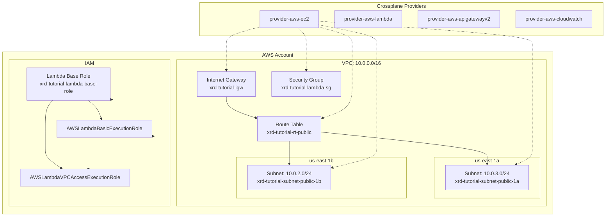
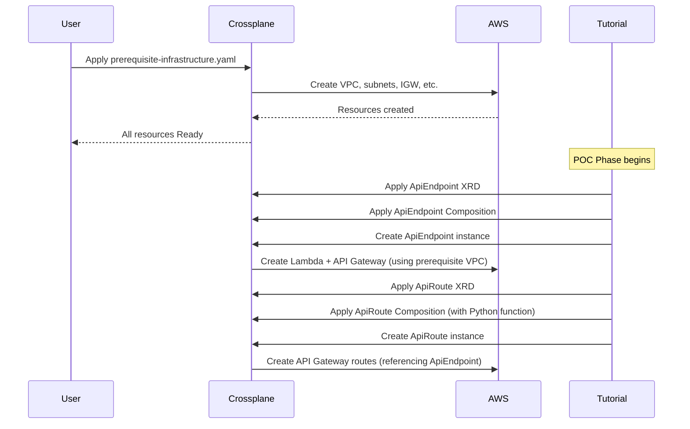

# XRD Tutorial POC Infrastructure

This directory contains the infrastructure manifests and documentation for the XRD tutorial proof-of-concept validation.

## Overview

The POC infrastructure provides a complete foundation for validating the XRD tutorial's technical assumptions. It creates all prerequisite AWS resources needed to test ApiEndpoint and ApiRoute XRDs using both traditional patches and Python composition functions.

## Infrastructure Architecture



## Infrastructure Components

### Networking Foundation
- **VPC**: `xrd-tutorial-vpc` (10.0.0.0/16)
  - DNS hostnames and support enabled
  - Provides isolated network environment for tutorial resources

- **Public Subnets**:
  - `xrd-tutorial-subnet-public-1a` (10.0.3.0/24) in us-east-1a
  - `xrd-tutorial-subnet-public-1b` (10.0.2.0/24) in us-east-1b
  - Both subnets auto-assign public IPs for Lambda functions

- **Internet Gateway**: `xrd-tutorial-igw`
  - Provides internet access for Lambda functions and API Gateway

- **Route Table**: `xrd-tutorial-rt-public`
  - Default route (0.0.0.0/0) to Internet Gateway
  - Associated with both public subnets

### Security Configuration
- **Lambda Security Group**: `xrd-tutorial-lambda-sg`
  - Allows all outbound traffic (0.0.0.0/0:0-65535)
  - Enables Lambda functions to access external APIs (CloudWatch, etc.)

### IAM Configuration
- **Lambda Base Role**: `xrd-tutorial-lambda-base-role`
  - Assumable by Lambda service
  - Attached policies:
    - `AWSLambdaBasicExecutionRole` - CloudWatch logging
    - `AWSLambdaVPCAccessExecutionRole` - VPC network access

### Crossplane Providers
- **provider-aws-ec2** (v1.14.0) - VPC, subnets, security groups
- **provider-aws-lambda** (v1.14.0) - Lambda functions and permissions  
- **provider-aws-apigatewayv2** (v1.14.0) - HTTP APIs and routes
- **provider-aws-iam** (v1.14.0) - Roles and policies
- **provider-aws-cloudwatch** (v1.14.0) - Metrics integration

## Resource Labeling Strategy

All resources use consistent labels for organization and selection:

```yaml
labels:
  tutorial.crossplane.io/component: infrastructure
  tutorial.crossplane.io/layer: prerequisite
  # Additional purpose-specific labels:
  tutorial.crossplane.io/az: us-east-1a  # for AZ-specific resources
  tutorial.crossplane.io/purpose: lambda # for Lambda-related resources
```

## Tutorial Integration Flow



## Files in this Directory

### Active Files
- **`prerequisite-infrastructure.yaml`** - Complete infrastructure definition
  - All Crossplane providers
  - Complete VPC networking setup
  - Security groups and IAM roles
  - Single file containing all prerequisites

- **`README.md`** - This documentation file

### Deployment Instructions

1. **Apply Infrastructure**:
   ```bash
   kubectl apply -f prerequisite-infrastructure.yaml
   ```

2. **Wait for Readiness**:
   ```bash
   kubectl get managed -l tutorial.crossplane.io/layer=prerequisite
   # Wait for all resources to show SYNCED=True, READY=True
   ```

3. **Verify with AWS CLI**:
   ```bash
   # From project root:
   ./scripts/quick-verify.sh
   # or for detailed verification:
   ./scripts/verify-prerequisites.sh
   ```

## Validation and Testing

### Crossplane Status Validation
```bash
# Check all prerequisite resources
kubectl get managed -l tutorial.crossplane.io/layer=prerequisite

# Check specific resource types
kubectl get vpc,subnet,internetgateway,securitygroup,role -l tutorial.crossplane.io/layer=prerequisite
```

### AWS CLI Validation
The project includes verification scripts in `../scripts/`:
- `quick-verify.sh` - Simple present/missing check
- `verify-prerequisites.sh` - Comprehensive validation with detailed output

### Expected Resource Count
- **Total Managed Resources**: 13
- **VPC Resources**: 7 (VPC, 2 subnets, IGW, route table, route, 2 route table associations)
- **Security Resources**: 2 (security group, security group rule)
- **IAM Resources**: 3 (role, 2 policy attachments)
- **Provider Resources**: 5 (individual AWS service providers)
- **Configuration**: 1 (ProviderConfig)

## Troubleshooting

### Common Issues

1. **CIDR Conflicts**: 
   - Ensure no existing subnets use 10.0.2.0/24 or 10.0.3.0/24
   - Check with: `aws ec2 describe-subnets --region us-east-1`

2. **Provider Installation**:
   - Providers must install before infrastructure resources
   - Check: `kubectl get providers`
   - Wait for all providers to show HEALTHY=True

3. **Route Table Associations**:
   - May fail if subnet selectors don't resolve
   - Check subnet labels match route table association selectors

4. **IAM Permissions**:
   - Ensure AWS credentials have sufficient permissions for all resource types
   - Required: EC2, Lambda, API Gateway, IAM, CloudWatch permissions

### Cleanup

To remove all POC infrastructure:
```bash
kubectl delete -f prerequisite-infrastructure.yaml
```

**Note**: Crossplane will handle proper deletion order and AWS resource cleanup.

## Next Steps

Once this infrastructure is deployed and validated:
1. Proceed to ApiEndpoint XRD implementation (Task 3.2.1)
2. Test traditional patch-based compositions
3. Implement ApiRoute XRD with Python composition functions
4. Validate dependency resolution and status propagation

This infrastructure provides the stable foundation needed for all subsequent POC validation tasks.