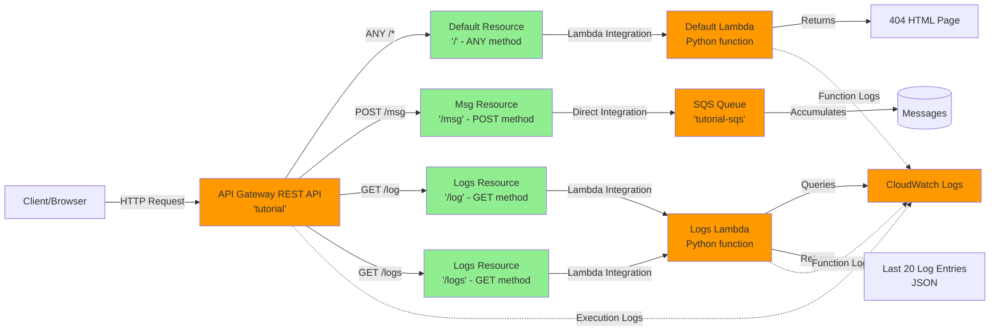

# AWS Terraform Setup Specification

## Overview
This specification describes a simple AWS infrastructure setup using Terraform to create an API Gateway REST API with multiple endpoints:
1. A default catch-all endpoint that returns a friendly 404 page
2. A `/msg` endpoint that accepts POST requests and writes them directly to an SQS queue
3. `/log` and `/logs` endpoints that return the last 20 CloudWatch log entries for this application

All components write to dedicated CloudWatch Log Groups for comprehensive tracing and debugging.

## Architecture Diagram

## Request Flow
- **Any request to `/` or unmatched paths** → Default Resource → Default Lambda → Friendly 404 HTML response
- **POST requests to `/msg`** → Msg Resource → Direct SQS integration → SQS Queue (stores raw POST body)
- **GET requests to `/log` or `/logs`** → Logs Resource → Logs Lambda → Query CloudWatch Logs → Return last 20 log entries as JSON

## Logging and Tracing
All components write to dedicated CloudWatch Log Groups:
- **API Gateway execution logs**: Full request/response tracing including when requests arrive, integration calls, and responses
- **default-lambda logs**: Lambda execution logs for the 404 handler
- **logs-lambda logs**: Lambda execution logs for the log retrieval function

This provides comprehensive tracing of all activity for learning and debugging purposes.

## General Requirements

### Terraform State
- Use local filesystem for Terraform state (no remote backend)

### IAM Policy Organization
- IAM policies, roles, and role assignments should be defined in the same Terraform file as the resource that needs them
- Example: IAM permissions for API Gateway to invoke the default-lambda should be in `default-resource.tf`, not in `default-lambda.tf`

### Code Style
- Use lots of comments throughout all Terraform files
- Explain what each resource does and why it's configured that way

### AWS Configuration
- **Region**: us-east-1
- **Stage**: default

### VPC Configuration
- No VPC attachments needed (all resources use public/regional AWS services)

## File Structure

### 1. api-gateway.tf
**Purpose**: Define the API Gateway REST API, deployment, and stage

**Contents**:
- API Gateway REST API resource named "tutorial"
- This is a public API (not private/VPC-attached)
- Deployment configuration
- Stage configuration (stage name: "default")

### 2. default-resource.tf
**Purpose**: Define the default catch-all endpoint and its integration

**Contents**:
- API Gateway resource at path `/`
- Method: ANY (catches all HTTP methods)
- Resource name: "default-resource"
- Integration with default-lambda function
- IAM permissions for API Gateway to invoke the Lambda function

### 3. default-lambda.tf
**Purpose**: Define the Lambda function that returns friendly 404 responses

**Contents**:
- Lambda function named "default-lambda"
- Runtime: Python (latest stable version)
- Code: Inline in Terraform (should be very short)
- Function behavior: Return a friendly HTML 404 page with HTTP 404 status code
- IAM execution role for the Lambda function (basic Lambda execution permissions)

**Note**: The Lambda function does NOT need VPC attachment

### 4. msg-sqs.tf
**Purpose**: Define the SQS queue

**Contents**:
- SQS queue named "tutorial-sqs"
- Standard queue configuration
- The queue simply accumulates messages (no processing)

### 5. msg-resource.tf
**Purpose**: Define the /msg endpoint with direct SQS integration

**Contents**:
- API Gateway resource at path `/msg`
- Method: POST
- Resource name: "msg-resource"
- Direct integration with SQS (no Lambda in between)
- Integration should send the raw POST body from the HTTP request to SQS
- IAM role and permissions for API Gateway to write to the SQS queue

### 6. logs-cloudwatch.tf
**Purpose**: Set up CloudWatch Log Groups and configure API Gateway logging

**Contents**:
- CloudWatch Log Group for API Gateway execution logs (e.g., `/aws/apigateway/tutorial`)
- CloudWatch Log Group for default-lambda (e.g., `/aws/lambda/default-lambda`)
- CloudWatch Log Group for logs-lambda (e.g., `/aws/lambda/logs-lambda`)
- Configure API Gateway stage to enable execution logging
- Logging settings should capture:
  - When requests arrive at API Gateway
  - When integrations are called
  - Integration execution details
  - Response status codes and data
- IAM role for API Gateway to write to CloudWatch Logs
- Log retention policies (optional, e.g., 7 days for cost management)

**Note**: This provides full request/response tracing for learning and debugging

### 7. logs-lambda.tf
**Purpose**: Define the Lambda function that retrieves CloudWatch logs

**Contents**:
- Lambda function named "logs-lambda"
- Runtime: Python (latest stable version)
- Code: Inline in Terraform
- Function behavior: Query CloudWatch Logs and return the last 20 log entries from this application's log groups
- Should query only the dedicated log groups created for this application:
  - API Gateway execution logs
  - default-lambda logs
  - logs-lambda logs (its own logs)
- Return format: JSON array of log entries
- IAM execution role with permissions to:
  - Write to CloudWatch Logs (its own logs)
  - Read from CloudWatch Logs (query the application's log groups)
  - Use CloudWatch Logs Insights or FilterLogEvents API

**Note**: Direct API Gateway → CloudWatch Logs integration for reading is not possible, so Lambda is required

### 8. logs-resource.tf
**Purpose**: Define the /log and /logs endpoints that return CloudWatch logs

**Contents**:
- Two API Gateway resources: `/log` and `/logs`
- Both resources use GET method
- Both resources named appropriately (e.g., "logs-resource-log" and "logs-resource-logs")
- Both resources integrate with the same logs-lambda function
- IAM permissions for API Gateway to invoke the logs-lambda function (two permission resources, one for each path)

**Note**: Having two separate resources pointing to the same Lambda provides flexibility for future differentiation

### 9. variables.tf (Optional)
**Purpose**: Define input variables for reusability

**Suggested contents**:
- AWS region (default: us-east-1)
- Common tags
- Naming prefixes

### 10. outputs.tf (Optional)
**Purpose**: Output useful information after deployment

**Suggested contents**:
- API Gateway endpoint URL
- SQS queue URL
- Any other useful references

## Technical Specifications

### API Gateway
- Type: REST API (not HTTP API v2)
- Public accessibility
- REST API name: "tutorial"

### Lambda Function (default-lambda)
- Runtime: Python (use latest stable, e.g., python3.11 or python3.12)
- Code: Inline in Terraform
- Handler: Standard Python Lambda handler
- Returns: HTML content with 404 status code
- Response should be "friendly" - user-facing error page
- No VPC configuration needed

### SQS Queue (tutorial-sqs)
- Type: Standard queue
- No special configuration needed
- Simply accumulates incoming messages

### API Gateway → Lambda Integration
- Integration type: AWS_PROXY or Lambda proxy integration
- Allows Lambda to control the full HTTP response

### API Gateway → SQS Integration
- Integration type: AWS integration (direct service integration)
- Action: SendMessage to SQS
- Message body: Raw POST body from HTTP request
- Should return appropriate HTTP response to client after queuing message
- **Note**: Empty POST body validation removed - API Gateway treats empty JSON as `{}` which is valid JSON
- Only POST method should work (GET, PUT, DELETE, etc. should be rejected)

### CloudWatch Logging Configuration
- **Log Groups**: Create dedicated CloudWatch Log Groups for each component
  - API Gateway: `/aws/apigateway/tutorial`
  - default-lambda: `/aws/lambda/default-lambda`
  - logs-lambda: `/aws/lambda/logs-lambda`
- **API Gateway Execution Logging**: Enable on the stage
  - Log level: INFO or higher (to capture full request/response details)
  - Log full requests/responses: enabled
  - Data trace enabled: yes (for debugging)
- **Lambda Logging**: Automatic via Lambda execution role permissions
- **Log Retention**: Optional (e.g., 7 days to manage costs)

### Lambda Function (logs-lambda)
- Runtime: Python (use latest stable, e.g., python3.11 or python3.12)
- Code: Inline in Terraform
- Handler: Standard Python Lambda handler
- Function behavior:
  - Query CloudWatch Logs using boto3 client
  - Use `filter_log_events` or `start_query` API
  - Aggregate logs from all application log groups
  - Return the last 20 log entries sorted by timestamp (most recent last)
  - Return format: JSON array
- IAM permissions needed:
  - `logs:CreateLogGroup`, `logs:CreateLogStream`, `logs:PutLogEvents` (for its own logs)
  - `logs:FilterLogEvents` or `logs:StartQuery`, `logs:GetQueryResults` (to read logs)
  - Permissions scoped to the application's log groups only
- **Method restrictions**: Only GET method should work (POST, PUT, DELETE, etc. should be rejected)

### IAM Permissions Required

1. **API Gateway → Lambda** (in default-resource.tf and logs-resource.tf):
   - API Gateway needs permission to invoke Lambda functions
   - Use `aws_lambda_permission` resource for each resource/Lambda combination
   - default-resource.tf: Permission for API Gateway to invoke default-lambda
   - logs-resource.tf: Permissions for API Gateway to invoke logs-lambda (one for /log, one for /logs)

2. **Lambda Execution Role - default-lambda** (in default-lambda.tf):
   - Basic Lambda execution role
   - CloudWatch Logs permissions: `logs:CreateLogGroup`, `logs:CreateLogStream`, `logs:PutLogEvents`
   - Write to the dedicated log group: `/aws/lambda/default-lambda`

3. **Lambda Execution Role - logs-lambda** (in logs-lambda.tf):
   - CloudWatch Logs write permissions (for its own logs): `logs:CreateLogGroup`, `logs:CreateLogStream`, `logs:PutLogEvents`
   - CloudWatch Logs read permissions: `logs:FilterLogEvents`, `logs:DescribeLogGroups`, `logs:DescribeLogStreams`
   - Scoped to read from: `/aws/apigateway/tutorial`, `/aws/lambda/default-lambda`, `/aws/lambda/logs-lambda`

4. **API Gateway → SQS** (in msg-resource.tf):
   - API Gateway needs an IAM role
   - Role needs permission to send messages to the SQS queue
   - Use `aws_iam_role` and `aws_iam_role_policy` resources

5. **API Gateway → CloudWatch Logs** (in logs-cloudwatch.tf):
   - API Gateway needs an IAM role to write execution logs
   - Role needs permissions: `logs:CreateLogGroup`, `logs:CreateLogStream`, `logs:PutLogEvents`, `logs:DescribeLogGroups`, `logs:DescribeLogStreams`
   - This role is attached to the API Gateway stage settings

## Success Criteria

After deployment, the following should work:

1. **GET/POST/etc to API endpoint `/`**: Returns friendly HTML 404 page with status code 404
2. **GET/POST/etc to any unmatched path**: Returns friendly HTML 404 page with status code 404
3. **POST to API endpoint `/msg`**: Accepts the request body and adds it to the SQS queue, returns 200 status
4. **GET to API endpoint `/log`**: Returns JSON array of the last 20 CloudWatch log entries
5. **GET to API endpoint `/logs`**: Returns JSON array of the last 20 CloudWatch log entries (same as `/log`)
6. **SQS Queue**: Contains messages from POST requests to `/msg`
7. **CloudWatch Logs**: All components writing to their dedicated log groups
8. **API Gateway execution logs**: Show full request/response tracing for all endpoints
9. **Terraform state**: Stored locally in the working directory

### Testing the Setup

1. Make a request to `/` → Should return 404 HTML, logs should appear in CloudWatch
2. Make a POST to `/msg` with a JSON body → Should return 200, message in SQS, logs in CloudWatch
3. Make a GET to `/log` → Should return JSON with the last 20 log entries from steps 1-2
4. Make a GET to `/logs` → Should return JSON with the last 20 log entries (same as `/log`)
5. Verify via AWS CLI: Use `aws logs describe-log-groups` to confirm three log groups exist for the application
6. Verify via AWS CLI: Use `aws logs filter-log-events` on each log group to confirm logs are being written

## Notes

- Keep the implementation simple and straightforward
- Prioritize clarity and readability with extensive comments
- No need for advanced features like custom domains, WAF, throttling, etc.
- This is a tutorial/learning setup, not production-ready infrastructure
