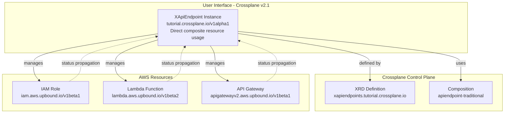
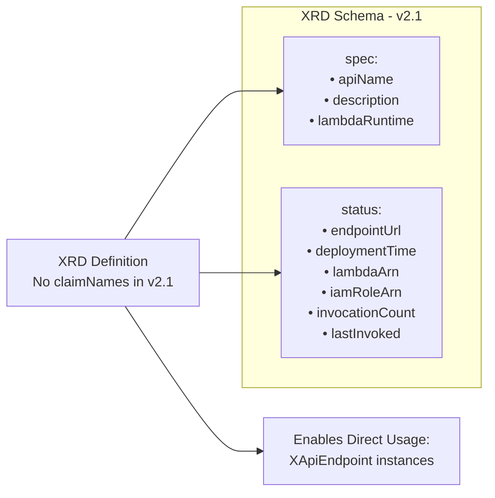
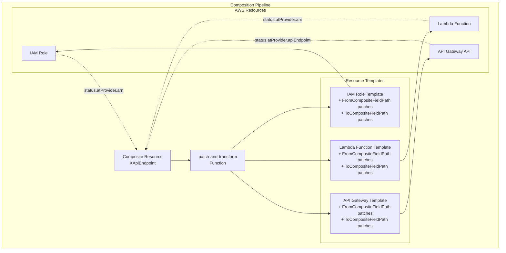
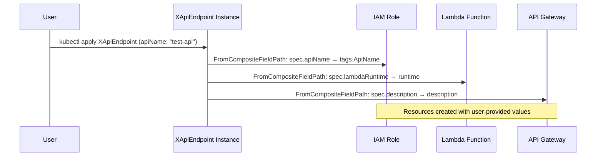
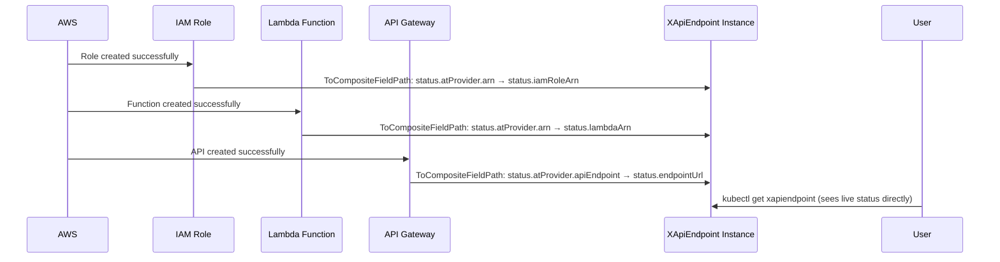
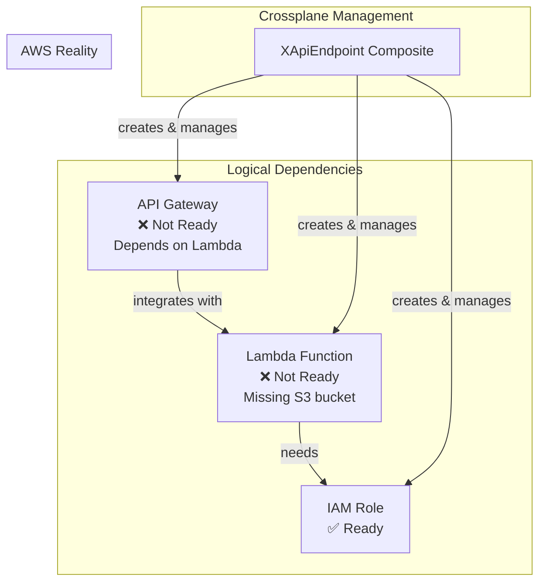

# ApiEndpoint POC - Crossplane v2.1 Traditional Patches Pattern

This directory contains the proof-of-concept implementation for the ApiEndpoint pattern using Crossplane v2.1's traditional patch-and-transform approach. This demonstrates declarative composition with built-in Crossplane functionality.

## Overview

The ApiEndpoint pattern creates a complete serverless API by composing AWS Lambda, API Gateway, and IAM resources. It showcases how Crossplane v2.1 can encapsulate complex infrastructure patterns into simple, reusable abstractions using direct composite resource interaction.

## Architecture Diagram



## File Structure

```
poc-validation/apiendpoint/
├── README.md                           # This file
├── xrd-apiendpoint.yaml               # XRD Definition (v2.1 - no claimNames)
├── composition-apiendpoint.yaml       # Composition Logic (Pipeline mode)
└── test-apiendpoint-instance.yaml     # Test XR Instance (direct usage)
```

## Crossplane v2.1 Key Changes

**❌ NO LONGER USED (v1 patterns):**
- Claims (ApiEndpoint claims)
- claimNames in XRDs
- Resources mode compositions
- Namespace-scoped claim resources

**✅ CROSSPLANE v2.1 PATTERNS:**
- Direct XR usage (XApiEndpoint instances)
- XRDs without claimNames sections
- Pipeline mode compositions
- Cluster-scoped composite resources

## Manifest Relationships

### 1. XRD Definition (`xrd-apiendpoint.yaml`)

The **CompositeResourceDefinition (XRD)** acts as the API contract and schema definition for Crossplane v2.1.



**Key Features:**
- Defines the `XApiEndpoint` composite type for direct user interaction
- **NO claimNames section** (removed in Crossplane v2.1)
- Specifies input parameters (spec) and output status fields
- Users interact directly with XApiEndpoint resources, not through claims

### 2. Composition Logic (`composition-apiendpoint.yaml`)

The **Composition** defines how to create and configure AWS resources using traditional patches.



**Patch Types Used:**

1. **FromCompositeFieldPath**: Copies data from composite spec to managed resource spec
   ```yaml
   - type: FromCompositeFieldPath
     fromFieldPath: spec.apiName
     toFieldPath: spec.forProvider.tags.ApiName
   ```

2. **ToCompositeFieldPath**: Copies data from managed resource status to composite status
   ```yaml
   - type: ToCompositeFieldPath
     fromFieldPath: status.atProvider.arn
     toFieldPath: status.iamRoleArn
   ```

### 3. Test Instance (`test-apiendpoint-instance.yaml`)

A direct XApiEndpoint instance that demonstrates Crossplane v2.1 usage patterns.

```mermaid
graph LR
    TestXR[test-apiendpoint<br/>XApiEndpoint Instance<br/>Direct usage - no claims] 
    TestXR --> Spec[spec:<br/>• apiName: "test-api"<br/>• description: "Test API..."<br/>• lambdaRuntime: "python3.9"]
    TestXR --> Status[status:<br/>• iamRoleArn: "arn:aws:iam::..."<br/>• conditions: Ready/Synced]
```

## Data Flow Patterns

### Input Data Flow (FromCompositeFieldPath)



### Status Propagation Flow (ToCompositeFieldPath)



## Resource Dependencies



**Current Status:**
- ✅ **IAM Role**: Successfully created and Ready
- ❌ **Lambda Function**: Failing due to missing S3 bucket for code
- ❌ **API Gateway**: Waiting for Lambda to be Ready

## Key Crossplane Concepts Demonstrated

### 1. Declarative Composition
- Resources defined as templates with patch-based customization
- No imperative code - pure YAML configuration
- Built-in Crossplane functionality handles resource lifecycle

### 2. Status Propagation
- Real AWS resource status automatically flows back to users
- ToCompositeFieldPath patches enable status aggregation
- Users see live infrastructure state without AWS console access

### 3. Resource Lifecycle Management
- Crossplane handles creation, updates, and deletion
- Proper cleanup order maintained automatically
- Error conditions surfaced through Kubernetes conditions

### 4. API Abstraction
- Complex AWS patterns hidden behind simple API
- Users only specify business intent (apiName, description, runtime)
- Infrastructure complexity encapsulated in composition

## Testing Status Propagation

The current test demonstrates successful status propagation in Crossplane v2.1:

```bash
# Check XApiEndpoint instance status directly
kubectl get xapiendpoint test-apiendpoint -o yaml
```

**Expected Results:**
- `status.iamRoleArn` populated with actual AWS IAM role ARN
- Status propagates from managed resource → composite resource
- Direct interaction with XApiEndpoint - no claims involved

## Next Steps

1. **Fix Lambda Function**: Provide valid S3 bucket or use inline code
2. **Complete API Gateway**: Ensure Lambda integration works
3. **Test End-to-End**: Verify API endpoint responds to HTTP requests
4. **Add CloudWatch Integration**: Implement invocation count status fields

## Educational Value

This POC validates that:
- ✅ Crossplane v2.1 traditional patch-and-transform patterns work as designed
- ✅ Direct XR usage eliminates the need for claims
- ✅ Status propagation flows correctly through the system
- ✅ Complex AWS patterns can be abstracted into simple APIs
- ✅ Crossplane v2.1 Pipeline mode functions correctly
- ✅ XRD schema validation and type safety work as expected

The pattern demonstrated here forms the foundation for the tutorial's traditional patches approach, showing learners how to build declarative infrastructure abstractions using Crossplane v2.1's built-in capabilities without the complexity of claims.