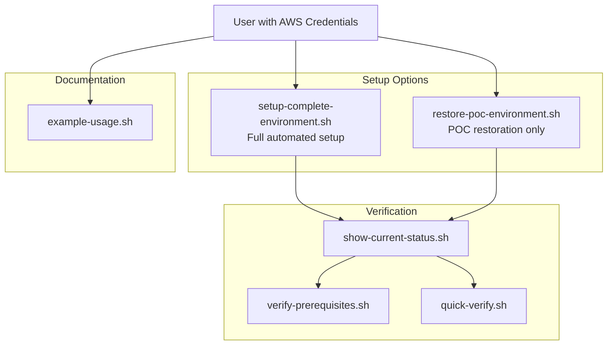

# Scripts Directory

This directory contains automation scripts for the XRD Tutorial environment setup and management.

## 🚀 Main Setup Scripts

### `setup-complete-environment.sh`
**Complete automated environment setup from scratch**

- Validates AWS credentials from environment variables
- Installs Crossplane v2.1+ and AWS providers
- Configures authentication and AWS CLI
- Runs full POC environment restoration
- Performs final verification

**Usage:**
```bash
# Option 1: Use existing config file
source ~/.config/env-mk8-aws
./scripts/setup-complete-environment.sh

# Option 2: Set environment variables manually
export AWS_ACCESS_KEY_ID="your_access_key"
export AWS_SECRET_ACCESS_KEY="your_secret_key"
export AWS_DEFAULT_REGION="us-east-1"
./scripts/setup-complete-environment.sh
```

### `restore-poc-environment.sh`
**Restore POC environment on existing Crossplane cluster**

- Assumes Crossplane and AWS providers are already installed
- Applies prerequisite infrastructure
- Installs required functions
- Creates ApiEndpoint POC components
- Validates current state

**Usage:**
```bash
./scripts/restore-poc-environment.sh
```

## 📊 Status and Verification Scripts

### `show-current-status.sh`
**Display real-time environment status**

- Shows task progress
- Reports component status
- Lists managed resources
- Highlights known issues
- Provides next steps

**Usage:**
```bash
./scripts/show-current-status.sh
```

### `verify-prerequisites.sh`
**Verify prerequisite AWS infrastructure**

- Checks all 13 prerequisite resources
- Uses AWS CLI for secondary verification
- Reports present/missing status
- Validates infrastructure readiness

**Usage:**
```bash
./scripts/verify-prerequisites.sh
```

### `quick-verify.sh`
**Quick infrastructure status check**

- Fast verification of key resources
- Simplified present/missing output
- Good for automated checks

**Usage:**
```bash
./scripts/quick-verify.sh
```

## 📖 Documentation Scripts

### `example-usage.sh`
**Usage examples and guidance**

- Shows how to set environment variables
- Demonstrates setup process
- Provides troubleshooting tips
- Security best practices

**Usage:**
```bash
./scripts/example-usage.sh
```

## 🔄 Script Dependencies



## 🎯 Workflow Recommendations

### New Environment Setup
1. **Read guidance**: `./scripts/example-usage.sh`
2. **Set credentials**: `source ~/.config/env-mk8-aws` (or export manually)
3. **Full setup**: `./scripts/setup-complete-environment.sh`
4. **Verify status**: `./scripts/show-current-status.sh`

### Existing Crossplane Cluster
1. **Restore POC**: `./scripts/restore-poc-environment.sh`
2. **Check status**: `./scripts/show-current-status.sh`
3. **Verify infra**: `./scripts/verify-prerequisites.sh`

### Regular Monitoring
1. **Quick check**: `./scripts/quick-verify.sh`
2. **Detailed status**: `./scripts/show-current-status.sh`
3. **Infrastructure**: `./scripts/verify-prerequisites.sh`

## 🔧 Prerequisites

### For `setup-complete-environment.sh`:
- Kubernetes cluster access (kubectl configured)
- Helm installed
- AWS credentials as environment variables
- Internet access for downloading packages

### For `restore-poc-environment.sh`:
- Crossplane v2.1+ already installed
- AWS providers installed and healthy
- ProviderConfig configured
- AWS CLI configured

### For verification scripts:
- kubectl access to cluster
- AWS CLI configured (for infrastructure verification)

## 🚨 Security Notes

- **Never commit AWS credentials** to version control
- Use environment variables for credential management
- Scripts validate credential format before proceeding
- AWS CLI configuration is created in user's home directory
- Kubernetes secrets are created in crossplane-system namespace

## 🐛 Troubleshooting

### Common Issues

**Script fails with "command not found":**
- Ensure script is executable: `chmod +x scripts/script-name.sh`
- Run from project root directory

**AWS credential validation fails:**
- Check environment variable names (case sensitive)
- Verify credential format matches AWS standards
- Test with `aws sts get-caller-identity`

**Kubernetes access fails:**
- Verify kubectl is configured: `kubectl cluster-info`
- Check cluster connectivity
- Ensure sufficient permissions

**Provider installation hangs:**
- Check internet connectivity
- Verify cluster has sufficient resources
- Check Crossplane logs: `kubectl logs -n crossplane-system -l app=crossplane`

### Debug Commands

```bash
# Check script permissions
ls -la scripts/

# Test AWS credentials
aws sts get-caller-identity

# Check Kubernetes access
kubectl cluster-info

# Monitor Crossplane
kubectl get pods -n crossplane-system
kubectl logs -n crossplane-system -l app=crossplane

# Check provider status
kubectl get providers
kubectl describe provider provider-aws-ec2
```

## 📝 Script Maintenance

When updating scripts:

1. **Test thoroughly** in clean environment
2. **Update documentation** in this README
3. **Validate error handling** for common failure cases
4. **Check credential validation** logic
5. **Verify timeout values** are appropriate
6. **Update version references** as needed

## 🎉 Success Indicators

After successful setup, you should see:

- ✅ All AWS providers showing as Healthy
- ✅ ProviderConfig configured and working
- ✅ Prerequisite infrastructure (13 resources) Ready
- ✅ XRD established and available
- ✅ Composition applied successfully
- ✅ Test XApiEndpoint instance created
- ✅ Status propagation working (iamRoleArn populated)

Use `./scripts/show-current-status.sh` to verify all components are working correctly.